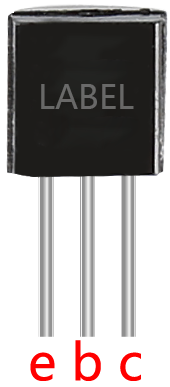

.. _cpn_transistor:

Transistor
============

.. image:: img/npn_pnp.png

Ein Transistor ist ein Halbleitergerät, das den Stromfluss durch einen Strom steuert. Er funktioniert, indem er schwache Signale zu Signalen mit größerer Amplitude verstärkt und wird auch als kontaktloser Schalter eingesetzt.

Ein Transistor besteht aus einer dreischichtigen Struktur aus P-Typ- und N-Typ-Halbleitern. Diese bilden intern drei Regionen. Die mittlere, dünnere Region ist die Basisregion; die anderen beiden sind entweder N-Typ oder P-Typ - die kleinere Region mit intensiven Majoritätsträgern ist die Emitterregion, während die andere die Kollektorregion ist. Diese Zusammensetzung ermöglicht es dem Transistor, als Verstärker zu fungieren. 
Aus diesen drei Regionen entstehen jeweils drei Pole, die Basis (b), Emitter (e) und Kollektor (c). Sie bilden zwei P-N-Übergänge, nämlich den Emitterübergang und den Kollektorübergang. Die Richtung des Pfeils im Transistorschaltsymbol gibt die des Emitterübergangs an.

* `P-N-Übergang - Wikipedia <https://en.wikipedia.org/wiki/P-n_junction>`_

Basierend auf dem Halbleitertyp können Transistoren in zwei Gruppen eingeteilt werden, in NPN- und PNP-Transistoren. Aus der Abkürzung können wir ableiten, dass der Erstere aus zwei N-Typ-Halbleitern und einem P-Typ besteht und der Letztere das Gegenteil ist. Siehe die Abbildung unten.

.. note::
    Der s8550 ist ein PNP-Transistor und der s8050 ein NPN-Transistor. Sie sehen sehr ähnlich aus, daher müssen wir sorgfältig ihre Etiketten prüfen.

.. image:: img/transistor_symbol.png

Wenn ein High-Level-Signal durch einen NPN-Transistor fließt, wird dieser aktiviert. Ein PNP-Transistor benötigt jedoch ein Low-Level-Signal zur Steuerung. Beide Transistortypen werden häufig für kontaktlose Schalter eingesetzt, wie in diesem Experiment.

* `S8050 Transistor-Datenblatt <https://components101.com/asset/sites/default/files/component_datasheet/S8050%20Transistor%20Datasheet.pdf>`_
* `S8550 Transistor-Datenblatt <https://www.mouser.com/datasheet/2/149/SS8550-118608.pdf>`_

Richten Sie die Beschriftungsseite zu sich und die Pins nach unten. Die Pins von links nach rechts sind Emitter (e), Basis (b) und Kollektor (c).

.. note::
    * Die Basis ist das Steuerelement für die größere Stromversorgung.
    * Beim NPN-Transistor ist der Kollektor die größere Stromquelle und der Emitter der Ausgang für diese Versorgung, beim PNP-Transistor ist es genau umgekehrt.

.. Beispiel
.. -------------------

.. :ref:`Zwei Arten von Transistoren`

**Beispiele**

* :ref:`ar_transistor` (Arduino-Projekt)
* :ref:`ar_ac_buz` (Arduino-Projekt)
* :ref:`ar_fruit_piano` (Arduino-Projekt)
* :ref:`py_transistor` (MicroPython-Projekt)
* :ref:`py_pa_buz` (MicroPython-Projekt)
* :ref:`py_light_theremin` (MicroPython-Projekt)

