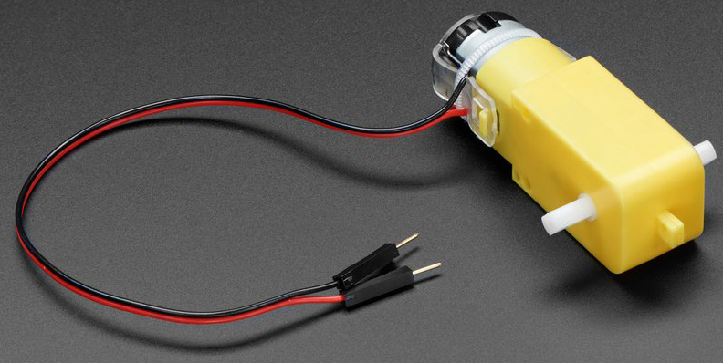
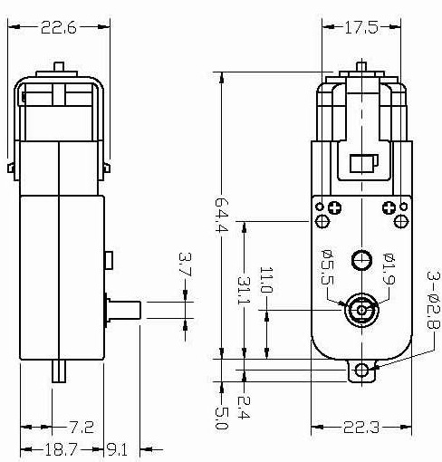

.. note::

    Ciao, benvenuto nella community di appassionati di SunFounder Raspberry Pi & Arduino & ESP32 su Facebook! Approfondisci le tue conoscenze su Raspberry Pi, Arduino ed ESP32 insieme ad altri appassionati.

    **Perché unirti?**

    - **Supporto esperto**: Risolvi i problemi post-vendita e le sfide tecniche con l'aiuto della nostra comunità e del nostro team.
    - **Impara e condividi**: Scambia consigli e tutorial per migliorare le tue competenze.
    - **Anteprime esclusive**: Accedi in anteprima agli annunci di nuovi prodotti e alle anticipazioni.
    - **Sconti speciali**: Approfitta di sconti esclusivi sui nostri prodotti più recenti.
    - **Promozioni e omaggi festivi**: Partecipa a promozioni e omaggi durante le festività.

    👉 Sei pronto a esplorare e creare con noi? Clicca su [|link_sf_facebook|] e unisciti oggi stesso!

.. _cpn_tt_motor:

Motore TT
==============

Questo è un motore CC con riduttore TT con un rapporto di trasmissione di 1:48. Viene fornito con 2 fili da 200 mm con connettori maschio da 0,1" che si adattano a una breadboard. Perfetto per essere collegato a una breadboard o a un blocco terminale.

Puoi alimentare questi motori con 3 ~ 6VCC, ma ovviamente andranno un po' più veloci a tensioni più elevate.

Nota che questi sono motori molto basilari senza encoder integrato, controllo della velocità o feedback di posizione. L'alimentazione entra e il motore gira. Ci sarà una variazione da motore a motore, quindi se hai bisogno di un movimento preciso, avrai bisogno di un sistema di feedback separato.

**Dettagli tecnici**

* Tensione nominale: 3~6V
* Corrente continua a vuoto: 150mA +/- 10%
* Velocità minima di funzionamento (3V): 90+/- 10% RPM
* Velocità minima di funzionamento (6V): 200+/- 10% RPM
* Coppia di stallo (3V): 0.4kg.cm
* Coppia di stallo (6V): 0.8kg.cm
* Rapporto di trasmissione: 1:48
* Dimensioni del corpo: 70 x 22 x 18mm
* Lunghezza dei fili: 200mm & 28 AWG
* Peso: 30.6g

**Disegno dimensionale**

**Esempio**

* :ref:`ar_motor` (Progetto Arduino)
* :ref:`py_motor` (Progetto MicroPython)
* :ref:`sh_rotating_fan` (Progetto Scratch)
