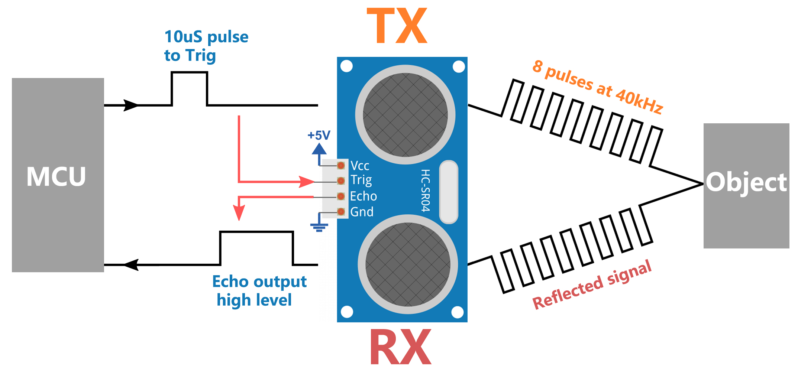

.. note::

    こんにちは、SunFounderのRaspberry Pi & Arduino & ESP32愛好家コミュニティへようこそ！Facebook上でRaspberry Pi、Arduino、ESP32についてもっと深く掘り下げ、他の愛好家と交流しましょう。

    **参加する理由は？**

    - **エキスパートサポート**：コミュニティやチームの助けを借りて、販売後の問題や技術的な課題を解決します。
    - **学び＆共有**：ヒントやチュートリアルを交換してスキルを向上させましょう。
    - **独占的なプレビュー**：新製品の発表や先行プレビューに早期アクセスしましょう。
    - **特別割引**：最新製品の独占割引をお楽しみください。
    - **祭りのプロモーションとギフト**：ギフトや祝日のプロモーションに参加しましょう。

    👉 私たちと一緒に探索し、創造する準備はできていますか？[|link_sf_facebook|]をクリックして今すぐ参加しましょう！

.. _cpn_ultrasonic:

超音波モジュール
================================

.. image:: img/ultrasonic_pic.png
    :width: 400
    :align: center

* **TRIG**: トリガーパルス入力
* **ECHO**: エコーパルス出力
* **GND**: グラウンド
* **VCC**: 5V供給

これはHC-SR04超音波距離センサーで、2cmから400cmの非接触測定を提供し、範囲の精度は最大3mmまでです。このモジュールには超音波送信機、受信機、および制御回路が含まれています。

使用するために接続する必要があるのは4つのピンだけです：VCC（電源）、Trig（トリガー）、Echo（受信）、GND（グラウンド）。

**特徴**

* 動作電圧: DC5V
* 動作電流: 16mA
* 動作周波数: 40Hz
* 最大範囲: 500cm
* 最小範囲: 2cm
* トリガー入力信号: 10uS TTLパルス
* エコー出力信号: 入力TTLレベル信号および範囲の比率
* コネクタ: XH2.54-4P
* 寸法: 46x20.5x15 mm

**原理**

基本的な原理は以下の通りです：

* IOトリガーを少なくとも10usの高レベル信号で使用します。

* モジュールは40kHzで超音波の8サイクルのバーストを送信し、パルス信号が受信されたかどうかを検出します。

* 信号が返されると、Echoは高レベルを出力します。この高レベルの持続時間は、放射から返還までの時間です。

* 距離 = (高レベルの時間 x 音速(340M/S)) / 2

式:

* us / 58 = センチメートルでの距離
* us / 148 = インチでの距離
* 距離 = 高レベルの時間 x 速度(340M/S) / 2

.. note::

    このモジュールは電源投入時に接続してはいけません。必要な場合、モジュールのGNDを最初に接続してください。そうしないと、モジュールの動作に影響が出る可能性があります。

    測定対象の物体の面積は少なくとも0.5平方メートルであり、できるだけ平らでなければなりません。そうでないと、結果に影響が出る可能性があります。

**例**

* :ref:`ar_ultrasonic` (Arduinoプロジェクト)
* :ref:`ar_reversing_aid` (Arduinoプロジェクト)
* :ref:`py_ultrasonic` (MicroPythonプロジェクト)
* :ref:`py_reversing_aid` (MicroPythonプロジェクト)
* :ref:`sh_parrot` (Scratchプロジェクト)
