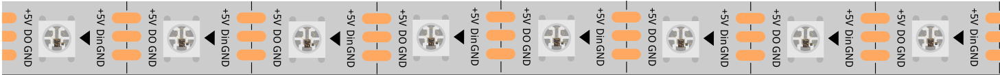

.. note::

    Ciao, benvenuto nella community di appassionati di SunFounder Raspberry Pi & Arduino & ESP32 su Facebook! Approfondisci le tue conoscenze su Raspberry Pi, Arduino ed ESP32 insieme ad altri appassionati.

    **Perché unirti?**

    - **Supporto esperto**: Risolvi i problemi post-vendita e le sfide tecniche con l'aiuto della nostra comunità e del nostro team.
    - **Impara e condividi**: Scambia consigli e tutorial per migliorare le tue competenze.
    - **Anteprime esclusive**: Accedi in anteprima agli annunci di nuovi prodotti e alle anticipazioni.
    - **Sconti speciali**: Approfitta di sconti esclusivi sui nostri prodotti più recenti.
    - **Promozioni e omaggi festivi**: Partecipa a promozioni e omaggi durante le festività.

    👉 Sei pronto a esplorare e creare con noi? Clicca su [|link_sf_facebook|] e unisciti oggi stesso!

.. _cpn_ws2812:

Striscia LED RGB WS2812 con 8 LED
=======================================

La striscia LED RGB WS2812 con 8 LED è composta da 8 LED RGB. È sufficiente 
un solo pin per controllare tutti i LED. Ogni LED RGB ha un chip WS2812, che 
può essere controllato indipendentemente. Può realizzare una visualizzazione 
di luminosità a 256 livelli e una visualizzazione a colori veri completa di 
16.777.216 colori. Allo stesso tempo, il pixel contiene un circuito di pilotaggio 
con amplificatore di segnale digitale ad interfaccia intelligente e un circuito 
di rimodellamento del segnale integrato per garantire efficacemente la coerenza 
cromatica dei punti luce pixel.

È flessibile, può essere connessa, piegata e tagliata a piacere, e sul retro è 
dotata di nastro adesivo, che consente di fissarla su superfici irregolari e 
installarla in spazi ristretti.

**Caratteristiche**

* Tensione di lavoro: DC5V
* IC: Un IC controlla un LED RGB
* Consumo: 0.3W per LED
* Temperatura di lavoro: -15-50°C
* Colore: RGB a colori pieni
* Tipo RGB: 5050RGB (IC WS2812B integrato)
* Spessore della striscia luminosa: 2mm
* Ogni LED può essere controllato individualmente

**Introduzione a WS2812B**

* `WS2812B Datasheet <https://cdn-shop.adafruit.com/datasheets/WS2812B.pdf>`_

WS2812B è una sorgente luminosa a LED a controllo intelligente in cui il circuito 
di controllo e il chip RGB sono integrati in un pacchetto di componenti 5050. 
Include un circuito di pilotaggio con amplificatore di segnale digitale e un'oscillatore 
interno di precisione, oltre a una parte di controllo della corrente costante programmabile 
a 12V, garantendo efficacemente la coerenza cromatica dei punti luce pixel.

Il protocollo di trasferimento dati utilizza una modalità di comunicazione 
NZR singola. Dopo il reset dell'alimentazione del pixel, la porta DIN riceve 
i dati dal controller; il primo pixel raccoglie i primi 24 bit di dati e li 
invia al latch dei dati interni, mentre gli altri dati, rimodellati dal circuito 
di amplificazione del segnale interno, vengono inviati al pixel successivo tramite 
la porta DO. Dopo la trasmissione di ogni pixel, il segnale si riduce di 24 bit. 
I pixel adottano la tecnologia di trasmissione automatica rimodellata, facendo sì 
che il numero di pixel in cascata non sia limitato dalla trasmissione del segnale, 
dipendendo solo dalla velocità di trasmissione del segnale.

Il LED con bassa tensione di pilotaggio è ecologico e a risparmio energetico, 
con alta luminosità, ampio angolo di diffusione, buona coerenza, basso consumo 
energetico, lunga durata e altri vantaggi. Il chip di controllo integrato nel LED 
rende il circuito più semplice, di piccole dimensioni e facile da installare.

**Esempi**

* :ref:`ar_rgb_strip` (Progetto Arduino)
* :ref:`ar_flowing_light` (Progetto Arduino)
* :ref:`py_rgb_strip` (Progetto MicroPython)
* :ref:`py_flowing_light` (Progetto MicroPython)
* :ref:`py_color_gradient` (Progetto MicroPython)
