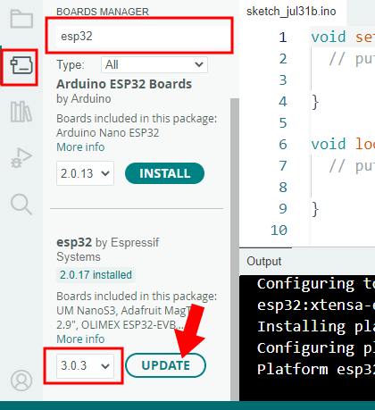
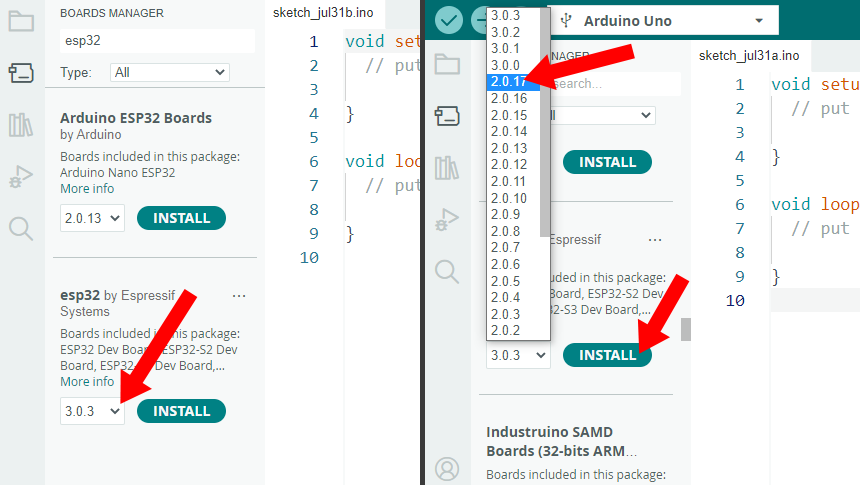

一部のプロジェクトコードがコンパイルに失敗する？
============================================================

Q1: ``'ledcAttach' was not declared in this scope``
---------------------------------------------------------------

LED、RGB LED、またはパッシブブザーを使用する場合、ESP32ボードの |link_ledc| ペリフェラルがPWM信号を生成する必要があります。しかし、ESP32ボードは最近バージョン3.0にアップグレードされ、|link_ledc|ペリフェラル内の関数名と使用方法が変更されました。

そのため、コードを対応して更新しました。コンパイル中にledc関連の問題が発生した場合は、ESP32ボードのバージョンを3.0以上にアップグレードしてください。

Q2: ESP32をバージョン3.0にアップグレードした後、BluetoothおよびIR受信機関連のプロジェクトでエラーが発生する？
-------------------------------------------------------------------------------------------------------------------

ESP32ボードはバージョン3.0にアップグレードされましたが、BluetoothおよびIR受信機関連のプロジェクトで使用されているライブラリはまだバージョン3.0と互換性がありません。

これらのプロジェクトを実行するには、一時的にESP32のバージョンを2.0、具体的にはバージョン2.0.17にダウングレードすることをお勧めします。

これらのライブラリの更新を継続的に監視し、ESP32バージョン3.0と互換性がある場合は、迅速にコードとドキュメントを更新します。

