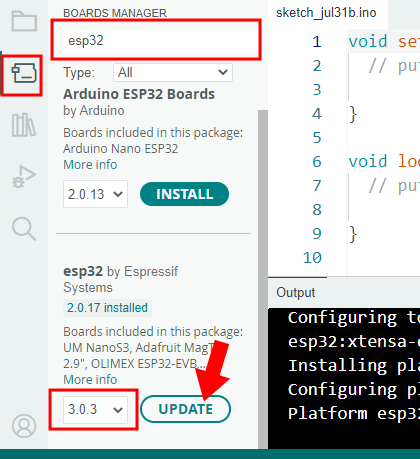
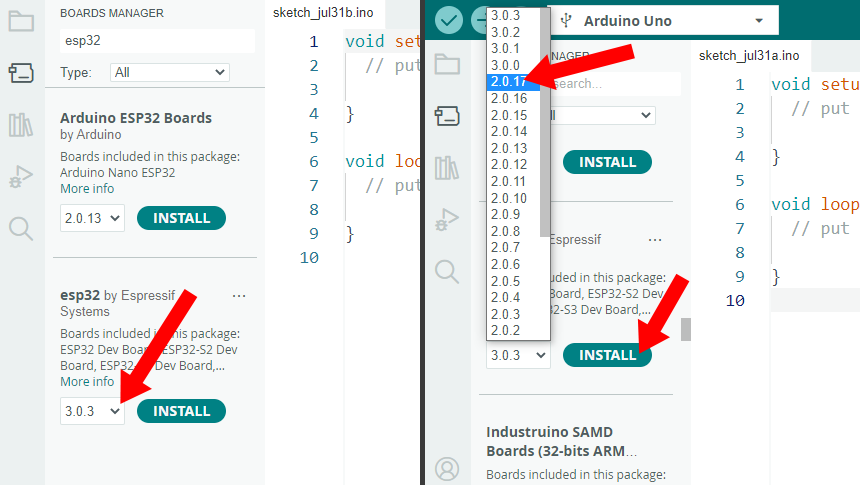

Alcuni codici di progetto non riescono a compilarsi?
==========================================================

Q1: ``'ledcAttach' non è stato dichiarato in questo ambito``
-----------------------------------------------------------------

Quando si utilizzano LED, LED RGB o buzzer passivi, sarà necessario utilizzare la periferica |link_ledc| della scheda ESP32 per generare segnali PWM. Tuttavia, la scheda ESP32 è stata recentemente aggiornata alla versione 3.0, che ha comportato cambiamenti nei nomi delle funzioni e nel loro utilizzo all'interno della periferica |link_ledc|.

Pertanto, abbiamo aggiornato il nostro codice di conseguenza. Se riscontri problemi relativi a ledc durante la compilazione, ti consigliamo di aggiornare la tua scheda ESP32 alla versione 3.0 o superiore.

Q2: Errori nei progetti relativi a Bluetooth e ricevitore IR dopo l'aggiornamento della ESP32 alla versione 3.0?
---------------------------------------------------------------------------------------------------------------------

La scheda ESP32 è stata aggiornata alla versione 3.0, ma le librerie utilizzate nei progetti relativi a Bluetooth e ricevitore IR non sono ancora compatibili con la versione 3.0.

Per eseguire questi progetti, si consiglia di effettuare un downgrade temporaneo della versione ESP32 alla 2.0, specificamente alla versione 2.0.17.

Monitoreremo continuamente gli aggiornamenti di queste librerie e, non appena saranno compatibili con la versione 3.0 della ESP32, aggiorneremo prontamente il nostro codice e la nostra documentazione.

.. _download_mode:

Q3: Errore “Wrong boot mode detected (0x13)” durante il flashing del firmware ESP32
--------------------------------------------------------------------------------------

Quando si esegue il flashing del firmware ESP32 con Thonny o si carica il codice sull’ESP32 utilizzando l’Arduino IDE, potrebbe comparire il seguente errore:

.. code-block:: text

    A fatal error occurred: Failed to connect to ESP32: Wrong boot mode detected (0x13)! The chip needs to be in download mode.

Questo errore **non** indica un problema hardware con la scheda ESP32.  
Può verificarsi quando il computer non riesce a mettere automaticamente l’ESP32 in **modalità download** durante il processo di flashing.

**Causa**

L’ESP32 deve essere in **modalità download** per poter eseguire correttamente il flashing del firmware.  
In alcuni ambienti, il trigger automatico per entrare in download mode potrebbe non funzionare correttamente a causa di differenze di temporizzazione nei driver USB, nel comportamento della porta USB o nel modo in cui il sistema operativo gestisce i segnali DTR/RTS.  
Di conseguenza, l’ESP32 rimane in modalità di esecuzione normale e il flashing fallisce.

**Soluzione**

Se si verifica questo errore, è possibile entrare manualmente in modalità download prima del flashing:

* **Utilizzando i pulsanti (BOOT + EN/RST):**  
  Tenere premuto il pulsante ``BOOT``, premere brevemente ``EN`` (o ``RST``), quindi rilasciare ``BOOT``.  
  Questo forza l’ESP32 a entrare in modalità download.

* **Utilizzando un cavallotto (jumper wire):**  
  Collegare ``GPIO0`` a ``GND`` con un jumper, quindi premere ``EN`` (o riavviare la scheda) per entrare in modalità download.  
  Dopo il flashing, rimuovere il jumper per consentire l’avvio normale.

**Note**

* Assicurarsi di utilizzare un **cavo dati** (non solo di ricarica).  
* Se il problema persiste, provare a cambiare porta USB, aggiornare il driver USB-seriale oppure ridurre la velocità in baud (ad es. ``115200``).
