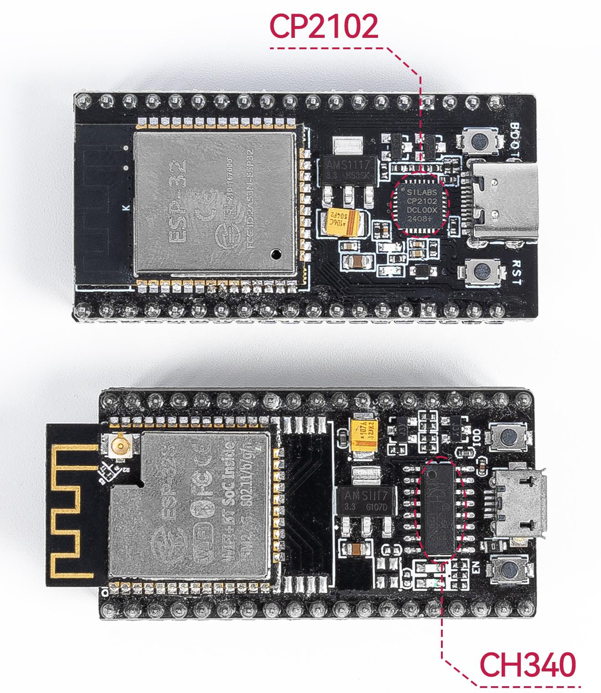

.. note::

    こんにちは、SunFounderのRaspberry Pi & Arduino & ESP32愛好家コミュニティへようこそ！Facebook上でRaspberry Pi、Arduino、ESP32についてもっと深く掘り下げ、他の愛好家と交流しましょう。

    **参加する理由は？**

    - **エキスパートサポート**：コミュニティやチームの助けを借りて、販売後の問題や技術的な課題を解決します。
    - **学び＆共有**：ヒントやチュートリアルを交換してスキルを向上させましょう。
    - **独占的なプレビュー**：新製品の発表や先行プレビューに早期アクセスしましょう。
    - **特別割引**：最新製品の独占割引をお楽しみください。
    - **祭りのプロモーションとギフト**：ギフトや祝日のプロモーションに参加しましょう。

    👉 私たちと一緒に探索し、創造する準備はできていますか？[|link_sf_facebook|]をクリックして今すぐ参加しましょう！

.. _install_driver:

ESP32用ドライバを手動でインストールする
========================================

ESP32ボードをUSBでパソコンに接続しても、Arduino IDEやThonny IDEで**ポートが表示されない**（または**COM1**しか表示されない）場合は、パソコンがボードを認識していない可能性があります。  
この場合は、USBドライバを手動でインストールする必要があります。

ESP32ボードには2種類のUSB-シリアル変換チップが使われています：

- **CP2102**
- **CH340**

機能的には同じですが、必要なUSBドライバが異なります。

* ESP32ボードに **CH340** チップが使用されている場合は、以下のガイドに従ってください：

  * :ref:`driver_ch340`

* **CP2102** チップが使用されている場合は、以下のガイドを参照してください：

  * :ref:`driver_cp2102`

.. _driver_ch340:

CH340ドライバのインストール方法
----------------------------------------

このセクションでは、CH340ドライバを各OSにインストールする方法を説明します。多くの場合、ドライバは自動的にインストールされますが、システム構成によっては初回接続時に手動インストールが必要になることがあります。

ドライバ
^^^^^^^^^^^^

CH340チップはWCH社によって製造されています。以下に、公式WCHサイトからダウンロードできる各OS向けドライバのリンクを示します：

* `Windows (ZIP) <https://www.wch.cn/download/file?id=5>`_ -- バージョン3.4（2024-10-16）
* `Windows (EXE) <https://www.wch.cn/download/file?id=65>`_ -- 実行形式のインストーラ
* `Mac (ZIP) <https://www.wch.cn/download/file?id=178>`_ -- バージョン1.5（2025-02-26）
* `Linux (ZIP) <https://www.wch.cn/download/file?id=177>`_ -- バージョン1.5（2024-10-24）

また、最新バージョンはWCHの中国語公式サイトからも確認できます：

* `WCH Driver Download <https://www.wch.cn/downloads/CH343SER_EXE.html>`_

Google Chromeを使用している場合は、ページの翻訳機能を利用することができます。

次に、各OSにおけるCH340ドライバのインストール手順を説明します。

Windows 7/11
^^^^^^^^^^^^^^^^^^^^^

#. ドライバをダウンロードします。

   * `Windows (ZIP) <https://www.wch.cn/download/file?id=5>`_
   * `Windows (EXE) <https://www.wch.cn/download/file?id=65>`_

#. ``.exe`` ファイルをダブルクリックします。ZIP版を使用する場合は、まず解凍してから ``.exe`` を実行します。

#. 以前のドライバを削除するには「Uninstall」、その後「Install」をクリックします。

   .. image:: img/driver_ch340_install.png

#. インストール後、「デバイスマネージャー」を開きます。（スタートボタンや ⊞ + R キーを押して ``devmgmt.msc`` と入力）

   .. image:: img/driver_ch340_device.png

#. 「ポート（COMとLPT）」を展開し、**USB-SERIAL CH340 (COM##)** が表示されることを確認します。

   .. image:: img/driver_ch340_com.png

macOS
^^^^^^^^^^^^

#. ドライバパッケージをダウンロード・解凍します。

   * `Mac (ZIP) <https://www.wch.cn/download/file?id=178>`_

#. フォルダ内の ``.pkg`` ファイルをダブルクリックしてインストールを開始します。

   .. note::

      「システム拡張がブロックされました」や「未確認の開発元」などの警告が出る場合は、  
      **システム設定 > プライバシーとセキュリティ** へ移動し、WCHの拡張機能を「許可」してください。  
      パスワードの入力が求められることがあります。再起動が必要です。

   .. image:: img/driver_ch340_install_mac.png
      :width: 500
      :align: center

#. ドライバの動作確認：CH340デバイスを接続し、ターミナルを開いて以下を実行：

   .. code-block::

      ls /dev/cu*

#. ``/dev/cu.usbserial*****`` のようなデバイスが表示されれば、正常にインストールされています。

   .. image:: img/driver_ch340_mac_port.png
      :width: 500
      :align: center

Linux
^^^^^^^^^^^

#. 多くのLinuxディストリビューションにはCH340ドライバが含まれており、接続するだけで動作します。  
   認識されない場合は以下を実行してシステムを更新します：

   .. code-block::

      sudo apt-get update
      sudo apt-get upgrade

#. 手動でLinux用ドライバをインストールする場合は、以下からダウンロードしてください：

   * `Linux (ZIP) <https://www.wch.cn/download/file?id=177>`_

#. ESP32ボードを再接続し、次のコマンドをターミナルで実行します：

   .. code-block::

      ls /dev/ttyUSB*

#. ``/dev/ttyUSB0`` のような表示があれば、ドライバは正常に動作しています。

.. _driver_cp2102:

CH2102 ドライバのインストール方法
-----------------------------------

このガイドでは、CH2102 USB-シリアルドライバを各オペレーティングシステムにインストールする手順を説明します。  
多くの場合、ドライバはOSによって自動的にインストールされますが、システムのバージョンや構成によっては、初めてCH2102デバイスを接続する際に手動でインストールする必要がある場合があります。

Windows
^^^^^^^^^^^^^

#. `Silicon Labs USB to UART Bridge VCP Drivers <https://www.silabs.com/developers/usb-to-uart-bridge-vcp-drivers?tab=downloads>`_ ページにアクセスし、**CP210x_Universal_Windows_Driver** をダウンロードします。

#. ZIPファイルを解凍し、``.inf`` ファイルを右クリックして **インストール** を選択します。画面の指示に従ってインストールを完了してください。

   .. image:: img/driver_cp2102_install.png

#. インストールが完了したら、CP2102デバイスをUSBポートに接続します。  
   **デバイスマネージャー** を開きます（⊞ Win + Rを押し、 ``devmgmt.msc`` と入力してEnter）。

#. **ポート（COMとLPT）** を展開すると、 ``Silicon Labs CP210x USB to UART Bridge (COM#)`` というエントリが表示されます。

   .. image:: img/driver_cp2102_com.png

#. 警告アイコンなしで表示されていれば、ドライバは正しくインストールされています。

macOS
^^^^^^^^^^^^

CP2102 USB-UARTブリッジはSilicon Labs製です。最近のmacOSバージョンでは基本的なサポートが含まれている場合がありますが、完全な互換性と安定性のために公式ドライバのインストールが推奨されます。

#. `USB to UART Bridge VCP Drivers <https://www.silabs.com/developer-tools/usb-to-uart-bridge-vcp-drivers?tab=downloads>`_ ページにアクセスし、システム（Apple Silicon または Intel）に適した **CP210x VCP Mac OSX Driver** をダウンロードします。

#. ダウンロードしたZIPファイルを解凍し、含まれている ``.dmg`` ファイルをダブルクリックしてマウントします。

#. マウントされたボリューム内で **Install CP210x VCP Driver.app** を実行します。

#. 画面の指示に従ってインストールを完了してください。

   .. image:: img/driver_cp2102_mac_install.png
      :width: 500

#. macOS 10.13以降では、ドライバ拡張がブロックされることがあります。以下の操作を行ってください：

   * **システム設定 > プライバシーとセキュリティ** に移動
   * Silicon Labsの拡張機能の横にある **許可** をクリック
   * 必要であればロックアイコンをクリックし、パスワードを入力して設定を解除
   * Macを再起動して変更を適用

#. インストールが完了したら、 **Macを再起動** してください（まだの場合）。

#. ドライバが正しくインストールされたか確認するには、ターミナルを開いて次のコマンドを実行：

   .. code-block::

      ls /dev/cu.*

#. 以下のようなデバイスが表示されていれば、ドライバは正常に機能しています：

   .. code-block::

      /dev/cu.SLAB_USBtoUART

Linux
^^^^^^^^^^^^^

#. ほとんどのLinuxディストリビューション（Ubuntu、Debian、Fedoraなど）にはCP2102ドライバのサポートが組み込まれており、デバイスを接続するだけで自動的に利用可能になります。

#. デバイスが認識されない場合は、以下のコマンドでシステムを更新してください：

   .. code-block::

      sudo apt-get update
      sudo apt-get upgrade

#. 更新後、CP2102デバイスを再接続し、次のコマンドを実行します：

   .. code-block::

      ls /dev/ttyUSB*

#. ドライバが正しく動作していれば、次のような出力が表示されます：

   .. code-block::

      /dev/ttyUSB0

#. また、カーネルログを確認して認識されたかどうか確認できます：

   .. code-block::

      dmesg | grep ttyUSB
