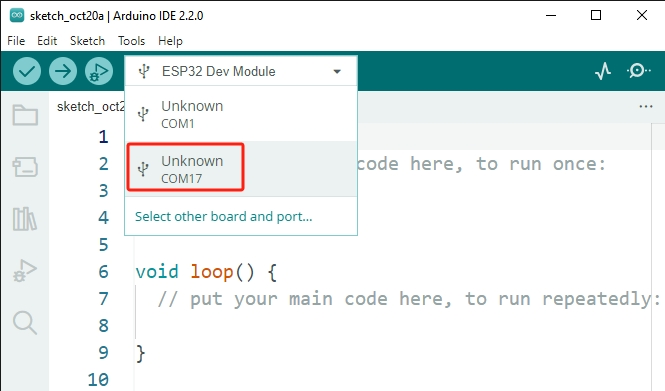

.. note::

    Ciao, benvenuto nella Community di SunFounder per appassionati di Raspberry Pi, Arduino ed ESP32 su Facebook! Approfondisci le tue conoscenze su Raspberry Pi, Arduino ed ESP32 insieme ad altri appassionati.

    **Perché unirti?**

    - **Supporto esperto**: Risolvi problemi post-vendita e sfide tecniche con l'aiuto della nostra community e del nostro team.
    - **Impara e Condividi**: Scambia consigli e tutorial per migliorare le tue competenze.
    - **Anteprime Esclusive**: Ottieni accesso anticipato agli annunci di nuovi prodotti e anteprime speciali.
    - **Sconti Speciali**: Godi di sconti esclusivi sui nostri prodotti più recenti.
    - **Promozioni e Omaggi Festivi**: Partecipa a omaggi e promozioni festive.

    👉 Pronto a esplorare e creare con noi? Clicca su [|link_sf_facebook|] e unisciti oggi stesso!

.. _unknown_com_port:

Vedi sempre "COMxx sconosciuto"?
=======================================

Quando colleghi l'ESP32 al computer, l'Arduino IDE spesso mostra ``COMxx sconosciuto``. Perché accade questo?

Questo succede perché il driver USB per ESP32 è diverso da quello delle schede Arduino regolari. L'Arduino IDE non può riconoscere automaticamente questa scheda.

In questo caso, è necessario selezionare manualmente la scheda corretta seguendo questi passaggi:

#. Clicca su **"Seleziona un'altra scheda e porta"**.

    .. image:: img/unknown_select.png

#. Nella ricerca, digita **"esp32 dev module"**, quindi seleziona la scheda che appare. Successivamente, seleziona la porta corretta e clicca su **OK**.

    .. image:: img/unknown_board.png

#. Ora dovresti essere in grado di vedere la tua scheda e porta in questa finestra di visualizzazione rapida.

    .. image:: img/unknown_correct.png
