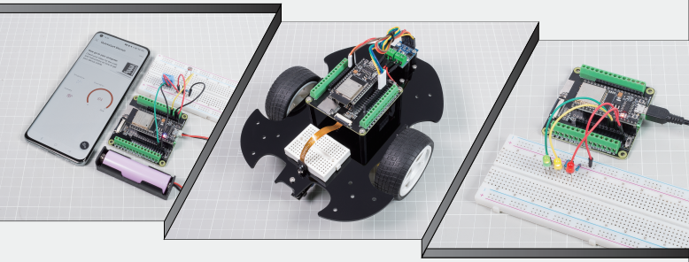
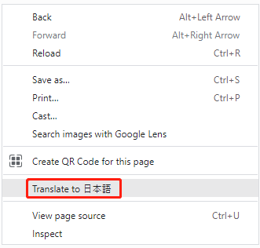

.. note::

    こんにちは、SunFounderのRaspberry Pi & Arduino & ESP32愛好家コミュニティへようこそ！Facebook上でRaspberry Pi、Arduino、ESP32についてもっと深く掘り下げ、他の愛好家と交流しましょう。

    **参加する理由は？**

    - **エキスパートサポート**：コミュニティやチームの助けを借りて、販売後の問題や技術的な課題を解決します。
    - **学び＆共有**：ヒントやチュートリアルを交換してスキルを向上させましょう。
    - **独占的なプレビュー**：新製品の発表や先行プレビューに早期アクセスしましょう。
    - **特別割引**：最新製品の独占割引をお楽しみください。
    - **祭りのプロモーションとギフト**：ギフトや祝日のプロモーションに参加しましょう。

    👉 私たちと一緒に探索し、創造する準備はできていますか？[|link_sf_facebook|]をクリックして今すぐ参加しましょう！

SunFounder |link_esp32_starter_kit|
==================================================

SunFounder |link_esp32_starter_kit| をお選びいただき、ありがとうございます。

* |link_esp32_kit|

.. note::
    このドキュメントは以下の言語で利用可能です。
    
        * |link_spanish_tutorials|
        * |link_german_tutorials|
        * |link_jp_tutorials|
        * |link_en_tutorials|
        * |link_fr_tutorials|

    ご希望の言語でドキュメントにアクセスするために、それぞれのリンクをクリックしてください。

Esp32-starter-kitへようこそ！この包括的なキットは、ESP32マイクロコントローラの多機能な世界を初心者から熟練開発者まで深く探ることを目的として設計されています。中心にはESP32 WROOM 32Eがあり、LED、センサー、モーターなどの付属部品が豊富に揃っているので、さまざまなプロジェクトを探索できます。

基本的な電子工作からIoTの統合まで、このキットには全てが備わっています。MicroPythonの愛好者のために、MicroPythonの構造化された導入から、IDEのセットアップや基本的な文法のレッスンまで提供しています。Arduinoユーザーも忘れられておらず、Arduinoを始めるための専用セクションや基本プロジェクトのスイートが含まれていて、学習プロセスをスタートできます。

クリエイティブな方には、Scratchとの統合に関する楽しいセクションがあり、プログラミングとストーリーテリングの融合を実現します。キット内の各プロジェクトは綿密に概説されており、目的、回路の組み立て、プログラミングの側面を理解することを確実にします。

多数のゲームプロジェクト、実用的なアプリケーション、トラブルシューティングのFAQを備えたこのキットは、全てのユーザーに豊かな学習経験を約束します。ESP32の冒険を始めてみましょう！

ご質問や他の興味深いアイディアがあれば、service@sunfounder.comまでメールをお送りください。

**表示言語について**

英語に加えて、このコースの他の言語に取り組んでいます。協力に興味がある方はservice@sunfounder.comまでご連絡ください。ご協力いただいた方には無料で製品を提供いたします。
それまでは、Google Translateを使用して英語をお求めの言語に変換することをおすすめします。

手順は以下の通りです。

* このコースのページで、右クリックして **Translate to xx** を選択します。現在の言語が望むものでない場合は、後で変更できます。

* 右上隅に言語のポップアップが表示されます。メニューボタンをクリックして **choose another language** します。

.. image:: img/translate2.png
    :align: center

* 反転した三角形のボックスから言語を選択し、 **Done** をクリックします。

.. image:: img/translate3.png
    :align: center

.. toctree::
    :maxdepth: 2

    このキットについて <self>
    download_code
    arduino/for_arduino_user
    arduino_video_course/arduino_video_course
    micropython/for_micropython_user
    scratch/play_with_scratch
    components/component_list
    faq/faq
    thank-learning

著作権に関する通知
-----------------------

このマニュアルに含まれるテキスト、画像、コードなど全ての内容はSunFounder社が所有しています。関連する規定や著作権法のもとで、著者や関連する権利保持者の合法的権利を侵害することなく、個人的な学習、調査、楽しみ、またはその他の非営利目的のためにのみ使用する必要があります。許可なく商業的利益のためにこれらを使用する個人や組織に対して、会社は法的措置を取る権利を留保します。
