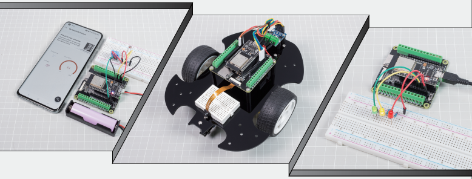

.. note::

    Bonjour, bienvenue dans la communauté des passionnés de SunFounder Raspberry Pi & Arduino & ESP32 sur Facebook ! Plongez plus profondément dans Raspberry Pi, Arduino et ESP32 avec d'autres passionnés.

    **Pourquoi nous rejoindre ?**

    - **Support d'experts** : Résolvez les problèmes après-vente et les défis techniques avec l'aide de notre communauté et de notre équipe.
    - **Apprendre et partager** : Échangez des astuces et des tutoriels pour améliorer vos compétences.
    - **Aperçus exclusifs** : Accédez en avant-première aux nouvelles annonces de produits et aux aperçus.
    - **Réductions spéciales** : Profitez de réductions exclusives sur nos nouveaux produits.
    - **Promotions festives et concours** : Participez à des concours et à des promotions de vacances.

    👉 Prêt à explorer et créer avec nous ? Cliquez sur [|link_sf_facebook|] et rejoignez-nous dès aujourd'hui !

SunFounder |link_esp32_starter_kit|
==================================================

Merci d'avoir choisi notre |link_esp32_starter_kit|.

* |link_esp32_kit|

.. note::
    Ce document est disponible dans les langues suivantes.

        * |link_spanish_tutorials|
        * |link_german_tutorials|
        * |link_jp_tutorials|
        * |link_en_tutorials|
        * |link_fr_tutorials|
        * |link_it_tutorials|

    Veuillez cliquer sur les liens respectifs pour accéder au document dans la langue de votre choix.

Bienvenue dans le Kit d'Apprentissage ESP32 ! Ce package complet est conçu pour offrir aux débutants comme aux développeurs chevronnés une plongée profonde dans le monde polyvalent du microcontrôleur ESP32. Avec l'ESP32 board en son cœur, et une gamme de composants accompagnants comme des LED, des capteurs, des moteurs, et plus encore, les utilisateurs peuvent explorer une vaste gamme de projets.

Que vous soyez intéressé par l'électronique de base ou les intégrations IoT, ce kit a tout ce qu'il vous faut. Pour les amateurs de MicroPython, nous offrons une introduction structurée à MicroPython, avec des configurations d'IDE et des leçons de syntaxe de base. Les utilisateurs d'Arduino ne sont pas en reste, avec une section dédiée pour bien commencer avec Arduino, et une suite de projets de base pour lancer le processus d'apprentissage.

Pour les créatifs, il y a une section agréable sur l'intégration avec Scratch, permettant de mêler programmation et narration. Chaque projet dans le kit est méticuleusement détaillé, garantissant que vous comprenez les objectifs, l'assemblage du circuit et les aspects de programmation.

Avec une myriade de projets de jeux, d'applications pratiques et de FAQ de dépannage, ce kit promet une expérience d'apprentissage enrichissante pour tous. Plongez et laissez l'aventure ESP32 commencer !

Si vous avez des questions ou d'autres idées intéressantes, n'hésitez pas à envoyer un e-mail à service@sunfounder.com.

.. toctree::
    :maxdepth: 2

    About this Kit <self>
    download_code
    arduino/for_arduino_user
    arduino_video_course/arduino_video_course
    micropython/for_micropython_user
    scratch/play_with_scratch
    components/component_list
    faq/faq
    thank-learning

Avis de droits d'auteur
---------------------------

Tous les contenus, y compris mais sans s'y limiter les textes, les images et le code de ce manuel, sont la propriété de la société SunFounder. Vous ne devez les utiliser que pour des études personnelles, des enquêtes, des loisirs ou d'autres fins non commerciales ou sans but lucratif, conformément aux réglementations et lois sur les droits d'auteur en vigueur, sans enfreindre les droits légaux de l'auteur et des détenteurs de droits concernés. Pour toute personne ou organisation utilisant ces contenus à des fins commerciales sans autorisation, la société se réserve le droit d'engager des poursuites judiciaires.
