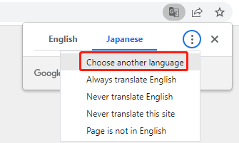

SunFounder ESP32 Starter Kit
==================================================

Danke, dass Sie sich für unser ESP32 Starter Kit entschieden haben.

.. note::
    Dieses Dokument ist in den folgenden Sprachen verfügbar.

        * |link_german_tutorials|
        * |link_jp_tutorials|
        * |link_en_tutorials|
    
    Bitte klicken Sie auf die jeweiligen Links, um das Dokument in Ihrer bevorzugten Sprache aufzurufen.

.. image:: img/esp32_ultimate_kit.png

Willkommen beim ESP32 Lernkit! Dieses umfassende Paket ist sowohl für Anfänger als auch für erfahrene Entwickler konzipiert, um einen tiefen Einblick in die vielseitige Welt des ESP32-Mikrocontrollers zu erhalten. Mit dem ESP32 WROOM 32E als Herzstück und einer Reihe von begleitenden Komponenten wie LEDs, Sensoren, Motoren und mehr können Benutzer eine Vielzahl von Projekten erkunden.

Ob Sie sich für Grundlagen der Elektronik oder IoT-Integrationen interessieren, dieses Kit bietet alles. Für MicroPython-Begeisterte bieten wir eine strukturierte Einführung in MicroPython, komplett mit Einrichtungen der IDE und Grundlagen der Syntax. Auch Arduino-Anwender kommen nicht zu kurz, mit einem eigenen Abschnitt zum Einstieg in Arduino und einer Sammlung von Grundprojekten, um den Lernprozess zu starten.

Für Kreative gibt es einen reizvollen Abschnitt zur Integration mit Scratch, der Programmierung und Geschichtenerzählen verbindet. Jedes Projekt im Kit ist akribisch dargestellt, um sicherzustellen, dass Sie die Ziele, den Schaltungsanbau und die Programmieraspekte verstehen.

Mit einer Fülle von Spielprojekten, praktischen Anwendungen und FAQs zur Fehlersuche verspricht dieses Kit eine bereichernde Lernerfahrung für alle. Tauchen Sie ein und lassen Sie das ESP32-Abenteuer beginnen!

Wenn Sie Fragen haben oder andere interessante Ideen, zögern Sie nicht, eine E-Mail an service@sunfounder.com zu senden.

**Über die Anzeigesprache**

Zusätzlich zu Englisch arbeiten wir an anderen Sprachen für diesen Kurs. Bitte kontaktieren Sie service@sunfounder.com , wenn Sie helfen möchten, und wir werden Ihnen als Dank ein kostenloses Produkt geben.
In der Zwischenzeit empfehlen wir, Google Translate zu verwenden, um Englisch in die Sprache zu übersetzen, die Sie sehen möchten.

Die Schritte sind wie folgt.

* Rechtsklicken Sie auf dieser Kursseite und wählen Sie **Translate to xx**. Wenn die aktuelle Sprache nicht die gewünschte ist, können Sie sie später ändern.

.. image:: img/translate1.png
    :align: center

* Es erscheint ein Sprach-Popup in der oberen rechten Ecke. Klicken Sie auf das Menüsymbol, um **choose another language**.

* Wählen Sie aus dem umgekehrten Dreieckkasten die Sprache aus und klicken Sie dann auf **Done**.

.. image:: img/translate3.png
    :align: center

.. toctree::
    :maxdepth: 2

    Über dieses Kit <self>
    download_code
    components/component_list
    arduino/for_arduino_user
    micropython/for_micropython_user
    scratch/play_with_scratch
    faq/faq
    thank-learning

Urheberrechtshinweis
-----------------------

Alle Inhalte, einschließlich aber nicht beschränkt auf Texte, Bilder und Code in diesem Handbuch sind Eigentum der SunFounder Company. Sie sollten es nur für persönliche Studien, Untersuchungen, Vergnügen oder andere nicht-kommerzielle oder gemeinnützige Zwecke unter Beachtung der entsprechenden Vorschriften und Urheberrechtsgesetze verwenden, ohne die gesetzlichen Rechte des Autors und der relevanten Rechteinhaber zu verletzen. Für jede Einzelperson oder Organisation, die diese ohne Erlaubnis zu kommerziellen Gewinnzwecken nutzt, behält sich das Unternehmen das Recht vor, rechtliche Schritte einzuleiten.
