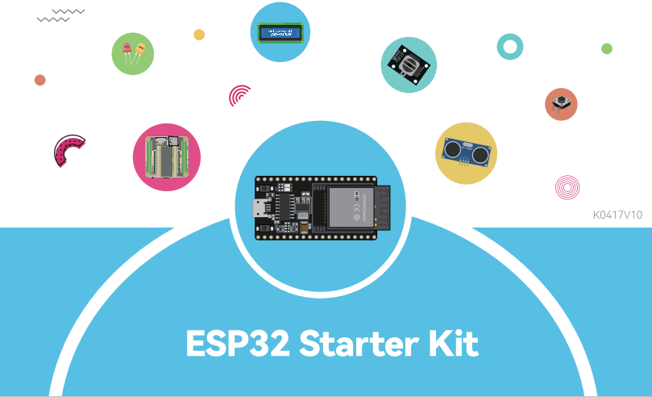

SunFounder ESP32 Starter Kit
==================================================

Welcome to the ESP32 Learning Kit! This comprehensive package is designed to offer both beginners and seasoned developers a deep dive into the versatile world of the ESP32 microcontroller. With the ESP32 WROOM 32E at its core, and a range of accompanying components like LEDs, sensors, motors, and more, users can explore a vast array of projects.

Whether you're keen on basic electronics, IoT integrations, this kit has it all. For MicroPython enthusiasts, we provide a structured introduction to MicroPython, complete with IDE setups and basic syntax lessons. Arduino users are not left behind, with a dedicated section on getting started with Arduino, and a suite of basic projects to jumpstart the learning process.

For the creatives, there's a delightful section on integrating with Scratch, allowing for a blend of programming and storytelling. Each project in the kit is meticulously outlined, ensuring you understand the objectives, the circuit assembly, and the programming aspects.

With a myriad of game projects, practical applications, and troubleshooting FAQs, this kit promises an enriching learning experience for all. Dive in and let the ESP32 adventure begin!

If you have any questions or other interesting ideas, feel free to send an email to cs@sunfounder.com.

**About the display language**

In addition to English, we are working on other languages for this course. Please contact service@sunfounder.com if you are interested in helping, and we will give you a free product in return. 
In the meantime, we recommend using Google Translate to convert English to the language you want to see.

The steps are as follows.

* In this course page, right-click and select **Translate to xx**. If the current language is not what you want, you can change it later.

.. image:: img/translate1.png
    :align: center

* There will be a language popup in the upper right corner. Click on the menu button to **choose another language**.

.. image:: img/translate2.png
    :align: center

* Select the language from the inverted triangle box, and then click **Done**.

.. image:: img/translate3.png
    :align: center

.. toctree::
    :maxdepth: 2

    components/component_list
    arduino/for_arduino_user
    micropython/for_micropython_user
    scratch/play_with_scratch
    faq/faq
    thank-learning

Copyright Notice
-----------------------

All contents including but not limited to texts, images, and code in this manual are owned by the SunFounder Company. You should only use it for personal study, investigation, enjoyment, or other non-commercial or nonprofit purposes, under the related regulations and copyrights laws, without infringing the legal rights of the author and relevant right holders. For any individual or organization that uses these for commercial profit without permission, the Company reserves the right to take legal action.