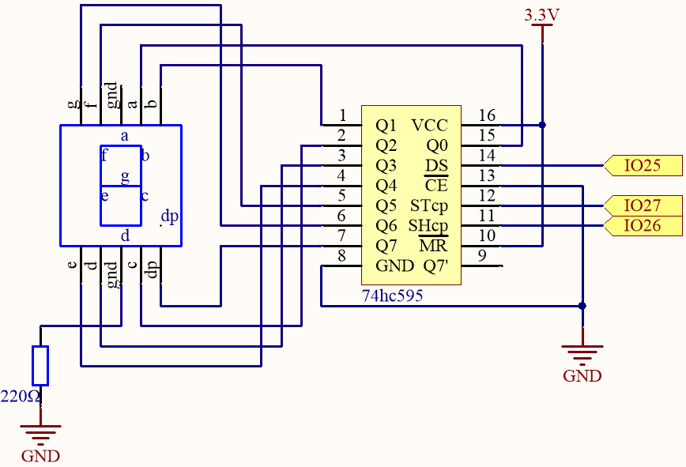

.. _py_74hc_7seg:

1.5 Number Display
=======================

Welcome to this fascinating project! In this project, we will explore the enchanting world of displaying numbers from 0 to 9 on a seven-segment display.

Imagine triggering this project and witnessing a small, compact display glowing brightly with each number from 0 to 9. It's like having a miniature screen that showcases the digits in a captivating way. By controlling the signal pins, you can effortlessly change the displayed number and create various engaging effects.

Through simple circuit connections and programming, you will learn how to interact with the seven-segment display and bring your desired numbers to life. Whether it's a counter, a clock, or any other intriguing application, the seven-segment display will be your reliable companion, adding a touch of brilliance to your projects.

**Available Pins**

Here is a list of available pins on the ESP32 board for this project.

.. list-table::
    :widths: 5 20 

    * - Available Pins
      - IO13, IO12, IO14, IO27, IO26, IO25, IO33, IO32, IO15, IO2, IO0, IO4, IO5, IO18, IO19, IO21, IO22, IO23

**Schematic**

Here the wiring principle is basically the same as :ref:`py_74hc_led`, the only difference is that Q0-Q7 are connected to the a ~ g pins of the 7 Segment Display.

.. list-table:: Wiring
    :widths: 15 25
    :header-rows: 1

    *   - 74HC595
        - LED Segment Display
    *   - Q0
        - a
    *   - Q1
        - b
    *   - Q2
        - c
    *   - Q3
        - d
    *   - Q4
        - e
    *   - Q5
        - f
    *   - Q6
        - g
    *   - Q7
        - dp

**Wiring**

.. image:: ../../img/wiring/2.5_segment_bb.png

* :ref:`cpn_esp32_extension`
* :ref:`cpn_breadboard`
* :ref:`cpn_wires`
* :ref:`cpn_resistor`
* :ref:`cpn_7_segment`
* :ref:`cpn_74hc595`

**Code**

.. note::

    * Open the ``1.5_number_display.py`` file located in the ``esp32-ultimate-kit-main\micropython\codes`` path, or copy and paste the code into Thonny. Then, click "Run Current Script" or press F5 to execute it.
    * Make sure to select the "MicroPython (ESP32).COMxx" interpreter in the bottom right corner. 

.. code-block:: python

    import machine
    import time

    # Define the segment code for a common anode 7-segment display
    SEGCODE = [0x3f, 0x06, 0x5b, 0x4f, 0x66, 0x6d, 0x7d, 0x07, 0x7f, 0x6f]

    # Initialize the pins for the 74HC595 shift register
    sdi = machine.Pin(25, machine.Pin.OUT)  # DS
    rclk = machine.Pin(27, machine.Pin.OUT)  # STcp
    srclk = machine.Pin(26, machine.Pin.OUT)  # SHcp

    # Define the hc595_shift function to shift data into the 74HC595 shift register
    def hc595_shift(dat):
        # Set the RCLK pin to low
        rclk.off()
        
        # Iterate through each bit (from 7 to 0)
        for bit in range(7, -1, -1):
            # Extract the current bit from the input data
            value = 1 & (dat >> bit)
            
            # Set the SRCLK pin to low
            srclk.off()
            
            # Set the value of the SDI pin
            sdi.value(value)
            
            # Clock the current bit into the shift register by setting the SRCLK pin to high
            srclk.on()
            
        # Latch the data into the storage register by setting the RCLK pin to high
        rclk.on()

    # Continuously loop through the numbers 0 to 9 and display them on the 7-segment display
    while True:
        for num in range(10):
            hc595_shift(SEGCODE[num])  # Shift the segment code for the current number into the 74HC595
            time.sleep_ms(500)  # Wait 500 milliseconds before displaying the next number

    

When the script is running, you will be able to see the LED Segment Display display 0~9 in sequence.

**How it works?**

In this project, we are using the ``hc595_shift()`` function to write the binary number to the shift register. 

Suppose that the 7-segment Display display the number "2". This bit pattern corresponds to the segments **f**, **c** and **dp** being turned off (low), while the segments **a**, **b**, **d**, **e** and **g** are turned on (high). This is "01011011" in binary and "0x5b" in hexadecimal notation. 

Therefore, you would need to call **hc595_shift(0x5b)** to display the number "2" on the 7-segment display.

.. image:: img/7_segment2.png

* `Hexadecimal <https://en.wikipedia.org/wiki/Hexadecimal>`_

* `BinaryHex Converter <https://www.binaryhexconverter.com/binary-to-hex-converter>`_

The following table shows the hexadecimal patterns that need to be written to the shift register to display the numbers 0 to 9 on a 7-segment display.

.. list-table:: Glyph Code
    :widths: 20 20 20
    :header-rows: 1

    *   - Numbers	
        - Binary Code
        - Hex Code  
    *   - 0	
        - 00111111	
        - 0x3f
    *   - 1	
        - 00000110	
        - 0x06
    *   - 2	
        - 01011011	
        - 0x5b
    *   - 3	
        - 01001111	
        - 0x4f
    *   - 4	
        - 01100110	
        - 0x66
    *   - 5	
        - 01101101	
        - 0x6d
    *   - 6	
        - 01111101	
        - 0x7d
    *   - 7	
        - 00000111	
        - 0x07
    *   - 8	
        - 01111111	
        - 0x7f
    *   - 9	
        - 01101111	
        - 0x6f

Write these codes into ``hc595_shift()`` to make the LED Segment Display display the corresponding numbers.