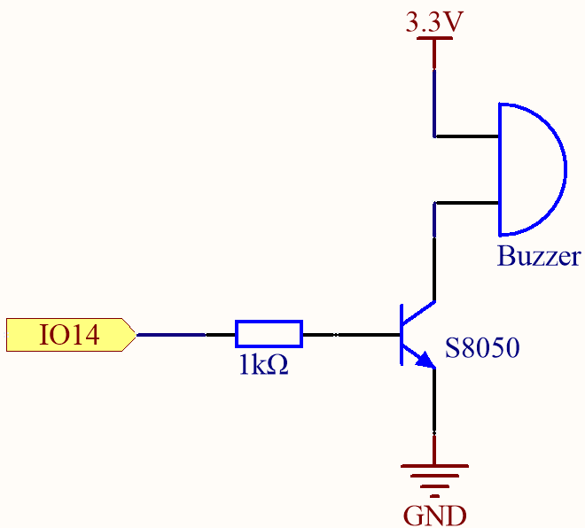
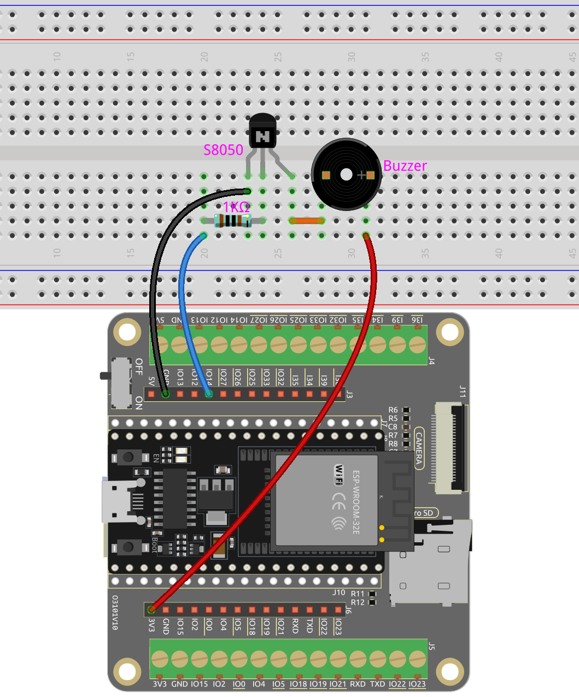

.. note::

    Hallo und willkommen in der SunFounder Raspberry Pi & Arduino & ESP32 Enthusiasten-Gemeinschaft auf Facebook! Tauchen Sie tiefer ein in die Welt von Raspberry Pi, Arduino und ESP32 mit anderen Enthusiasten.

    **Warum beitreten?**

    - **Expertenunterstützung**: Lösen Sie Nachverkaufsprobleme und technische Herausforderungen mit Hilfe unserer Gemeinschaft und unseres Teams.
    - **Lernen & Teilen**: Tauschen Sie Tipps und Anleitungen aus, um Ihre Fähigkeiten zu verbessern.
    - **Exklusive Vorschauen**: Erhalten Sie frühzeitigen Zugang zu neuen Produktankündigungen und exklusiven Einblicken.
    - **Spezialrabatte**: Genießen Sie exklusive Rabatte auf unsere neuesten Produkte.
    - **Festliche Aktionen und Gewinnspiele**: Nehmen Sie an Gewinnspielen und Feiertagsaktionen teil.

    👉 Sind Sie bereit, mit uns zu erkunden und zu erschaffen? Klicken Sie auf [|link_sf_facebook|] und treten Sie heute bei!

.. _py_ac_buz:

3.1 Beep
==================
Dies ist ein einfaches Projekt, um einen aktiven Summer viermal pro Sekunde schnell piepsen zu lassen.

**Benötigte Komponenten**

Für dieses Projekt benötigen wir die folgenden Komponenten.

Es ist definitiv praktisch, ein komplettes Set zu kaufen, hier ist der Link:

.. list-table::
    :widths: 20 20 20
    :header-rows: 1

    *   - Name	
        - ARTIKEL IN DIESEM KIT
        - LINK
    *   - ESP32 Starter Kit
        - 320+
        - |link_esp32_starter_kit|

Sie können diese auch einzeln über die untenstehenden Links kaufen.

.. list-table::
    :widths: 30 20
    :header-rows: 1

    *   - KOMPONENTENBESCHREIBUNG
        - KAUF-LINK

    *   - :ref:`cpn_esp32_wroom_32e`
        - |link_esp32_wroom_32e_buy|
    *   - :ref:`cpn_esp32_camera_extension`
        - |link_esp32_extension_board|
    *   - :ref:`cpn_breadboard`
        - |link_breadboard_buy|
    *   - :ref:`cpn_wires`
        - |link_wires_buy|
    *   - :ref:`cpn_resistor`
        - |link_resistor_buy|
    *   - :ref:`cpn_buzzer`
        - \-
    *   - :ref:`cpn_transistor`
        - |link_transistor_buy|

**Verfügbare Pins**

Hier ist eine Liste der verfügbaren Pins auf dem ESP32-Board für dieses Projekt.

.. list-table::
    :widths: 5 20 

    * - Verfügbare Pins
      - IO13, IO12, IO14, IO27, IO26, IO25, IO33, IO32, IO15, IO2, IO0, IO4, IO5, IO18, IO19, IO21, IO22, IO23

**Schaltplan**

Wenn der IO14-Ausgang hoch ist, leitet der S8050 (NPN-Transistor) nach dem 1K-Strombegrenzungswiderstand (zum Schutz des Transistors), sodass der Summer ertönt.

Die Rolle des S8050 (NPN-Transistor) ist es, den Strom zu verstärken und den Summer lauter klingen zu lassen. Tatsächlich können Sie den Summer auch direkt an IO14 anschließen, aber dann wird der Summer leiser klingen.

**Verdrahtung**

Im Set sind zwei Arten von Summern enthalten. 
Wir benötigen den aktiven Summer. Drehen Sie ihn um, die versiegelte Rückseite (nicht die freiliegende Leiterplatte) ist die, die wir verwenden wollen.

.. image:: ../../components/img/buzzer.png
    :width: 500
    :align: center

Der Summer benötigt beim Betrieb einen Transistor, hier verwenden wir S8050 (NPN-Transistor).

**Code**

.. note::

    * Öffnen Sie die Datei ``3.1_beep.py``, die sich im Pfad ``esp32-starter-kit-main\micropython\codes`` befindet, oder kopieren und fügen Sie den Code in Thonny ein. Klicken Sie dann auf "Aktuelles Skript ausführen" oder drücken Sie F5, um es auszuführen.
    * Stellen Sie sicher, dass Sie den Interpreter "MicroPython (ESP32).COMxx" in der unteren rechten Ecke ausgewählt haben.

.. code-block:: python

    import machine
    import time

    # Create a Pin object representing pin 14 and set it to output mode
    buzzer = machine.Pin(14, machine.Pin.OUT)

    # Enter an infinite loop
    while True:
        # Iterate over the values 0 to 3 using a for loop
        for i in range(4):
            # Turn on the buzzer by setting its value to 1
            buzzer.value(1)
            # Pause for 0.2 seconds
            time.sleep(0.2)
            # Turn off the buzzer
            buzzer.value(0)
            # Pause for 0.2 seconds
            time.sleep(0.2)
        # Pause for 1 second before restarting the for loop
        time.sleep(1)

Wenn das Skript ausgeführt wird, piept der Summer jede Sekunde schnell viermal.

