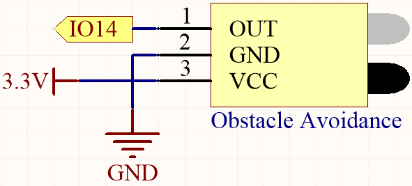
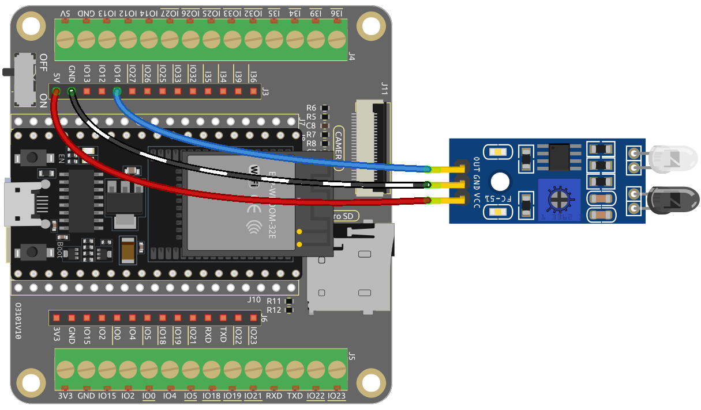

.. note::

    Hallo und willkommen in der SunFounder Raspberry Pi & Arduino & ESP32 Enthusiasten-Gemeinschaft auf Facebook! Tauchen Sie tiefer ein in die Welt von Raspberry Pi, Arduino und ESP32 mit anderen Enthusiasten.

    **Warum beitreten?**

    - **Expertenunterstützung**: Lösen Sie Nachverkaufsprobleme und technische Herausforderungen mit Hilfe unserer Gemeinschaft und unseres Teams.
    - **Lernen & Teilen**: Tauschen Sie Tipps und Anleitungen aus, um Ihre Fähigkeiten zu verbessern.
    - **Exklusive Vorschauen**: Erhalten Sie frühzeitigen Zugang zu neuen Produktankündigungen und exklusiven Einblicken.
    - **Spezialrabatte**: Genießen Sie exklusive Rabatte auf unsere neuesten Produkte.
    - **Festliche Aktionen und Gewinnspiele**: Nehmen Sie an Gewinnspielen und Feiertagsaktionen teil.

    👉 Sind Sie bereit, mit uns zu erkunden und zu erschaffen? Klicken Sie auf [|link_sf_facebook|] und treten Sie heute bei!

.. _py_ir_obstacle:

5.3 Hinderniserkennung
===================================

Dieses Modul wird üblicherweise in Autos und Robotern installiert, um die Existenz von Hindernissen voraus zu erkennen. Es wird auch häufig in Handgeräten, Wasserhähnen und ähnlichem verwendet.

**Benötigte Komponenten**

Für dieses Projekt benötigen wir die folgenden Komponenten.

Es ist definitiv praktisch, ein komplettes Set zu kaufen, hier ist der Link:

.. list-table::
    :widths: 20 20 20
    :header-rows: 1

    *   - Name	
        - ARTIKEL IN DIESEM KIT
        - LINK
    *   - ESP32 Starter Kit
        - 320+
        - |link_esp32_starter_kit|

Sie können diese auch einzeln über die untenstehenden Links kaufen.

.. list-table::
    :widths: 30 20
    :header-rows: 1

    *   - KOMPONENTENBESCHREIBUNG
        - KAUF-LINK

    *   - :ref:`cpn_esp32_wroom_32e`
        - |link_esp32_wroom_32e_buy|
    *   - :ref:`cpn_esp32_camera_extension`
        - |link_esp32_extension_board|
    *   - :ref:`cpn_wires`
        - |link_wires_buy|
    *   - :ref:`cpn_avoid`
        - |link_avoid_buy|

**Verfügbare Pins**

* **Verfügbare Pins**

    Hier ist eine Liste der verfügbaren Pins auf dem ESP32-Board für dieses Projekt.

    .. list-table::
        :widths: 5 20

        *   - Verfügbare Pins
            - IO13, IO14, IO27, IO26, IO25, IO33, I35, I34, I39, I36, IO4, IO18, IO19, IO21, IO22, IO23

* **Strapping Pins (Eingang)**

    Strapping Pins sind eine spezielle Gruppe von Pins, die verwendet werden, um bestimmte Boot-Modi während des Startvorgangs des Geräts 
    (d.h., beim Einschalten) festzulegen.
   
    .. list-table::
        :widths: 5 15

        *   - Strapping Pins
            - IO5, IO0, IO2, IO12, IO15 
    
    Generell wird **nicht empfohlen, sie als Eingangspins zu verwenden**. Wenn Sie diese Pins verwenden möchten, bedenken Sie die möglichen Auswirkungen auf den Bootvorgang. Für weitere Details siehe den Abschnitt :ref:`esp32_strapping`.

**Schaltplan**

Wenn das Hindernisvermeidungsmodul keine Hindernisse erkennt, gibt IO14 ein hohes Signal zurück. Erkennt es jedoch ein Hindernis, wird ein niedriges Signal zurückgegeben. Sie können das blaue Potentiometer anpassen, um die Erkennungsdistanz dieses Moduls zu modifizieren.

**Verdrahtung**

**Code**

.. note::

    * Öffnen Sie die Datei ``5.3_avoid.py``, die sich im Pfad ``esp32-starter-kit-main\micropython\codes`` befindet, oder kopieren und fügen Sie den Code in Thonny ein. Klicken Sie dann auf "Aktuelles Skript ausführen" oder drücken Sie F5, um es auszuführen.
    * Stellen Sie sicher, dass Sie den Interpreter "MicroPython (ESP32).COMxx" in der unteren rechten Ecke ausgewählt haben.

.. code-block:: python

    import machine
    import time

    ir_avoid = machine.Pin(14, machine.Pin.IN, machine.Pin.PULL_UP) # avoid module pin

    while True:

        # Print values of the obstacle avoidance module 
        print(ir_avoid.value()) 
        time.sleep(0.1)

Während das Programm läuft, wird auf dem Serial Monitor der Wert "0" angezeigt, wenn das IR-Hindernisvermeidungsmodul ein Hindernis vor sich erkennt, andernfalls wird der Wert "1" angezeigt.
