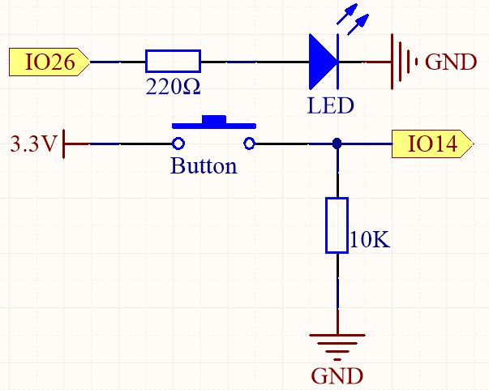

.. _py_button:

5.1 Lectura del Valor del Botón
==============================================

En este proyecto interactivo, nos adentraremos en el ámbito de los controles por botón y la manipulación de LEDs.

El concepto es sencillo pero efectivo. Leeremos el estado de un botón. Cuando el botón se presiona, registra un nivel de voltaje alto, o 'estado alto'. Esta acción entonces hará que un LED se ilumine.

**Componentes Necesarios**

En este proyecto, necesitamos los siguientes componentes.

Es definitivamente conveniente comprar un kit completo, aquí tienes el enlace:

.. list-table::
    :widths: 20 20 20
    :header-rows: 1

    *   - Nombre
        - ELEMENTOS EN ESTE KIT
        - ENLACE
    *   - Kit de Inicio ESP32
        - 320+
        - |link_esp32_starter_kit|

También puedes comprarlos por separado en los enlaces a continuación.

.. list-table::
    :widths: 30 20
    :header-rows: 1

    *   - INTRODUCCIÓN DE COMPONENTES
        - ENLACE DE COMPRA

    *   - :ref:`cpn_esp32_wroom_32e`
        - |link_esp32_wroom_32e_buy|
    *   - :ref:`cpn_esp32_camera_extension`
        - \-
    *   - :ref:`cpn_breadboard`
        - |link_breadboard_buy|
    *   - :ref:`cpn_wires`
        - |link_wires_buy|
    *   - :ref:`cpn_resistor`
        - |link_resistor_buy|
    *   - :ref:`cpn_led`
        - |link_led_buy|
    *   - :ref:`cpn_button`
        - |link_button_buy|

**Pines Disponibles**

* **Pines Disponibles**

    Aquí tienes una lista de los pines disponibles en la placa ESP32 para este proyecto.

    .. list-table::
        :widths: 5 20

        *   - Para Entrada
            - IO14, IO25, I35, I34, I39, I36, IO18, IO19, IO21, IO22, IO23
        *   - Para Salida
            - IO13, IO12, IO14, IO27, IO26, IO25, IO33, IO32, IO15, IO2, IO0, IO4, IO5, IO18, IO19, IO21, IO22, IO23
    
* **Uso Condicional de Pines (Entrada)**

    Los siguientes pines tienen resistencias de pull-up o pull-down integradas, por lo que no se requieren resistencias externas cuando **se usan como pines de entrada**:

    .. list-table::
        :widths: 5 15
        :header-rows: 1

        *   - Pines de Uso Condicional
            - Descripción
        *   - IO13, IO15, IO2, IO4
            - Pull-up con una resistencia de 47K por defecto da un valor alto.
        *   - IO27, IO26, IO33
            - Pull-up con una resistencia de 4.7K por defecto da un valor alto.
        *   - IO32
            - Pull-down con una resistencia de 1K por defecto da un valor bajo.

* **Pines de Arranque (Entrada)**

    Los pines de arranque son un conjunto especial de pines que se utilizan para determinar modos de arranque específicos durante el inicio del dispositivo 
    (es decir, reseteo por encendido).

        
    .. list-table::
        :widths: 5 15

        *   - Pines de Arranque
            - IO5, IO0, IO2, IO12, IO15 
    
    Generalmente, **no se recomienda usarlos como pines de entrada**. Si deseas utilizar estos pines, considera el impacto potencial en el proceso de arranque. Para más detalles, por favor refiérete a la sección :ref:`esp32_strapping`.

**Esquemático**

Para asegurar una funcionalidad adecuada, conecta un lado del pin del botón a 3.3V y el otro lado a IO14. Cuando el botón se presiona, IO14 se establece en alto, causando que el LED se ilumine. Cuando el botón se suelta, IO14 volverá a su estado suspendido, que puede ser alto o bajo. Para asegurar un nivel bajo estable cuando el botón no está presionado, IO14 debe conectarse a GND a través de una resistencia de pull-down de 10K.

**Cableado**

.. image:: ../../img/wiring/5.1_button_bb.png

.. note::
    
    Un botón de cuatro pines está diseñado en forma de H. Cuando el botón no está presionado, los pines izquierdo y derecho están desconectados, y la corriente no puede fluir entre ellos. Sin embargo, cuando el botón se presiona, los pines izquierdo y derecho se conectan, creando un camino para que fluya la corriente.

**Código**

.. note::

    * Abre el archivo ``5.1_read_button_value.py`` ubicado en la ruta ``esp32-starter-kit-main\micropython\codes``, o copia y pega el código en Thonny. Luego, haz clic en "Ejecutar Script Actual" o presiona F5 para ejecutarlo.
    * Asegúrate de seleccionar el intérprete "MicroPython (ESP32).COMxx" en la esquina inferior derecha. 

.. code-block:: python

    import machine
    import time

    button = machine.Pin(14, machine.Pin.IN) # Button pin
    led = machine.Pin(26, machine.Pin.OUT) # LED pin

    while True:
        # If the button is pressed by reading its value
        if button.value() == 1:
            # Turn on the LED by setting its value to 1
            led.value(1)
    #         time.sleep(0.5)
        else:
            # Turn off the LED
            led.value(0)

Durante la ejecución del script, el LED se ilumina cuando presionas el botón y se apaga cuando lo sueltas.
