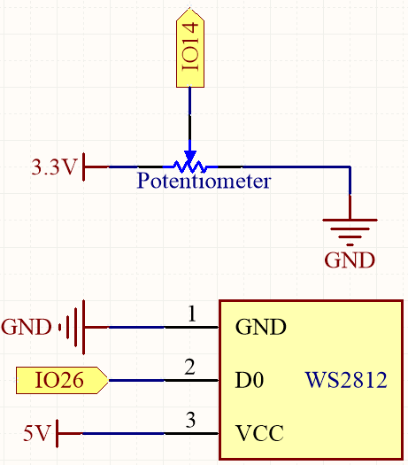
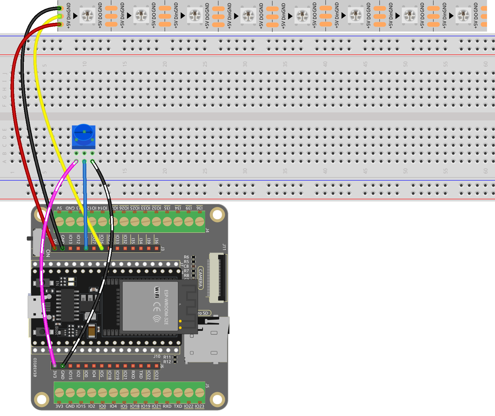

.. _py_color_gradient:

6.5 カラーグラデーション
=========================

色彩の世界を体験する準備はできましたか？このプロジェクトでは、LEDストリップをコントロールして滑らかな色の変化を実現する魔法のような旅に出かけます。家の装飾に色を加えたい場合でも、楽しいプログラミングプロジェクトを探している場合でも、このプロジェクトはあなたをサポートします。さあ、このカラフルな世界に一緒に飛び込みましょう！

**必要な部品**

このプロジェクトには、以下のコンポーネントが必要です。

キット全体を購入すると確かに便利です。こちらがリンクです：

.. list-table::
    :widths: 20 20 20
    :header-rows: 1

    *   - 名前
        - このキットのアイテム
        - リンク
    *   - ESP32 Starter Kit
        - 320+
        - |link_esp32_starter_kit|

以下のリンクから個別に購入することもできます。

.. list-table::
    :widths: 30 20
    :header-rows: 1

    *   - コンポーネントの紹介
        - 購入リンク

    *   - :ref:`cpn_esp32_wroom_32e`
        - |link_esp32_wroom_32e_buy|
    *   - :ref:`cpn_esp32_camera_extension`
        - \-
    *   - :ref:`cpn_breadboard`
        - |link_breadboard_buy|
    *   - :ref:`cpn_wires`
        - |link_wires_buy|
    *   - :ref:`cpn_pot`
        - |link_potentiometer_buy|
    *   - :ref:`cpn_ws2812`
        - |link_ws2812_buy|

**回路図**

このプロジェクトでは、LEDストリップとポテンショメータを使用して色の混合効果を作り出します。ポテンショメータはLEDの色相値を調整するために使用され、その後、色変換関数を使用してRGB値に変換されます。そして、そのRGB値を使ってLEDの色を更新します。

**配線図**

**コード**

.. note::

    * ``esp32-starter-kit-main\micropython\codes`` パスにある ``6.5_color_gradient.py`` ファイルを開くか、コードをThonnyにコピー＆ペーストします。それから、「Run Current Script」をクリックするかF5キーを押して実行します。
    * 右下隅にある「MicroPython (ESP32).COMxx」インタプリタを選択してください。

.. code-block:: python
    
    from machine import Pin, ADC, PWM
    import neopixel
    import time

    NUM_LEDS = 8  # Number of LEDs in the strip
    PIN_NUM = 26  # LED strip
    POT_PIN = 14  # Potentiometer

    # Initialize the potentiometer
    potentiometer = ADC(Pin(POT_PIN))
    potentiometer.atten(ADC.ATTN_11DB)

    # Initialize the NeoPixel LED strip
    np = neopixel.NeoPixel(Pin(PIN_NUM), NUM_LEDS)

    # Function to convert HSL color space to RGB color space
    def hsl_to_rgb(h, s, l):
        # Helper function to convert hue to RGB
        def hue_to_rgb(p, q, t):
            if t < 0:
                t += 1
            if t > 1:
                t -= 1
            if t < 1/6:
                return p + (q - p) * 6 * t
            if t < 1/2:
                return q
            if t < 2/3:
                return p + (q - p) * (2/3 - t) * 6
            return p
        
        if s == 0:
            r = g = b = l
        else:
            q = l * (1 + s) if l < 0.5 else l + s - l * s
            p = 2 * l - q
            r = hue_to_rgb(p, q, h + 1/3)
            g = hue_to_rgb(p, q, h)
            b = hue_to_rgb(p, q, h - 1/3)
        
        return (int(r * 255), int(g * 255), int(b * 255))

    # Function to set the color of all LEDs in the strip
    def set_color(np, color):
        for i in range(NUM_LEDS):
            np[i] = color
        np.write()

    # Main loop
    while True:
        # Read the potentiometer value and normalize it to the range [0, 1]
        pot_value = potentiometer.read() / 4095.0
        hue = pot_value  # Set hue value based on the potentiometer's position
        saturation = 1  # Set saturation to 1 (fully saturated)
        lightness = 0.5  # Set lightness to 0.5 (halfway between black and white)

        # Convert the HSL color to RGB
        current_color = hsl_to_rgb(hue, saturation, lightness)
        
        # Set the LED strip color based on the converted RGB value
        set_color(np, current_color)
        
        # Sleep for a short period to allow for smooth transitions
        time.sleep(0.1)

コードの実行中にポテンショメータをゆっくりと回転させると、RGB ストリップの色が赤から紫にフェードしていくのがわかります。
