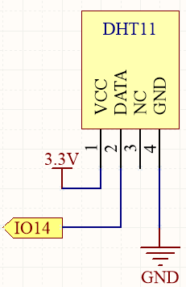
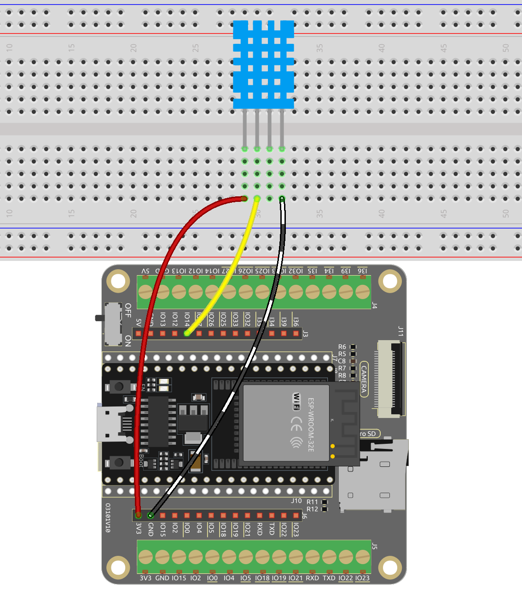
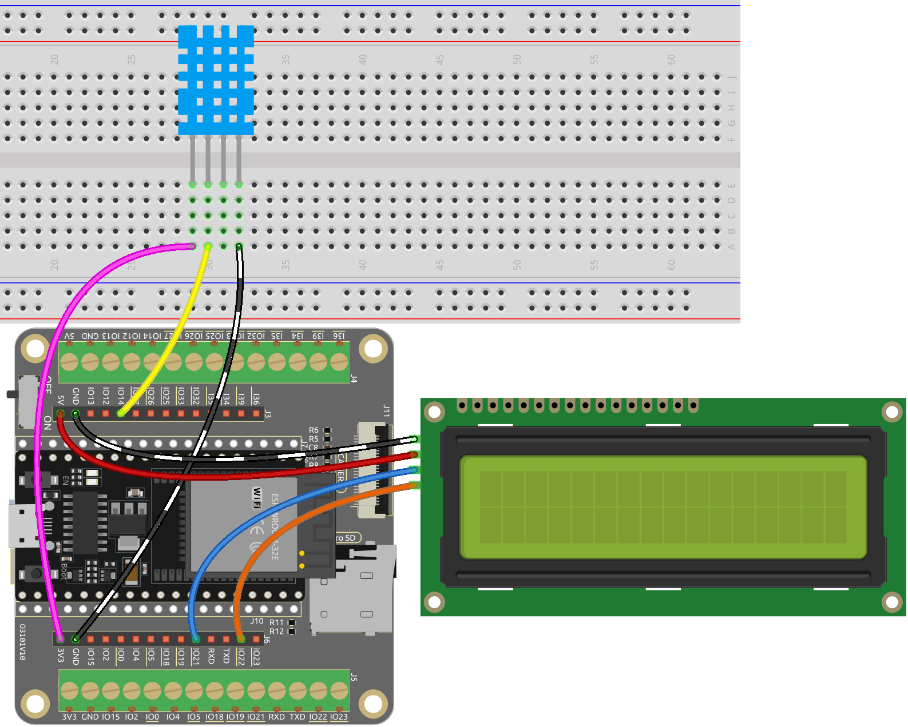

.. note::

    Hello, welcome to the SunFounder Raspberry Pi & Arduino & ESP32 Enthusiasts Community on Facebook! Dive deeper into Raspberry Pi, Arduino, and ESP32 with fellow enthusiasts.

    **Why Join?**

    - **Expert Support**: Solve post-sale issues and technical challenges with help from our community and team.
    - **Learn & Share**: Exchange tips and tutorials to enhance your skills.
    - **Exclusive Previews**: Get early access to new product announcements and sneak peeks.
    - **Special Discounts**: Enjoy exclusive discounts on our newest products.
    - **Festive Promotions and Giveaways**: Take part in giveaways and holiday promotions.

    👉 Ready to explore and create with us? Click [|link_sf_facebook|] and join today!

.. _py_dht11:

5.13 Temperature - Humidity
=======================================
The DHT11 is a temperature and humidity sensor commonly used for environmental measurements. It is a digital sensor that communicates with a microcontroller to provide temperature and humidity readings.

In this project, we will be reading the DHT11 sensor and printing out the temperature and humidity values it detects.

By reading the data provided by the sensor, we can obtain the current temperature and humidity values in the environment. These values can be used for real-time monitoring of environmental conditions, weather observations, indoor climate control, humidity reports, and more.

**Required Components**

In this project, we need the following components. 

It's definitely convenient to buy a whole kit, here's the link: 

.. list-table::
    :widths: 20 20 20
    :header-rows: 1

    *   - Name	
        - ITEMS IN THIS KIT
        - LINK
    *   - ESP32 Starter Kit
        - 320+
        - |link_esp32_starter_kit|

You can also buy them separately from the links below.

.. list-table::
    :widths: 30 20
    :header-rows: 1

    *   - COMPONENT INTRODUCTION
        - PURCHASE LINK

    *   - :ref:`cpn_esp32_wroom_32e`
        - |link_esp32_wroom_32e_buy|
    *   - :ref:`cpn_esp32_camera_extension`
        - |link_esp32_extension_board|
    *   - :ref:`cpn_breadboard`
        - |link_breadboard_buy|
    *   - :ref:`cpn_wires`
        - |link_wires_buy|
    *   - :ref:`cpn_dht11`
        - |link_dht11_buy|

* **Available Pins**

    Here is a list of available pins on the ESP32 board for this project.

    .. list-table::
        :widths: 5 20

        *   - Available Pins
            - IO13, IO12, IO14, IO27, IO26, IO25, IO33, IO15, IO2, IO0, IO4, IO5, IO18, IO19, IO21, IO22, IO23

**Schematic**

**Wiring**

**Code**

.. note::

    * Open the ``5.13_dht11.py`` file located in the ``esp32-starter-kit-main\micropython\codes`` path, or copy and paste the code into Thonny. Then, click "Run Current Script" or press F5 to execute it.
    * Make sure to select the "MicroPython (ESP32).COMxx" interpreter in the bottom right corner. 

.. code-block:: python

    import dht
    import machine
    import time

    # Initialize the DHT11 sensor and connect it to pin 14
    sensor = dht.DHT11(machine.Pin(14))

    # Loop indefinitely to continuously measure temperature and humidity
    while True:
        try:
            # Measure temperature and humidity
            sensor.measure()

            # Get temperature and humidity values
            temp = sensor.temperature()
            humi = sensor.humidity()

            # Print temperature and humidity
            print("Temperature: {}, Humidity: {}".format(temp, humi))

            # Wait for 1 second between measurements
            time.sleep(1)
        except Exception as e:
            print("Error: ", e)
            time.sleep(1)

When the code is running, you will see the Shell continuously print out the temperature and humidity, and as the program runs steadily, these two values will become more and more accurate.

**Learn More**

You can also display the temperature and humidity on the I2C LCD1602.

.. note::

    * Open the ``5.13_dht11_lcd.py`` file located in the ``esp32-starter-kit-main\micropython\codes`` path, or copy and paste the code into Thonny. Then, click "Run Current Script" or press F5 to execute it.
    * Make sure to select the "MicroPython (ESP32).COMxx" interpreter in the bottom right corner. 
    * Here you need to use the library called ``lcd1602.py``, please check if it has been uploaded to ESP32, for a detailed tutorial refer to :ref:`add_libraries_py`.

.. code-block:: python

    import dht
    import machine
    import time
    from lcd1602 import LCD

    # Initialize the DHT11 sensor and connect it to pin 14
    sensor = dht.DHT11(machine.Pin(14))

    # Initialize the LCD1602 display
    lcd = LCD()

    # Loop to measure temperature and humidity
    while True:
        try:
            # Measure temperature and humidity
            sensor.measure()

            # Get temperature and humidity values
            temp = sensor.temperature()
            humi = sensor.humidity()

            # Print temperature and humidity
            print("Temperature: {}, Humidity: {}".format(temp, humi))

            # Clear the LCD display
            lcd.clear()

            # Display temperature and humidity on the LCD1602 screen
            lcd.write(0, 0, "Temp: {}\xDFC".format(temp))
            lcd.write(0, 1, "Humi: {}%".format(humi))

            # Wait for 2 seconds before measuring again
            time.sleep(2)

        except Exception as e:
            print("Error: ", e)
            time.sleep(2)

