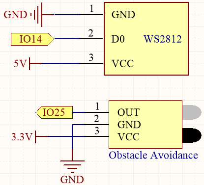
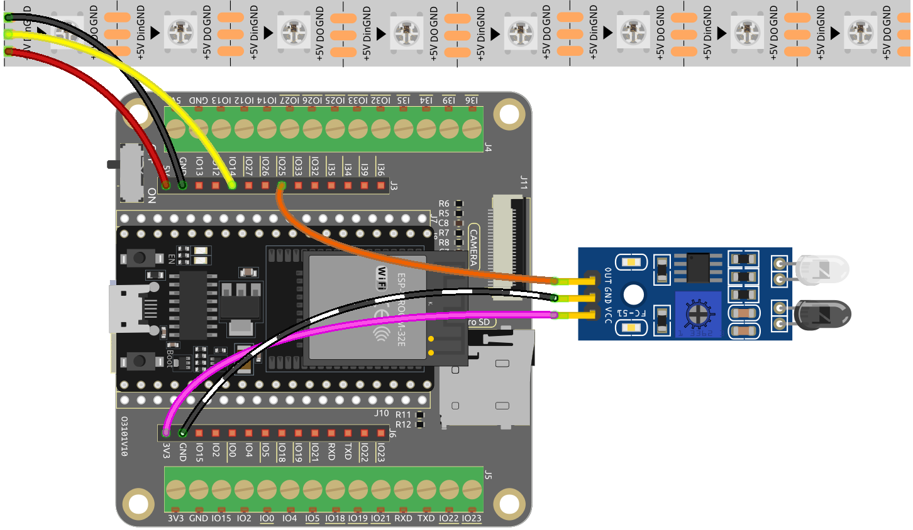

5.2 Flowing Light
=================================

Have you ever wanted to add some fun and interactive element to your living space? 
This project involves creating a running light using WS2812 LED strip and a obstacle avoidance module. 
The running light changes direction when an obstacle is detected, making it an exciting addition to your home or office decor.

**Schematic Diagram**

The WS2812 LED strip is composed of a series of individual LEDs that can be programmed to display different colors and patterns. 
In this project, the strip is set up to display a running light that moves in a particular direction and 
changes direction when an obstacle is detected by the obstacle avoidance module.

**Wiring**

    
* :ref:`cpn_esp32_extension`
* :ref:`cpn_avoid`
* :ref:`cpn_wires`
* :ref:`cpn_ws2812`

**Code**

.. note::

    * Open the ``5.2_flowing_led.py`` file located in the ``esp32-ultimate-kit-main\micropython\codes`` path, or copy and paste the code into Thonny. Then, click "Run Current Script" or press F5 to execute it.
    * Make sure to select the "MicroPython (ESP32).COMxx" interpreter in the bottom right corner. 

    
.. code-block:: python

      from machine import Pin
      import neopixel
      import time
      import random

      # Set the number of pixels for the running light
      num_pixels = 8

      # Set the data pin for the RGB LED strip
      data_pin = Pin(14, Pin.OUT)

      # Initialize the RGB LED strip object
      pixels = neopixel.NeoPixel(data_pin, num_pixels)

      # Initialize the avoid sensor
      avoid = Pin(25, Pin.IN)

      # Initialize the direction variable
      direction_forward = True

      # Initialize the reverse direction flag
      reverse_direction = False

      # Continuously loop the running light
      while True:
      
      # Read the input from the infrared sensor
      avoid_value = avoid.value()
      
      # Generate a random color for the current pixel
      color = (random.randint(0, 255), random.randint(0, 255), random.randint(0, 255))
                  
      # If no obstacle is detected
      if avoid_value:
            for i in range(num_pixels):
                  
                  # Turn on the current pixel with the random color
                  pixels[i] = color
                  
                  # Update the RGB LED strip display
                  pixels.write()
                  
                  # Turn off the current pixel
                  pixels[i] = (0, 0, 0)
                  time.sleep_ms(100)
                  
      # If detects an obstacle, change the direction of the LED strip
      else:
            for i in range(num_pixels-1, -1, -1):
                  
                  pixels[i] = color
                  pixels.write()
                  pixels[i] = (0, 0, 0)
                  time.sleep_ms(100)

LEDs on the RGB Strip light up one by one when the script runs. As soon as an object is placed in front of the obstacle avoidance module, the LEDs on the RGB Strip light up one by one in the opposite direction.