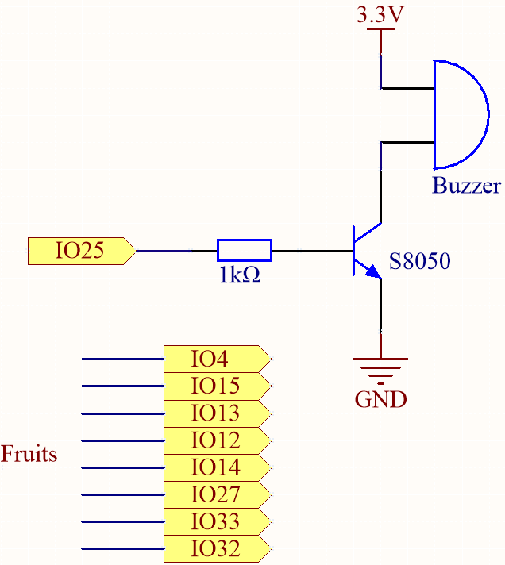
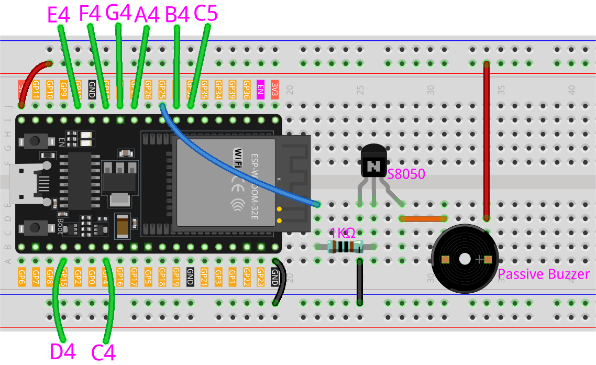

.. _py_fruit_piano:

6.1 Piano de Frutas
============================

¿Alguna vez has querido tocar el piano pero no podías permitírtelo? ¿O tal vez solo quieres divertirte haciendo un piano de frutas por ti mismo? ¡Pues este proyecto es para ti!

Con solo unos pocos sensores táctiles en la placa ESP32, ahora puedes tocar tus melodías favoritas y disfrutar de la experiencia de tocar el piano sin gastar una fortuna.

**Componentes Necesarios**

En este proyecto, necesitamos los siguientes componentes.

Es definitivamente conveniente comprar un kit completo, aquí tienes el enlace:

.. list-table::
    :widths: 20 20 20
    :header-rows: 1

    *   - Nombre
        - ELEMENTOS EN ESTE KIT
        - ENLACE
    *   - Kit de Inicio ESP32
        - 320+
        - |link_esp32_starter_kit|

También puedes comprarlos por separado en los enlaces a continuación.

.. list-table::
    :widths: 30 20
    :header-rows: 1

    *   - INTRODUCCIÓN DE COMPONENTES
        - ENLACE DE COMPRA

    *   - :ref:`cpn_esp32_wroom_32e`
        - |link_esp32_wroom_32e_buy|
    *   - :ref:`cpn_esp32_camera_extension`
        - \-
    *   - :ref:`cpn_breadboard`
        - |link_breadboard_buy|
    *   - :ref:`cpn_wires`
        - |link_wires_buy|
    *   - :ref:`cpn_resistor`
        - |link_resistor_buy|
    *   - :ref:`cpn_buzzer`
        - |link_passive_buzzer_buy|
    *   - :ref:`cpn_transistor`
        - |link_transistor_buy|

**Acerca de los Pines Táctiles**

El microcontrolador ESP32 tiene funcionalidad de sensor táctil incorporada, lo que te permite usar ciertos pines en la placa
como entradas sensibles al tacto. El sensor táctil funciona midiendo cambios en la capacitancia en los pines táctiles,
que son causados por las propiedades eléctricas del cuerpo humano.

Aquí hay algunas características clave del sensor táctil en el ESP32:

* **Número de pines táctiles**

    El ESP32 tiene hasta 10 pines táctiles, dependiendo de la placa específica. Los pines táctiles generalmente están etiquetados con una "T" seguida de un número.

    * GPIO4: TOUCH0
    * GPIO0：TOUCH1
    * GPIO2: TOUCH2
    * GPIO15: TOUCH3
    * GPIO13: TOUCH4
    * GPIO12: TOUCH5
    * GPIO14: TOUCH6
    * GPIO27: TOUCH7
    * GPIO33: TOUCH8
    * GPIO32: TOUCH9

    .. note::
        Los pines GPIO0 y GPIO2 se usan para el arranque y la carga de firmware en el ESP32, respectivamente. Estos pines también están conectados al LED y botón integrados en la placa. Por lo tanto, generalmente no se recomienda usar estos pines para otros fines, ya que podría interferir con el funcionamiento normal de la placa.

* **Sensibilidad**

    El sensor táctil en el ESP32 es muy sensible y puede detectar incluso pequeños cambios en la capacitancia. La sensibilidad se puede ajustar usando configuraciones de software.

* **Protección ESD**

    Los pines táctiles en el ESP32 tienen protección incorporada contra descargas electrostáticas (ESD), lo que ayuda a prevenir daños a la placa por electricidad estática.

* **Multitáctil**

    El sensor táctil en el ESP32 admite multitáctil, lo que significa que puedes detectar varios eventos táctiles simultáneamente.

**Esquemático**

La idea detrás de este proyecto es utilizar sensores táctiles para detectar cuándo un usuario toca un pin específico.
Cada pin táctil está asociado con una nota específica, y cuando el usuario toca un pin,
la nota correspondiente se reproduce en el zumbador pasivo.
El resultado es una forma simple y económica de disfrutar de la experiencia de tocar el piano.

**Cableado**

**Código**

.. note::

    * Abre el archivo ``6.1_fruit_piano.py`` ubicado en la ruta ``esp32-starter-kit-main\micropython\codes``, o copia y pega el código en Thonny. Luego, haz clic en "Ejecutar Script Actual" o presiona F5 para ejecutarlo.
    * Asegúrate de seleccionar el intérprete "MicroPython (ESP32).COMxx" en la esquina inferior derecha.

.. code-block:: python

    from machine import Pin, PWM, TouchPad
    import time

    # Define the touch pins and their corresponding notes
    touch_pins = [4, 15, 13, 12, 14, 27, 33, 32]  # Use valid touch-capable pins
    notes = [262, 294, 330, 349, 392, 440, 494, 523]

    # Initialize the touch sensors
    touch_sensors = [TouchPad(Pin(pin)) for pin in touch_pins]

    # Initialize the buzzer
    buzzer = PWM(Pin(25), duty=0)

    # Function to play a tone
    def play_tone(frequency, duration):
        buzzer.freq(frequency)
        buzzer.duty(512)
        time.sleep_ms(duration)
        buzzer.duty(0)

    touch_threshold = 200

    # Main loop to check for touch inputs and play the corresponding note
    while True:
        for i, touch_sensor in enumerate(touch_sensors):
            value = touch_sensor.read()
            print(i,value)
            if value < touch_threshold:
                play_tone(notes[i], 100)
                time.sleep_ms(50)
            time.sleep(0.01)

Puedes conectar frutas a estos pines del ESP32: 4, 15, 13, 12, 14, 27, 33, 32.

Cuando el script se ejecuta, tocar estas frutas reproducirá las notas C, D, E, F, G, A, B y C5.

.. note::
    ``Touch_threshold`` necesita ser ajustado basado en la conductividad de diferentes frutas.
    
    Puedes ejecutar el script primero para ver los valores impresos por la shell.

    .. code-block::

        0 884
        1 801
        2 856
        3 964
        4 991
        5 989
        6 1072
        7 1058

    Después de tocar las frutas en los pines 12, 14 y 27, los valores impresos son los siguientes. Por lo tanto, establecí el ``touch_threshold`` en 200, lo que significa que cuando se detecta un valor menor a 200, se considera que ha sido tocado, y el zumbador emitirá diferentes notas.
    
    .. code-block::

        0 882
        1 810
        2 799
        3 109
        4 122
        5 156
        6 1068
        7 1055
