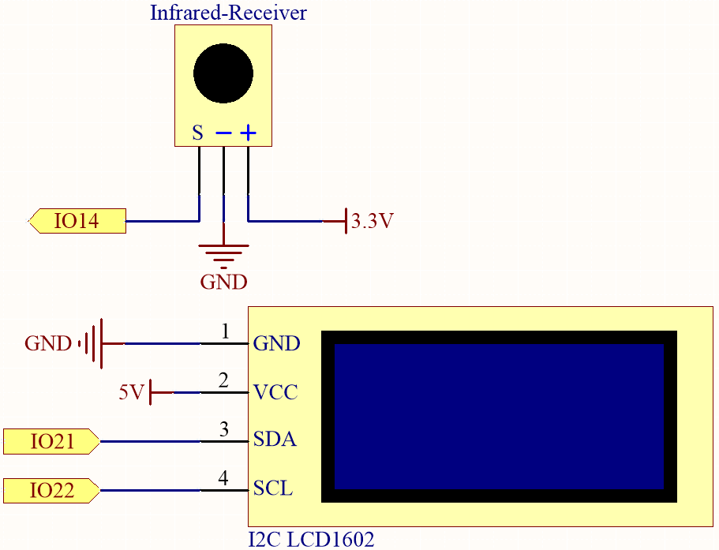

.. _py_guess_number:

6.7 Zahlenraten
==============================

Fühlen Sie sich glücklich? Wollen Sie Ihre Intuition testen und sehen, ob Sie die richtige Zahl erraten können? Dann ist das Zahlenraten-Spiel genau das Richtige für Sie!

Mit diesem Projekt können Sie ein spannendes und unterhaltsames Glücksspiel spielen.

Mit einer IR-Fernbedienung geben die Spieler Zahlen zwischen 0 und 99 ein, um zu versuchen, die zufällig generierte Glückszahl zu erraten.
Das System zeigt die vom Spieler eingegebene Zahl auf einem LCD-Bildschirm an, zusammen mit Tipps für die obere und untere Grenze, um den 
Spieler zur richtigen Antwort zu leiten. Mit jedem Versuch kommen die Spieler der Glückszahl näher,
bis schließlich jemand den Jackpot knackt und das Spiel gewinnt!

**Benötigte Komponenten**

Für dieses Projekt benötigen wir folgende Komponenten.

Es ist definitiv praktisch, ein ganzes Kit zu kaufen, hier ist der Link:

.. list-table::
    :widths: 20 20 20
    :header-rows: 1

    *   - Name	
        - ARTIKEL IN DIESEM KIT
        - LINK
    *   - ESP32 Starter Kit
        - 320+
        - |link_esp32_starter_kit|

Sie können sie auch einzeln über die untenstehenden Links kaufen.

.. list-table::
    :widths: 30 20
    :header-rows: 1

    *   - KOMPONENTENBESCHREIBUNG
        - KAUF-LINK

    *   - :ref:`cpn_esp32_wroom_32e`
        - |link_esp32_wroom_32e_buy|
    *   - :ref:`cpn_esp32_camera_extension`
        - \-
    *   - :ref:`cpn_breadboard`
        - |link_breadboard_buy|
    *   - :ref:`cpn_wires`
        - |link_wires_buy|
    *   - :ref:`cpn_receiver`
        - |link_receiver_buy|
    *   - :ref:`cpn_lcd`
        - |link_i2clcd1602_buy|

**Schaltplan**

**Verdrahtung**

.. image:: ../../img/wiring/6.7_guess_receiver_bb.png
    :width: 800

**Code**

.. note::

    * Öffnen Sie die Datei ``6.7_game_guess_number.py``, die sich im Pfad ``esp32-starter-kit-main\micropython\codes`` befindet, oder kopieren und fügen Sie den Code in Thonny ein. Klicken Sie dann auf "Run Current Script" oder drücken Sie F5, um ihn auszuführen.
    * Stellen Sie sicher, dass der Interpreter "MicroPython (ESP32).COMxx" in der unteren rechten Ecke ausgewählt ist. 
    * Die Bibliotheken ``lcd1602.py`` und ``ir_rx`` werden hier verwendet. Überprüfen Sie, ob sie auf den ESP32 hochgeladen wurden. Siehe :ref:`add_libraries_py` für eine Anleitung.

.. code-block:: python

    from lcd1602 import LCD
    import machine
    import time
    import urandom
    from machine import Pin
    from ir_rx.print_error import print_error
    from ir_rx.nec import NEC_8

    # IR receiver configuration
    pin_ir = Pin(14, Pin.IN)

    # Initialize the guessing game variables
    lower = 0
    upper = 99
    pointValue = int(urandom.uniform(lower, upper))
    count = 0

    # Initialize the LCD1602 display
    lcd = LCD()

    # Initialize a new random value for the game
    def init_new_value():
        global pointValue, upper, lower, count
        pointValue = int(urandom.uniform(lower, upper))
        print(pointValue)
        upper = 99
        lower = 0
        count = 0
        return False

    # Display messages on the LCD based on the game state
    def lcd_show(result):
        global count
        lcd.clear()
        if result == True: 
            string = "GAME OVER!\n"
            string += "Point is " + str(pointValue)
        else: 
            string = "Enter number: " + str(count) + "\n"
            string += str(lower) + " < Point < " + str(upper)
        lcd.message(string)
        return

    # Process the entered number and update the game state
    def number_processing():
        global upper, count, lower
        if count > pointValue:
            if count < upper:
                upper = count
        elif count < pointValue:
            if count > lower:
                lower = count
        elif count == pointValue:
            return True
        count = 0
        return False

    # Process the key inputs from the IR remote control
    def process_key(key):
        global count, lower, upper, pointValue, result
        if key == "Power":
            init_new_value()
            lcd_show(False)
        elif key == "+":
            result = number_processing()
            lcd_show(result)
            if result:
                time.sleep(5)
                init_new_value()
                lcd_show(False)
            else:
                lcd_show(False)
        elif key.isdigit():
            count = count * 10 + int(key) if count * 10 + int(key) <= 99 else count
            lcd_show(False)

    # Decode the received data and return the corresponding key name
    def decodeKeyValue(data):       
        if data == 0x16:
            return "0"
        if data == 0x0C:
            return "1"
        if data == 0x18:
            return "2"
        if data == 0x5E:
            return "3"
        if data == 0x08:
            return "4"
        if data == 0x1C:
            return "5"
        if data == 0x5A:
            return "6"
        if data == 0x42:
            return "7"
        if data == 0x52:
            return "8"
        if data == 0x4A:
            return "9"
        if data == 0x09:
            return "+"
        if data == 0x15:
            return "-"
        if data == 0x7:
            return "EQ"
        if data == 0x0D:
            return "U/SD"
        if data == 0x19:
            return "CYCLE"
        if data == 0x44:
            return "PLAY/PAUSE"
        if data == 0x43:
            return "FORWARD"
        if data == 0x40:
            return "BACKWARD"
        if data == 0x45:
            return "POWER"
        if data == 0x47:
            return "MUTE"
        if data == 0x46:
            return "MODE"
        return "ERROR"

    def callback(data, addr, ctrl):
        if data < 0:
            pass
        else:
            key = decodeKeyValue(data)
            if key != "ERROR":
                process_key(key)

    # Initialize the IR receiver object with the callback function
    ir = NEC_8(pin_ir, callback)

    # ir.error_function(print_error)

    # Initialize the game with a new random value
    init_new_value()

    # Show the initial game state on the LCD
    lcd_show(False)

    try:
        while True:
            pass
    except KeyboardInterrupt:
        ir.close()

* Wenn das Programm ausgeführt wird, wird eine geheime Zahl erzeugt, die jedoch nicht auf dem LCD angezeigt wird. Ihre Aufgabe ist es, diese Zahl zu erraten.
* Drücken Sie die von Ihnen vermutete Zahl auf der Fernbedienung und bestätigen Sie mit der ``+`` Taste.
* Gleichzeitig wird der auf dem I2C LCD1602 angezeigte Bereich verkleinert, und Sie müssen die entsprechende Zahl basierend auf diesem neuen Bereich eingeben.
* Sollten Sie die Glückszahl zufälligerweise erraten oder nicht erraten, erscheint ``GAME OVER!``.

.. note:: 

    Falls der Code und die Verkabelung korrekt sind, aber das LCD dennoch keinen Inhalt anzeigt, können Sie das Potentiometer auf der Rückseite justieren, um den Kontrast zu erhöhen.

**Wie funktioniert das?**

Im Folgenden eine detaillierte Analyse eines Teils des Codes.

#. Initialisierung der Variablen für das Ratespiel.

    .. code-block:: python
    
        lower = 0
        upper = 99
        pointValue = int(urandom.uniform(lower, upper))
        count = 0

    * ``lower`` und ``upper`` begrenzen die geheime Zahl.
    * Die geheime Zahl (``pointValue``) wird zufällig zwischen ``lower`` und ``upper`` generiert.
    * Der aktuelle Tipp des Benutzers (``count``).

#. Diese Funktion setzt die Werte des Ratespiels zurück und generiert eine neue Geheimzahl.

    .. code-block:: python
    
        def init_new_value():
            global pointValue, upper, lower, count
            pointValue = int(urandom.uniform(lower, upper))
            print(pointValue)
            upper = 99
            lower = 0
            count = 0
            return False

#. Diese Funktion zeigt den aktuellen Spielstatus auf dem LCD-Bildschirm an.

    .. code-block:: python

        def lcd_show(result):
            global count
            lcd.clear()
            if result == True: 
                string = "GAME OVER!\n"
                string += "Point is " + str(pointValue)
            else: 
                string = "Enter number: " + str(count) + "\n"
                string += str(lower) + " < Point < " + str(upper)
            lcd.message(string)
            return

    * Wenn das Spiel vorbei ist (``result=True``), wird ``GAME OVER!`` und die Geheimzahl angezeigt.
    * Andernfalls wird der aktuelle Tipp (``count``) und der aktuelle Ratebereich (``lower`` bis ``upper``) angezeigt.

#. Diese Funktion verarbeitet den aktuellen Tipp des Benutzers (``count``) und aktualisiert den Ratebereich.

    .. code-block:: python

        def number_processing():
            global upper, count, lower
            if count > pointValue:
                if count < upper:
                    upper = count
            elif count < pointValue:
                if count > lower:
                    lower = count
            elif count == pointValue:
                return True
            count = 0
            return False
    
    * Wenn der aktuelle Tipp (``count``) höher als die Geheimzahl ist, wird die obere Grenze aktualisiert.
    * Wenn der aktuelle Tipp (``count``) niedriger als die Geheimzahl ist, wird die untere Grenze aktualisiert.
    * Wenn der aktuelle Tipp (``count``) gleich der Geheimzahl ist, gibt die Funktion ``True`` zurück (Spiel vorbei).

#. Diese Funktion verarbeitet die Tastendrücke, die vom IR-Fernbedienung empfangen werden.

    .. code-block:: python

        def process_key(key):
            global count, lower, upper, pointValue, result
            if key == "Power":
                init_new_value()
                lcd_show(False)
            elif key == "+":
                result = number_processing()
                lcd_show(result)
                if result:
                    time.sleep(5)
                    init_new_value()
                    lcd_show(False)
                else:
                    lcd_show(False)
            elif key.isdigit():
                count = count * 10 + int(key) if count * 10 + int(key) <= 99 else count
                lcd_show(False)

    * Wenn die Taste ``Power`` gedrückt wird, wird das Spiel zurückgesetzt.
    * Wenn die Taste ``+`` gedrückt wird, wird der aktuelle Tipp (``count``) verarbeitet und der Spielstatus aktualisiert.
    * Wenn eine Zifferntaste gedrückt wird, wird der aktuelle Tipp (``count``) mit der neuen Ziffer aktualisiert.

#. Diese Callback-Funktion wird ausgelöst, wenn der IR-Empfänger ein Signal empfängt.

    .. code-block:: python

        def callback(data, addr, ctrl):
            if data < 0:
                pass
            else:
                key = decodeKeyValue(data)
                if key != "ERROR":
                    process_key(key)