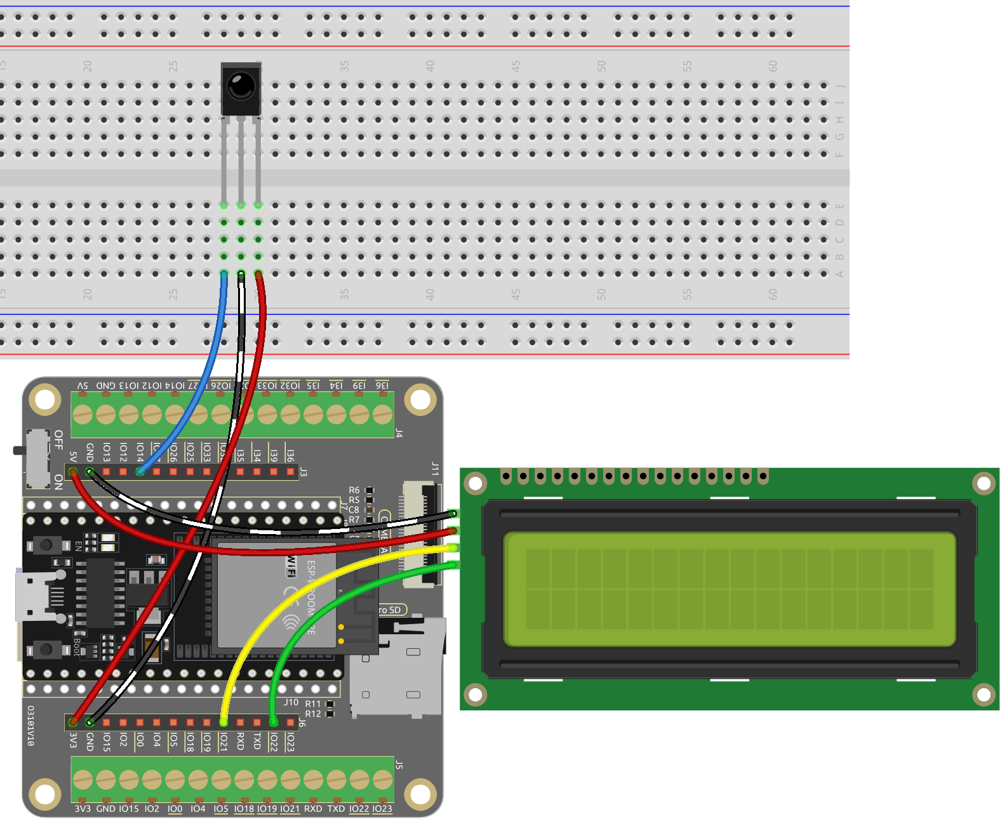

.. _py_guess_number:

6.7 Adivina el Número
==============================

¿Te sientes afortunado? ¿Quieres poner a prueba tu intuición a ver si puedes adivinar el número correcto? ¡Entonces este es el juego para ti!

Con este proyecto, puedes jugar un emocionante juego de azar.

Usando un control remoto IR, los jugadores introducen números entre 0 y 99 para intentar adivinar el número de la suerte generado aleatoriamente.
El sistema muestra el número introducido por el jugador en una pantalla LCD, junto con pistas de límites superior e inferior para guiar
al jugador hacia la respuesta correcta. Con cada intento, los jugadores se acercan al número de la suerte,
hasta que finalmente, alguien acierta el número y gana el juego.

**Componentes Necesarios**

En este proyecto, necesitamos los siguientes componentes.

Es definitivamente conveniente comprar un kit completo, aquí tienes el enlace:

.. list-table::
    :widths: 20 20 20
    :header-rows: 1

    *   - Nombre
        - ELEMENTOS EN ESTE KIT
        - ENLACE
    *   - Kit de Inicio ESP32
        - 320+
        - |link_esp32_starter_kit|

También puedes comprarlos por separado en los enlaces a continuación.

.. list-table::
    :widths: 30 20
    :header-rows: 1

    *   - INTRODUCCIÓN DE COMPONENTES
        - ENLACE DE COMPRA

    *   - :ref:`cpn_esp32_wroom_32e`
        - |link_esp32_wroom_32e_buy|
    *   - :ref:`cpn_esp32_camera_extension`
        - \-
    *   - :ref:`cpn_breadboard`
        - |link_breadboard_buy|
    *   - :ref:`cpn_wires`
        - |link_wires_buy|
    *   - :ref:`cpn_receiver`
        - |link_receiver_buy|
    *   - :ref:`cpn_lcd`
        - |link_i2clcd1602_buy|

**Esquemático**

.. image:: ../../img/circuit/circuit_6.7_guess_number.png

**Cableado**

**Código**

.. note::

    * Abre el archivo ``6.7_game_guess_number.py`` ubicado en la ruta ``esp32-starter-kit-main\micropython\codes``, o copia y pega el código en Thonny. Luego, haz clic en "Ejecutar Script Actual" o presiona F5 para ejecutarlo.
    * Asegúrate de seleccionar el intérprete "MicroPython (ESP32).COMxx" en la esquina inferior derecha.
    * Se utilizan las bibliotecas ``lcd1602.py`` y ``ir_rx`` aquí, verifica si se han cargado en el ESP32. Consulta :ref:`add_libraries_py` para obtener un tutorial.

.. code-block:: python

    from lcd1602 import LCD
    import machine
    import time
    import urandom
    from machine import Pin
    from ir_rx.print_error import print_error
    from ir_rx.nec import NEC_8

    # IR receiver configuration
    pin_ir = Pin(14, Pin.IN)

    # Initialize the guessing game variables
    lower = 0
    upper = 99
    pointValue = int(urandom.uniform(lower, upper))
    count = 0

    # Initialize the LCD1602 display
    lcd = LCD()

    # Initialize a new random value for the game
    def init_new_value():
        global pointValue, upper, lower, count
        pointValue = int(urandom.uniform(lower, upper))
        print(pointValue)
        upper = 99
        lower = 0
        count = 0
        return False

    # Display messages on the LCD based on the game state
    def lcd_show(result):
        global count
        lcd.clear()
        if result == True:
            string = "GAME OVER!\n"
            string += "Point is " + str(pointValue)
        else:
            string = "Enter number: " + str(count) + "\n"
            string += str(lower) + " < Point < " + str(upper)
        lcd.message(string)
        return

   # Process the entered number and update the game state
    def number_processing():
        global upper, count, lower
        if count > pointValue:
            if count < upper:
                upper = count
        elif count < pointValue:
            if count > lower:
                lower = count
        elif count == pointValue:
            return True
        count = 0
        return False

    # Process the key inputs from the IR remote control
    def process_key(key):
        global count, lower, upper, pointValue, result
        if key == "Power":
            init_new_value()
            lcd_show(False)
        elif key == "+":
            result = number_processing()
            lcd_show(result)
            if result:
                time.sleep(5)
                init_new_value()
                lcd_show(False)
            else:
                lcd_show(False)
        elif key.isdigit():
            count = count * 10 + int(key) if count * 10 + int(key) <= 99 else count
            lcd_show(False)

    # Decode the received data and return the corresponding key name
    def decodeKeyValue(data):       
        if data == 0x16:
            return "0"
        if data == 0x0C:
            return "1"
        if data == 0x18:
            return "2"
        if data == 0x5E:
            return "3"
        if data == 0x08:
            return "4"
        if data == 0x1C:
            return "5"
        if data == 0x5A:
            return "6"
        if data == 0x42:
            return "7"
        if data == 0x52:
            return "8"
        if data == 0x4A:
            return "9"
        if data == 0x09:
            return "+"
        if data == 0x15:
            return "-"
        if data == 0x7:
            return "EQ"
        if data == 0x0D:
            return "U/SD"
        if data == 0x19:
            return "CYCLE"
        if data == 0x44:
            return "PLAY/PAUSE"
        if data == 0x43:
            return "FORWARD"
        if data == 0x40:
            return "BACKWARD"
        if data == 0x45:
            return "POWER"
        if data == 0x47:
            return "MUTE"
        if data == 0x46:
            return "MODE"
        return "ERROR"

    def callback(data, addr, ctrl):
        if data < 0:
            pass
        else:
            key = decodeKeyValue(data)
            if key != "ERROR":
                process_key(key)

    # Initialize the IR receiver object with the callback function
    ir = NEC_8(pin_ir, callback)

    # ir.error_function(print_error)

    # Initialize the game with a new random value
    init_new_value()

    # Show the initial game state on the LCD
    lcd_show(False)

    try:
        while True:
            pass
    except KeyboardInterrupt:
        ir.close()

* Cuando se ejecuta el código, se genera un número secreto que no se muestra en el LCD, y lo que necesitas hacer es adivinarlo.
* Presiona el número que adivinaste en el control remoto, luego presiona la tecla ``+`` para confirmar.
* Simultáneamente, el rango mostrado en el LCD I2C 1602 disminuirá, y debes presionar el número adecuado basado en este nuevo rango.
* Si aciertas el número de la suerte, ya sea por suerte o por desgracia, aparecerá ``¡JUEGO TERMINADO!``.

.. note:: 

    Si el código y el cableado son correctos, pero el LCD aún no muestra ningún contenido, puedes ajustar el potenciómetro en la parte trasera para aumentar el contraste.

**¿Cómo funciona?**

A continuación, se presenta un análisis detallado de parte del código.

#. Inicializar las variables del juego de adivinanzas.

    .. code-block:: python
    
        lower = 0
        upper = 99
        pointValue = int(urandom.uniform(lower, upper))
        count = 0

    * ``lower`` y ``upper`` son los límites para el número secreto.
    * El número secreto (``valorPunto``) se genera aleatoriamente entre los límites ``lower`` y ``upper``.
    * La suposición actual del usuario (``count``).

#. Esta función restablece los valores del juego de adivinanzas y genera un nuevo número secreto.

    .. code-block:: python
    
        def init_new_value():
            global pointValue, upper, lower, count
            pointValue = int(urandom.uniform(lower, upper))
            print(pointValue)
            upper = 99
            lower = 0
            count = 0
            return False

#. Esta función muestra el estado actual del juego en la pantalla LCD.

    .. code-block:: python

        def lcd_show(result):
            global count
            lcd.clear()
            if result == True: 
                string = "GAME OVER!\n"
                string += "Point is " + str(pointValue)
            else: 
                string = "Enter number: " + str(count) + "\n"
                string += str(lower) + " < Point < " + str(upper)
            lcd.message(string)
            return

    * Si el juego ha terminado (``result=True``), muestra ``¡JUEGO TERMINADO!`` y el número secreto.
    * De lo contrario, muestra la suposición actual (``count``) y el rango de suposición actual (``lower`` a ``upper``)

#. Esta función procesa la suposición actual del usuario (``count``) y actualiza el rango de suposición.

    .. code-block:: python

        def number_processing():
            global upper, count, lower
            if count > pointValue:
                if count < upper:
                    upper = count
            elif count < pointValue:
                if count > lower:
                    lower = count
            elif count == pointValue:
                return True
            count = 0
            return False
    
    * Si la suposición actual (``count``) es más alta que el número secreto, se actualiza el límite superior.
    * Si la suposición actual (``count``) es más baja que el número secreto, se actualiza el límite inferior.
    * Si la suposición actual (``count``) es igual al número secreto, la función devuelve ``True`` (juego terminado).

#. Esta función procesa los eventos de pulsación de teclas recibidos del control remoto IR.

    .. code-block:: python

        def process_key(key):
            global count, lower, upper, pointValue, result
            if key == "Power":
                init_new_value()
                lcd_show(False)
            elif key == "+":
                result = number_processing()
                lcd_show(result)
                if result:
                    time.sleep(5)
                    init_new_value()
                    lcd_show(False)
                else:
                    lcd_show(False)
            elif key.isdigit():
                count = count * 10 + int(key) if count * 10 + int(key) <= 99 else count
                lcd_show(False)

    * Si se presiona la tecla ``Power``, el juego se reinicia.
    * Si se presiona la tecla ``+``, se procesa la suposición actual (``count``) y se actualiza el estado del juego.
    * Si se presiona una tecla de dígito, se actualiza la suposición actual (``count``) con el nuevo dígito.

#. Esta función de callback se activa cuando el receptor IR recibe

    .. code-block:: python

        def callback(data, addr, ctrl):
            if data < 0:
                pass
            else:
                key = decodeKeyValue(data)
                if key != "ERROR":
                    process_key(key)