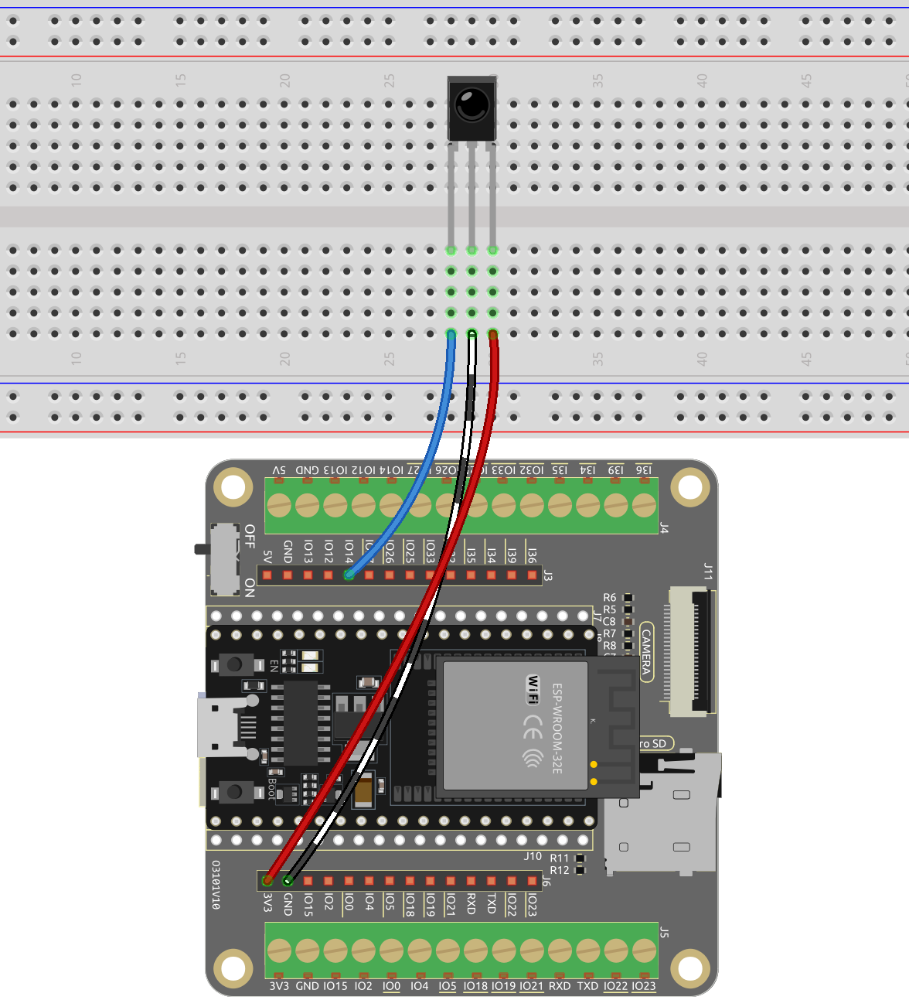

.. note::

    Ciao, benvenuto nella Community di SunFounder Raspberry Pi & Arduino & ESP32 su Facebook! Approfondisci le tue conoscenze su Raspberry Pi, Arduino e ESP32 insieme ad altri appassionati.

    **Perché unirsi a noi?**

    - **Supporto esperto**: Risolvi problemi post-vendita e sfide tecniche con l'aiuto della nostra community e del nostro team.
    - **Impara e condividi**: Scambia suggerimenti e tutorial per migliorare le tue competenze.
    - **Anteprime esclusive**: Ottieni accesso anticipato agli annunci di nuovi prodotti e anteprime.
    - **Sconti speciali**: Approfitta di sconti esclusivi sui nostri prodotti più recenti.
    - **Promozioni festive e giveaway**: Partecipa a giveaway e promozioni festive.

    👉 Pronto a esplorare e creare con noi? Clicca [|link_sf_facebook|] e unisciti oggi!

.. _py_receiver:

5.14 Controllo remoto IR
================================

Un ricevitore a infrarossi è un componente che riceve segnali a infrarossi e può rilevare e fornire segnali compatibili con il livello TTL in modo autonomo. È simile per dimensioni a un normale transistor incapsulato in plastica ed è comunemente utilizzato in diverse applicazioni, come il controllo remoto a infrarossi e la trasmissione a infrarossi.

In questo progetto, utilizzeremo un ricevitore a infrarossi per rilevare i segnali da un telecomando. Quando viene premuto un pulsante sul telecomando e il ricevitore a infrarossi riceve il segnale corrispondente, può decodificare il segnale per determinare quale pulsante è stato premuto. Decodificando il segnale ricevuto, possiamo identificare il tasto o il comando specifico associato.

Il ricevitore a infrarossi ci permette di integrare la funzionalità di controllo remoto nel nostro progetto, consentendoci di interagire e controllare i dispositivi utilizzando segnali a infrarossi.

**Componenti necessari**

In questo progetto, abbiamo bisogno dei seguenti componenti.

È sicuramente conveniente acquistare un intero kit, ecco il link:

.. list-table::
    :widths: 20 20 20
    :header-rows: 1

    *   - Nome
        - ELEMENTI IN QUESTO KIT
        - LINK
    *   - Kit di avviamento ESP32
        - 320+
        - |link_esp32_starter_kit|

Puoi anche acquistarli separatamente dai link sottostanti.

.. list-table::
    :widths: 30 20
    :header-rows: 1

    *   - INTRODUZIONE AI COMPONENTI
        - LINK PER L'ACQUISTO

    *   - :ref:`cpn_esp32_wroom_32e`
        - |link_esp32_wroom_32e_buy|
    *   - :ref:`cpn_esp32_camera_extension`
        - |link_esp32_extension_board|
    *   - :ref:`cpn_breadboard`
        - |link_breadboard_buy|
    *   - :ref:`cpn_wires`
        - |link_wires_buy|
    *   - :ref:`cpn_receiver`
        - |link_receiver_buy|

**Pin disponibili**

    Ecco un elenco di pin disponibili sulla scheda ESP32 per questo progetto.

    .. list-table::
        :widths: 5 20

        *   - Pin disponibili
            - IO13, IO12, IO14, IO27, IO26, IO25, IO15, IO0, IO5, IO18, IO19, IO21, IO22, IO23

**Schema**

.. image:: ../../img/circuit/circuit_5.14_receiver.png

Quando premi un pulsante sul telecomando, il ricevitore a infrarossi rileva il segnale e puoi utilizzare una libreria a infrarossi per decodificarlo. Questo processo di decodifica ti consente di ottenere il valore del tasto associato alla pressione del pulsante.

**Cablaggio**

    
**Codice**

.. note::

    * Apri il file ``5.14_ir_receiver.py`` che si trova nel percorso ``esp32-starter-kit-main\micropython\codes``, oppure copia e incolla il codice in Thonny. Quindi, fai clic su "Esegui script corrente" o premi F5 per eseguirlo.
    * Assicurati di selezionare l'interprete "MicroPython (ESP32).COMxx" nell'angolo in basso a destra.
    * Qui, è necessario utilizzare le librerie contenute nella cartella ``ir_rx``. Assicurati che siano state caricate su ESP32. Per un tutorial completo, fai riferimento a :ref:`add_libraries_py`.

.. code-block:: python

    import time
    from machine import Pin, freq
    from ir_rx.print_error import print_error
    from ir_rx.nec import NEC_8

    pin_ir = Pin(14, Pin.IN) # Ricevitore IR

    # Decodifica i dati ricevuti e restituisce il nome del tasto corrispondente
    def decodeKeyValue(data):       
        if data == 0x16:
            return "0"
        if data == 0x0C:
            return "1"
        if data == 0x18:
            return "2"
        if data == 0x5E:
            return "3"
        if data == 0x08:
            return "4"
        if data == 0x1C:
            return "5"
        if data == 0x5A:
            return "6"
        if data == 0x42:
            return "7"
        if data == 0x52:
            return "8"
        if data == 0x4A:
            return "9"
        if data == 0x09:
            return "+"
        if data == 0x15:
            return "-"
        if data == 0x7:
            return "EQ"
        if data == 0x0D:
            return "U/SD"
        if data == 0x19:
            return "CYCLE"
        if data == 0x44:
            return "PLAY/PAUSE"
        if data == 0x43:
            return "FORWARD"
        if data == 0x40:
            return "BACKWARD"
        if data == 0x45:
            return "POWER"
        if data == 0x47:
            return "MUTE"
        if data == 0x46:
            return "MODE"
        return "ERROR"

    # Callback utente
    def callback(data, addr, ctrl):
        if data < 0:  # Il protocollo NEC invia codici ripetuti.
            pass
        else:
            print(decodeKeyValue(data))
            

    ir = NEC_8(pin_ir, callback) # Istanzia il ricevitore NEC_8

    # Mostra informazioni di debug
    ir.error_function(print_error)  

    # Mantieni lo script in esecuzione fino a interruzione da tastiera (Ctrl+C)
    try:
        while True:
            pass
    except KeyboardInterrupt:
        ir.close()  # Chiudi il ricevitore

Quando il programma è in esecuzione, premi un tasto sul telecomando, il valore e il nome del tasto appariranno nella Shell.

.. note::
    Il nuovo telecomando ha una linguetta di plastica all'estremità per isolare la batteria all'interno. Per accendere il telecomando durante l'uso, basta rimuovere questo pezzo di plastica.

**Come funziona?**

#. Anche se questo programma può sembrare complesso a prima vista, in realtà esegue le funzioni fondamentali del ricevitore IR con poche righe di codice.

    .. code-block:: python

        import time
        from machine import Pin, freq
        from ir_rx.nec import NEC_8

        pin_ir = Pin(14, Pin.IN) # Ricevitore IR

        # Callback utente
        def callback(data, addr, ctrl):
            if data < 0:  # Il protocollo NEC invia codici ripetuti.
                pass
            else:
                print(decodeKeyValue(data))

        ir = NEC_8(pin_ir, callback)  # Istanzia il ricevitore

    * In questo codice, viene istanziato un oggetto ``ir``, permettendogli di leggere i segnali catturati dal ricevitore IR in qualsiasi momento.
    * Le informazioni risultanti vengono quindi memorizzate nella variabile ``data`` all'interno della funzione di callback.

        * `Callback Function - Wikipedia <https://en.wikipedia.org/wiki/Callback_(computer_programming)>`_

    * Se il ricevitore IR riceve valori duplicati (ad esempio, quando un tasto viene premuto e tenuto premuto), il ``data`` sarà inferiore a 0 e questo ``data`` deve essere filtrato.

    * Altrimenti, il ``data`` sarà un valore utilizzabile, anche se in un codice non leggibile. La funzione ``decodeKeyValue(data)`` viene quindi utilizzata per decodificarlo in un formato più comprensibile.

        .. code-block:: python

            def decodeKeyValue(data):
                if data == 0x16:
                    return "0"
                if data == 0x0C:
                    return "1"
                if data == 0x18:
                    return "2"
                if data == 0x5E:
                ...

#. Successivamente, incorporiamo diverse funzioni di debug nel programma. Sebbene queste funzioni siano essenziali, non sono direttamente correlate al risultato desiderato che vogliamo ottenere.

    .. code-block:: python

        from ir_rx.print_error import print_error

        ir.error_function(print_error) # Mostra informazioni di debug

#. Infine, utilizziamo un ciclo vuoto per il programma principale e implementiamo una struttura try-except per garantire che il programma si chiuda con l'oggetto ``ir`` correttamente terminato.

    .. code-block:: python

        try:
            while True:
                pass
        except KeyboardInterrupt:
            ir.close()

    * `Try Statement - Python Docs <https://docs.python.org/3/reference/compound_stmts.html?#the-try-statement>`_
