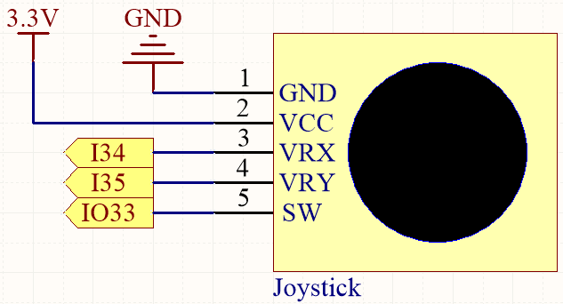
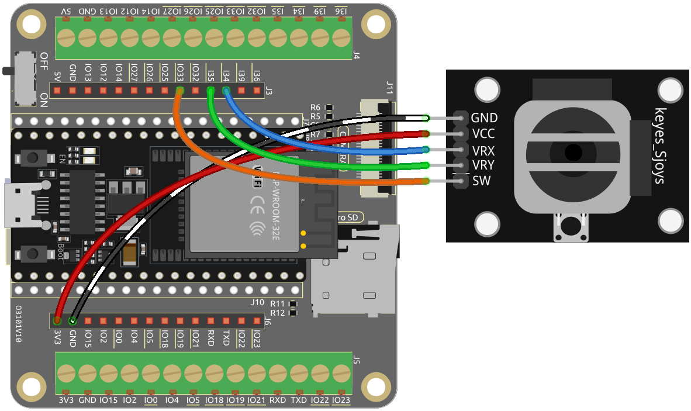

.. _py_joystick:

5.11 Toggle the Joystick
================================

If you play a lot of video games, then you should be very familiar with the Joystick.
It is usually used to move the character around, rotate the screen, etc.

The principle behind Joystick's ability to allow the computer to read our actions is very simple.
It can be thought of as consisting of two potentiometers that are perpendicular to each other.
These two potentiometers measure the analog value of the joystick vertically and horizontally, resulting in a value (x,y) in a planar right-angle coordinate system.

The joystick of this kit also has a digital input, which is activated when the joystick is pressed.

**Required Components**

In this project, we need the following components. 

It's definitely convenient to buy a whole kit, here's the link: 

.. list-table::
    :widths: 20 20 20
    :header-rows: 1

    *   - Name	
        - ITEMS IN THIS KIT
        - LINK
    *   - ESP32 Starter Kit
        - 320+
        - |link_esp32_starter_kit|

You can also buy them separately from the links below.

.. list-table::
    :widths: 30 20
    :header-rows: 1

    *   - COMPONENT INTRODUCTION
        - PURCHASE LINK

    *   - :ref:`cpn_esp32_wroom_32e`
        - |link_esp32_wroom_32e_buy|
    *   - :ref:`cpn_esp32_camera_extension`
        - \-
    *   - :ref:`cpn_wires`
        - |link_wires_buy|
    *   - :ref:`cpn_joystick`
        - |link_joystick_buy|

* **Available Pins**

    Here is a list of available pins on the ESP32 board for this project.

    .. list-table::
        :widths: 5 15

        *   - For Analog Input
            - IO14, IO25, I35, I34, I39, I36
        *   - For Digital Input
            - IO13, IO14, IO27, IO26, IO25, IO33, IO4, IO18, IO19, IO21, IO22, IO23

* **Strapping Pins (Input)**

    Strapping pins are a special set of pins that are used to determine specific boot modes during device startup 
    (i.e., power-on reset).

        
    .. list-table::
        :widths: 5 15

        *   - Strapping Pins
            - IO5, IO0, IO2, IO12, IO15 
    
    Generally, it is **not recommended to use them as input pins**. If you wish to use these pins, consider the potential impact on the booting process. For more details, please refer to the :ref:`esp32_strapping` section.

**Schematic**

The SW (Z-axis) pin is connected to IO33, which has a built-in 4.7K pull-up resistor. Therefore, when the SW button is not pressed, it will output a high level. When the button is pressed, it will output a low level.

I34 and I35 will change their values as you manipulate the joystick. The range of values is from 0 to 4095.

**Wiring**

**Code**

.. note::

    * Open the ``5.11_joystick.py`` file located in the ``esp32-starter-kit-main\micropython\codes`` path, or copy and paste the code into Thonny. Then, click "Run Current Script" or press F5 to execute it.
    * Make sure to select the "MicroPython (ESP32).COMxx" interpreter in the bottom right corner. 

.. code-block:: python

    from machine import ADC,Pin
    import time

    xAxis = ADC(Pin(34, Pin.IN)) # create an ADC object acting on a pin      
    xAxis.atten(xAxis.ATTN_11DB)
    yAxis = ADC(Pin(35, Pin.IN)) # create an ADC object acting on a pin      
    yAxis.atten(yAxis.ATTN_11DB)
    button = Pin(33, Pin.IN, Pin.PULL_UP)

    while True:
        xValue = xAxis.read()  # read a raw analog value in the range 0-4095
        yValue = yAxis.read()  # read a raw analog value in the range 0-4095
        btnValue = button.value()
        print(f"X:{xValue}, Y:{yValue}, Button:{btnValue}")
        time.sleep(0.1)

When the program runs, the Shell prints out the x, y, and button values of joystick.

.. code-block:: 

    X:1921, Y:1775, Button:0
    X:1921, Y:1775, Button:0
    X:1923, Y:1775, Button:0
    X:1924, Y:1776, Button:0
    X:1926, Y:1777, Button:0
    X:1925, Y:1776, Button:0
    X:1924, Y:1776, Button:0

* The x-axis and y-axis values are analog values that vary from 0 to 4095.
* The button is a digital value with a status of 1(release) or 0(press).

    .. image:: img/joystick_direction.png