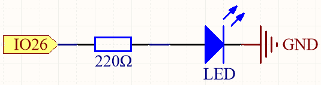
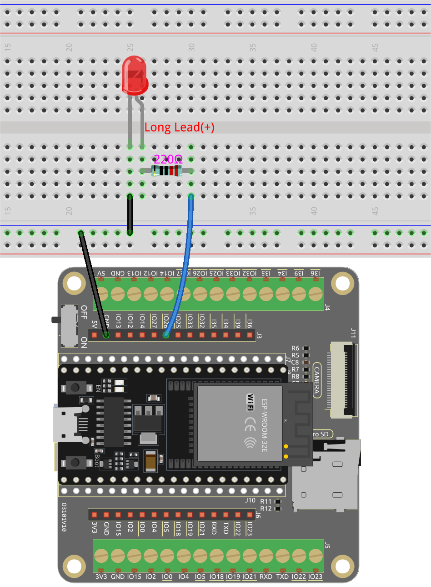

.. _py_blink:

2.1 ¡Hola, LED! 
=======================================

Así como imprimir "¡Hola, mundo!" es el primer paso para aprender a programar, usar un programa para controlar un LED es la introducción tradicional para aprender la programación física.

**Componentes Requeridos**

Para este proyecto, necesitamos los siguientes componentes.

Definitivamente es conveniente comprar un kit completo, aquí está el enlace:

.. list-table::
    :widths: 20 20 20
    :header-rows: 1

    *   - Nombre	
        - ELEMENTOS EN ESTE KIT
        - ENLACE
    *   - Kit de Inicio ESP32
        - 320+
        - |link_esp32_starter_kit|

También puedes comprarlos por separado en los enlaces a continuación.

.. list-table::
    :widths: 30 20
    :header-rows: 1

    *   - INTRODUCCIÓN DEL COMPONENTE
        - ENLACE DE COMPRA

    *   - :ref:`cpn_esp32_wroom_32e`
        - |link_esp32_wroom_32e_buy|
    *   - :ref:`cpn_esp32_camera_extension`
        - \-
    *   - :ref:`cpn_breadboard`
        - |link_breadboard_buy|
    *   - :ref:`cpn_wires`
        - |link_wires_buy|
    *   - :ref:`cpn_resistor`
        - |link_resistor_buy|
    *   - :ref:`cpn_led`
        - |link_led_buy|

**Pines Disponibles**

Aquí hay una lista de pines disponibles en la placa ESP32 para este proyecto.

.. list-table::
    :widths: 5 20 

    * - Pines Disponibles
      - IO13, IO12, IO14, IO27, IO26, IO25, IO33, IO32, IO15, IO2, IO0, IO4, IO5, IO18, IO19, IO21, IO22, IO23

**Esquemático**

Este circuito funciona bajo un principio simple, y la dirección de la corriente se muestra en la figura. El LED se iluminará después de la resistencia limitadora de corriente de 220ohm cuando el pin26 emita un nivel alto. El LED se apagará cuando el pin26 emita un nivel bajo.

**Conexión**

**Ejecutar el Código**

#. Abre el archivo ``2.1_hello_led.py`` ubicado en la ruta ``esp32-starter-kit-main\micropython\codes`` o copia y pega el código en Thonny. 

    .. code-block:: python

        # Import the necessary libraries
        import machine
        import time

        # Set up the LED on pin 26 as an output pin
        led = machine.Pin(26, machine.Pin.OUT)

        # Start an infinite loop
        while True:
            # Turn on the LED by setting its value to 1 (HIGH)
            led.value(1)
            # Wait for 1 second (1000 milliseconds) while the LED is on
            time.sleep(1)

            # Turn off the LED by setting its value to 0 (LOW)
            led.value(0)
            # Wait for 0.5 seconds (500 milliseconds) while the LED is off
            time.sleep(0.5)

#. Conecta el ESP32 WROOM 32E a tu computadora usando un cable Micro USB. 

    .. image:: ../../img/plugin_esp32.png
        :width: 600
        :align: center

#. Luego haz clic en el intérprete "MicroPython (ESP32).COMXX" en la esquina inferior derecha.

    .. image:: ../python_start/img/sec_inter.png

#. Finalmente, haz clic en "Ejecutar script actual" o presiona F5 para ejecutarlo.

    .. image:: ../python_start/img/quick_guide2.png

#. Después de ejecutar el código, verás el LED parpadeando.

**¿Cómo funciona?**

#. Importa dos módulos, ``machine`` y ``time``. El módulo ``machine`` proporciona acceso a bajo nivel al hardware del microcontrolador, mientras que el módulo ``time`` ofrece funciones para operaciones relacionadas con el tiempo.

    .. code-block:: python

        import machine
        import time

#. Luego configura el pin26 como un pin de salida usando la función ``machine.Pin()`` con el argumento ``machine.Pin.OUT``. 

    .. code-block:: python

        led = machine.Pin(26, machine.Pin.OUT)

#. En el bucle ``While True``, el LED se enciende durante un segundo estableciendo el valor del pin26 en 1 usando ``led.value(1)`` y luego se establece en 0 (``led.value(0)``) para apagarlo durante un segundo, y así sucesivamente en un bucle infinito.

    .. code-block:: python
        
        while True:
            # Turn on the LED by setting its value to 1 (HIGH)
            led.value(1)
            # Wait for 1 second (1000 milliseconds) while the LED is on
            time.sleep(1)

            # Turn off the LED by setting its value to 0 (LOW)
            led.value(0)
            # Wait for 0.5 seconds (500 milliseconds) while the LED is off
            time.sleep(0.5)

**Aprende Más**

En este proyecto, utilizamos los módulos ``machine`` y ``time`` de MicroPython, podemos encontrar más formas de usarlos aquí.

* `machine.Pin <https://docs.micropython.org/en/latest/library/machine.Pin.html>`_

* `time <https://docs.micropython.org/en/latest/library/time.html>`_

