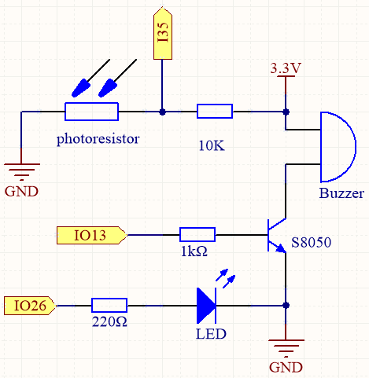
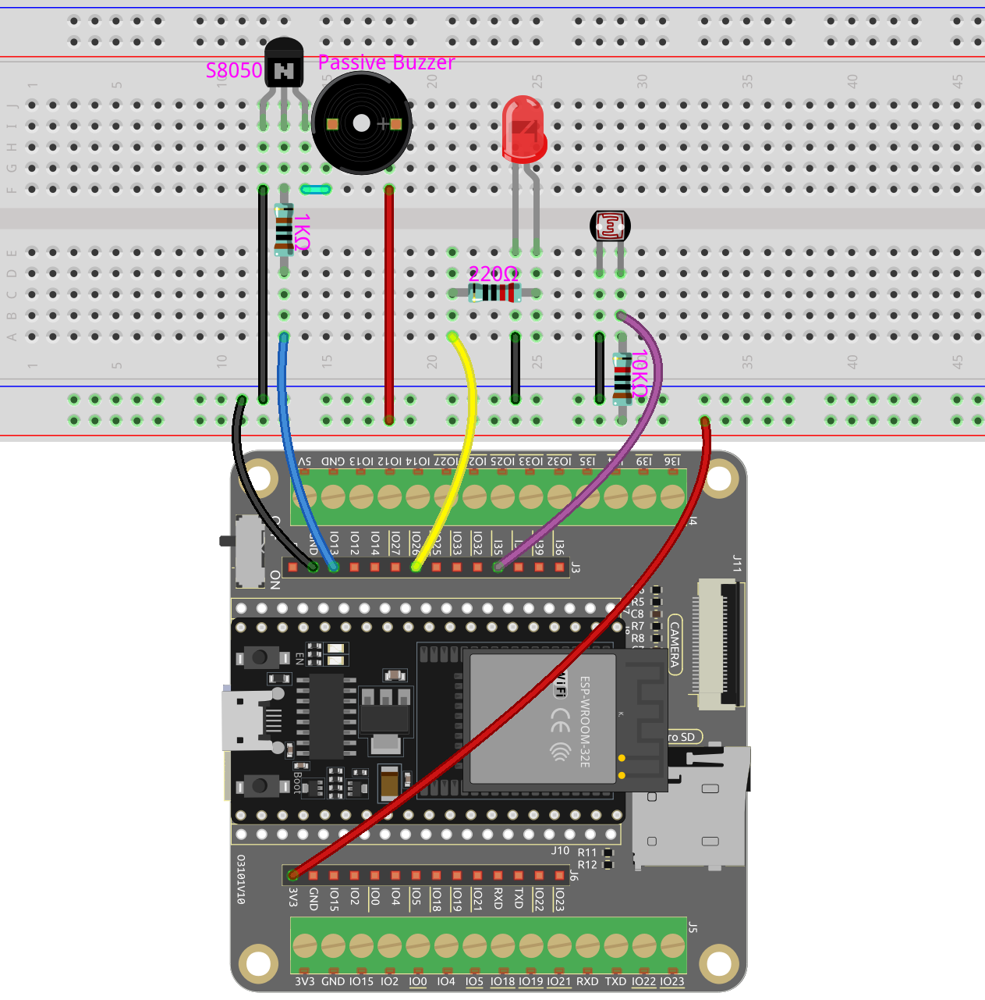

.. note::

    こんにちは、SunFounderのRaspberry Pi & Arduino & ESP32愛好家コミュニティへようこそ！Facebook上でRaspberry Pi、Arduino、ESP32についてもっと深く掘り下げ、他の愛好家と交流しましょう。

    **参加する理由は？**

    - **エキスパートサポート**：コミュニティやチームの助けを借りて、販売後の問題や技術的な課題を解決します。
    - **学び＆共有**：ヒントやチュートリアルを交換してスキルを向上させましょう。
    - **独占的なプレビュー**：新製品の発表や先行プレビューに早期アクセスしましょう。
    - **特別割引**：最新製品の独占割引をお楽しみください。
    - **祭りのプロモーションとギフト**：ギフトや祝日のプロモーションに参加しましょう。

    👉 私たちと一緒に探索し、創造する準備はできていますか？[|link_sf_facebook|]をクリックして今すぐ参加しましょう！

.. _py_light_theremin:

6.3 光セラミン
=========================

セラミンは物理的な接触を必要としない電子楽器です。プレイヤーの手の位置に基づいて、異なるトーンを生み出します。

通常、セラミン奏者の手の位置を感知してオシレータを制御する2つの金属アンテナで構成されており、一方の手で音程を、もう一方の手で音量をコントロールします。セラミンからの電気信号は増幅され、スピーカーに送られます。

ESP32を通じて同じ楽器を再現することはできませんが、フォトレジスタとパッシブブザーを使用して似たようなゲームプレイを実現することができます。

* `セラミン - Wikipedia <https://en.wikipedia.org/wiki/Theremin>`_

**必要な部品**

このプロジェクトには、以下のコンポーネントが必要です。

キット全体を購入すると確かに便利です。こちらがリンクです：

.. list-table::
    :widths: 20 20 20
    :header-rows: 1

    *   - 名前
        - このキットのアイテム
        - リンク
    *   - ESP32 Starter Kit
        - 320+
        - |link_esp32_starter_kit|

以下のリンクから個別に購入することもできます。

.. list-table::
    :widths: 30 20
    :header-rows: 1

    *   - コンポーネントの紹介
        - 購入リンク

    *   - :ref:`cpn_esp32_wroom_32e`
        - |link_esp32_wroom_32e_buy|
    *   - :ref:`cpn_esp32_camera_extension`
        - \-
    *   - :ref:`cpn_breadboard`
        - |link_breadboard_buy|
    *   - :ref:`cpn_wires`
        - |link_wires_buy|
    *   - :ref:`cpn_resistor`
        - |link_resistor_buy|
    *   - :ref:`cpn_led`
        - |link_led_buy|
    *   - :ref:`cpn_photoresistor`
        - |link_photoresistor_buy|
    *   - :ref:`cpn_buzzer`
        - |link_passive_buzzer_buy|
    *   - :ref:`cpn_transistor`
        - |link_transistor_buy|

**回路図**

プロジェクトを始める前に、フォトレジスタの上で手を振って光の強度の範囲を調整します。IO26に接続されたLEDは、調整プロセス中のインジケータとして使用されます。LEDが点灯すると調整の開始を、消灯すると調整の終了を示します。

フォトレジスタの上で手を振ると、フォトレジスタの値がそれに応じて変化します。
この変化を利用してブザーを制御し、異なる音楽ノートを演奏します。
フォトレジスタの値の各変化を特定の音楽ノートにマッピングし、
フォトレジスタの上で手を振るとブザーがメロディを生み出します。

**配線図**

**コード**

.. note::

    * ``esp32-starter-kit-main\micropython\codes`` パスにある ``6.3_light_theremin.py`` ファイルを開くか、コードをThonnyにコピー＆ペーストします。次に、「Run Current Script」をクリックするかF5キーを押して実行します。
    * 右下隅にある「MicroPython (ESP32).COMxx」インタプリタを選択してください。

.. code-block:: python

    from machine import Pin, PWM, ADC
    import time

    # Initialize LED pin
    led = Pin(26, Pin.OUT)

    # Initialize light sensor
    sensor = ADC(Pin(35))
    sensor.atten(ADC.ATTN_11DB)

    # Initialize buzzer
    buzzer = PWM(Pin(13), freq=440, duty=0)

    light_low=4095
    light_high=0

    # Map the interval of input values to output values
    def interval_mapping(x, in_min, in_max, out_min, out_max):
        return (x - in_min) * (out_max - out_min) / (in_max - in_min) + out_min

    # Create a tone using the specified pin, frequency, and duration
    def tone(pin,frequency,duration):
        pin.freq(frequency)
        pin.duty(512)
        time.sleep_ms(duration)
        pin.duty(0)

    # Calibrate the photoresistor's maximum and minimum values in 5 seconds.
    timer_init_start = time.ticks_ms()
    led.value(1) # turn on the LED   
    while time.ticks_diff(time.ticks_ms(), timer_init_start)<5000:
        light_value = sensor.read()
        if light_value > light_high:
            light_high = light_value
        if light_value < light_low:
            light_low = light_value   
    led.value(0) # turn off the LED 

    # Play the tones based on the light values
    while True:
        light_value  = sensor.read()
        pitch = int(interval_mapping(light_value,light_low,light_high,50,6000))
        if pitch > 50 :
            tone(buzzer,pitch,20)
        time.sleep_ms(10)

プログラムを開始すると、LEDが点灯し、フォトレジスタの検出範囲を調整するための5秒間のウィンドウが提供されます。

調整は、デバイスを使用する際に遭遇する可能性のある様々な照明条件（例えば、一日の異なる時間帯における光の強度の変化など）を考慮するため、非常に重要なステップです。
さらに、調整プロセスでは、私たちの手とフォトレジスタの間の距離を考慮に入れます。これにより楽器の演奏可能範囲が決まります。

調整期間が終了すると、LEDが消え、フォトレジスタの上で手を振ることで楽器を演奏できるようになります。
この設定により、手の高さを調整して音楽を作ることができ、インタラクティブで楽しい体験を提供します。
