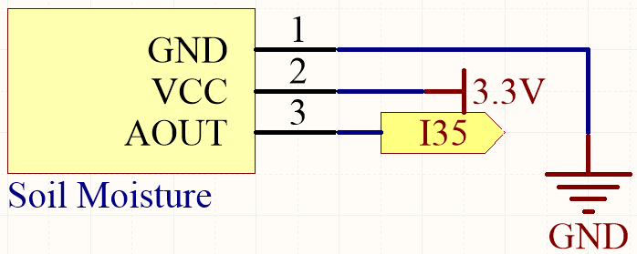
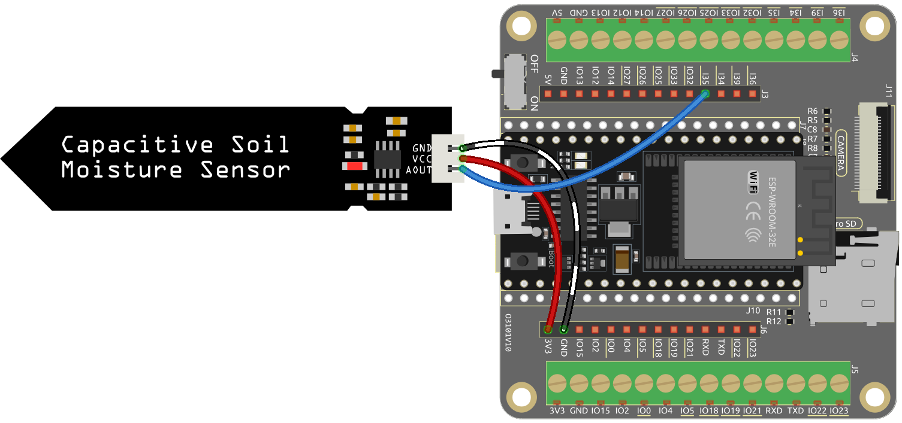

.. note::

    ¡Hola, bienvenido a la Comunidad de Aficionados a Raspberry Pi, Arduino y ESP32 de SunFounder en Facebook! Profundiza en Raspberry Pi, Arduino y ESP32 con otros entusiastas.

    **¿Por qué unirse?**

    - **Soporte de expertos**: Resuelve problemas posventa y desafíos técnicos con ayuda de nuestra comunidad y equipo.
    - **Aprender y compartir**: Intercambia consejos y tutoriales para mejorar tus habilidades.
    - **Vistas previas exclusivas**: Obtén acceso anticipado a anuncios de nuevos productos y avances.
    - **Descuentos especiales**: Disfruta de descuentos exclusivos en nuestros productos más nuevos.
    - **Promociones festivas y sorteos**: Participa en sorteos y promociones de fiestas.

    👉 ¿Listo para explorar y crear con nosotros? Haz clic en [|link_sf_facebook|] y únete hoy!

.. _py_moisture:

5.9 Medir la Humedad del Suelo
================================

Este sensor de humedad del suelo capacitivo es diferente a la mayoría de los sensores resistivos en el mercado, ya que utiliza el principio de inducción capacitiva para detectar la humedad del suelo.

Al leer visualmente los valores del sensor de humedad del suelo, podemos recopilar información sobre el nivel de humedad en el suelo. Esta información es útil para varias aplicaciones, como sistemas de riego automático, monitoreo de la salud de las plantas o proyectos de detección ambiental.

**Componentes Requeridos**

Para este proyecto, necesitamos los siguientes componentes.

Definitivamente es conveniente comprar un kit completo, aquí está el enlace:

.. list-table::
    :widths: 20 20 20
    :header-rows: 1

    *   - Nombre	
        - ELEMENTOS EN ESTE KIT
        - ENLACE
    *   - Kit de Inicio ESP32
        - 320+
        - |link_esp32_starter_kit|

También puedes comprarlos por separado en los enlaces a continuación.

.. list-table::
    :widths: 30 20
    :header-rows: 1

    *   - INTRODUCCIÓN DEL COMPONENTE
        - ENLACE DE COMPRA

    *   - :ref:`cpn_esp32_wroom_32e`
        - |link_esp32_wroom_32e_buy|
    *   - :ref:`cpn_esp32_camera_extension`
        - \-
    *   - :ref:`cpn_wires`
        - |link_wires_buy|
    *   - :ref:`cpn_soil_moisture`
        - |link_soil_moisture_buy|

**Pines Disponibles**

* **Pines Disponibles**

    Aquí hay una lista de pines disponibles en la placa ESP32 para este proyecto.

    .. list-table::
        :widths: 5 15

        *   - Pines Disponibles
            - IO14, IO25, I35, I34, I39, I36

* **Pines de Strapping**

    Los siguientes pines son pines de strapping, los cuales afectan el proceso de arranque del ESP32 durante el encendido o el reinicio. Sin embargo, una vez que el ESP32 se ha iniciado correctamente, pueden ser utilizados como pines regulares.

    .. list-table::
        :widths: 5 15

        *   - Pines de Strapping
            - IO0, IO12

**Esquemático**

Al insertar el módulo en el suelo y regarlo, el valor leído en I35 disminuirá.

**Conexión**

**Código**

.. note::

    * Abre el archivo ``5.9_moisture.py`` ubicado en la ruta ``esp32-starter-kit-main\micropython\codes`` o copia y pega el código en Thonny. Luego, haz clic en "Ejecutar script actual" o presiona F5 para ejecutarlo.
    * Asegúrate de seleccionar el intérprete "MicroPython (ESP32).COMxx" en la esquina inferior derecha. 

.. code-block:: python

    from machine import ADC,Pin
    import time

    # crear un objeto ADC actuando sobre un pin
    moisture = ADC(Pin(35, Pin.IN))

    # Configurar la atenuación del ADC a 11dB para el rango completo     
    moisture.atten(moisture.ATTN_11DB)

    while True:

        # leer un valor analógico crudo en el rango de 0-4095
        value = moisture.read()  
        print(value)
        time.sleep(0.05)

Cuando el script se ejecute, verás el valor de la humedad del suelo en la Shell.

Al insertar el módulo en el suelo y regarlo, el valor del sensor de humedad del suelo se volverá más pequeño.
