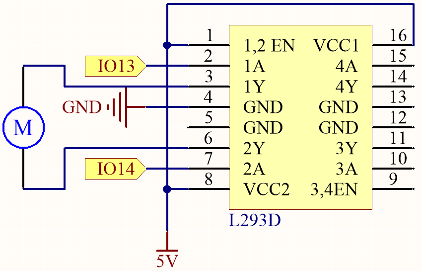
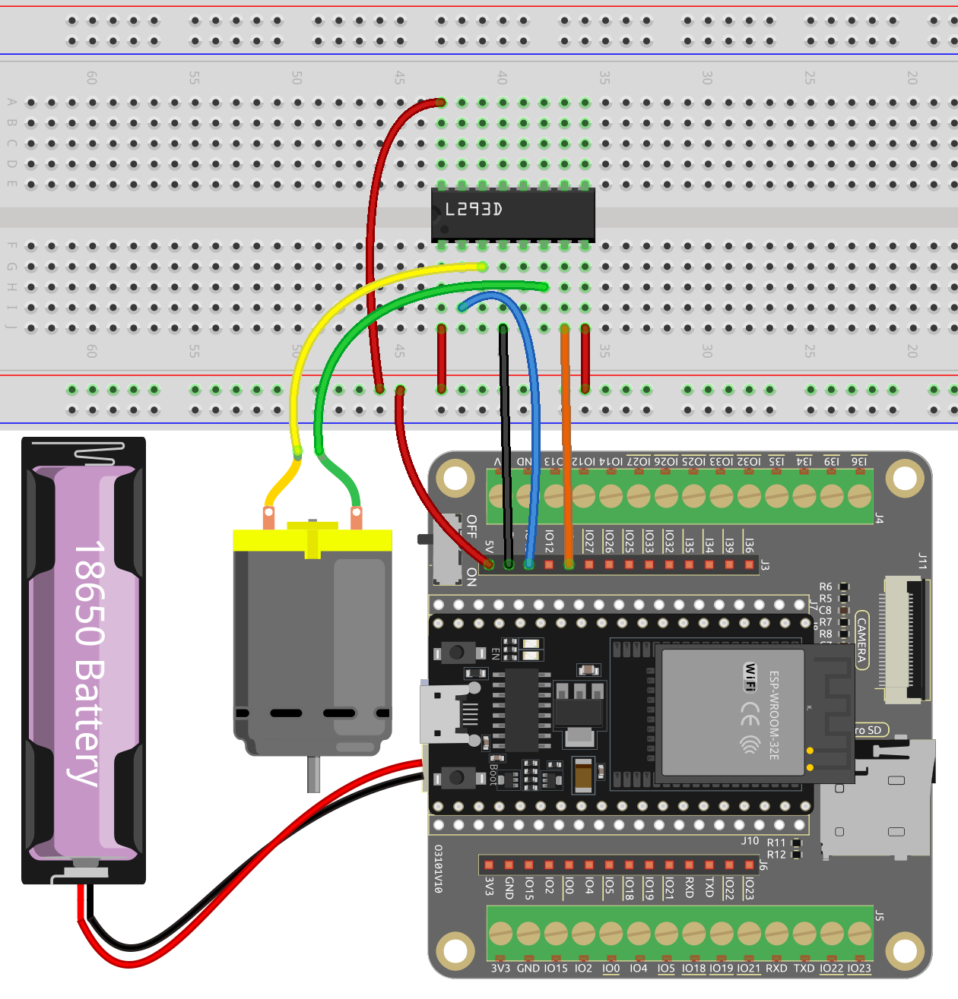

.. _py_motor:

4.1 Small Fan
=======================

In this engaging project, we'll explore how to drive a motor using the L293D.

The L293D is a versatile integrated circuit (IC) commonly used for motor control in electronics and robotics projects. It can drive two motors in both forward and reverse directions, making it a popular choice for applications requiring precise motor control.

By the end of this captivating project, you will have gained a thorough understanding of how digital signals and PWM signals can effectively be utilized to control motors. This invaluable knowledge will prove to be a solid foundation for your future endeavors in robotics and mechatronics. Buckle up and get ready to dive into the exciting world of motor control with the L293D!

**Available Pins**

Here is a list of available pins on the ESP32 board for this project.

.. list-table::
    :widths: 5 20 

    * - Available Pins
      - IO13, IO12, IO14, IO27, IO26, IO25, IO33, IO32, IO15, IO2, IO0, IO4, IO5, IO18, IO19, IO21, IO22, IO23

**Schematic**

    
**Wiring**

.. note:: 

    Since the motor requires a relatively high current, it is necessary to first insert the battery and then slide the switch on the expansion board to the ON position to activate the battery supply. 

* :ref:`cpn_esp32_wroom_32e`
* :ref:`cpn_esp32_camera_extension`
* :ref:`cpn_wires`
* :ref:`cpn_motor`
* :ref:`cpn_l293d`

**Code**

.. note::

    * Open the ``4.1_motor_turn.py`` file located in the ``esp32-starter-kit-main\micropython\codes`` path, or copy and paste the code into Thonny. Then, click "Run Current Script" or press F5 to execute it.
    * Make sure to select the "MicroPython (ESP32).COMxx" interpreter in the bottom right corner. 

.. code-block:: python

    import machine
    import time

    # Create Pin objects representing the motor control pins and set them to output mode
    motor1A = machine.Pin(13, machine.Pin.OUT)
    motor2A = machine.Pin(14, machine.Pin.OUT)

    # Define a function to rotate the motor clockwise
    def clockwise():
        motor1A.value(1)
        motor2A.value(0)

    # Define a function to rotate the motor anticlockwise
    def anticlockwise():
        motor1A.value(0)
        motor2A.value(1)

    # Define a function to stop the motor
    def stop():
        motor1A.value(0)
        motor2A.value(0)

    # Enter an infinite loop

    try:
        while True:
            clockwise() # Rotate the motor clockwise
            time.sleep(1) # Pause for 1 second
            anticlockwise() # Rotate the motor anticlockwise
            time.sleep(1)
            stop() # Stop the motor
            time.sleep(2)

    except KeyboardInterrupt:
        stop()  # Stop the motor when KeyboardInterrupt is caught

During script execution, you will see the motor alternately rotating clockwise and counterclockwise every second.

**Learn More**

In addition to simply making the motor rotate clockwise and counterclockwise, you can also control the speed of the motor's rotation by using pulse-width modulation (PWM) on the control pin, as shown below.

.. note::

    * Open the ``4.1_motor_turn_pwm.py`` file located in the ``esp32-starter-kit-main\micropython\codes`` path, or copy and paste the code into Thonny. Then, click "Run Current Script" or press F5 to execute it.
    * Make sure to select the "MicroPython (ESP32).COMxx" interpreter in the bottom right corner. 

.. code-block:: python

    from machine import Pin, PWM
    import time

    # Create PWM objects representing the motor control pins and set their frequency to 1000 Hz
    motor1A = PWM(Pin(13, Pin.OUT))
    motor2A = PWM(Pin(14, Pin.OUT))
    motor1A.freq(500)
    motor2A.freq(500)

    # Enter an infinite loop
    while True:
        # Rotate the motor forward by gradually increasing the power on the motor1A pin
        for power in range(0, 1023, 20):
            motor1A.duty(power)
            motor2A.duty(0)
            time.sleep(0.1)
        # Decreasing the power on the motor1A pin
        for power in range(1023, 0, -20):
            motor1A.duty(power)
            motor2A.duty(0)
            time.sleep(0.1)
        # Rotate the motor in the opposite direction by gradually increasing the power on the motor2A pin
        for power in range(0, 1023, 20):
            motor1A.duty(0)
            motor2A.duty(power)
            time.sleep(0.1)
        # Decreasing the power on the motor2A pin
        for power in range(1023, 0, -20):
            motor1A.duty(0)
            motor2A.duty(power)
            time.sleep(0.1)

Unlike the previous script, here the motor is controlled by PWM signals with a frequency of 1000 Hz, which determines the speed of the motor.

* The code uses a ``while True`` loop to run continuously. Inside the loop, there are four ``for`` loops that control the motors in a sequence. 
* The first two ``for`` loops increase and decrease the speed of IN1 while keeping IN2 at 0 speed. 
* The next two ``for`` loops increase and decrease the speed of IN2 while keeping IN1 at 0 speed.
* The ``range`` function in each ``for`` loop produces a string of numbers that serves as the duty cycle of the PWM signal. This is then output to IN1 or IN2 via the ``duty`` method. The duty cycle determines the percentage of time that the PWM signal is high, which in turn determines the average voltage applied to the motor, and thus the motor speed.
* The ``time.sleep`` function is used to introduce a delay of 0.1 seconds between each step in the sequence, which allows the motor to change speed gradually, rather than jumping from one speed to another instantaneously.