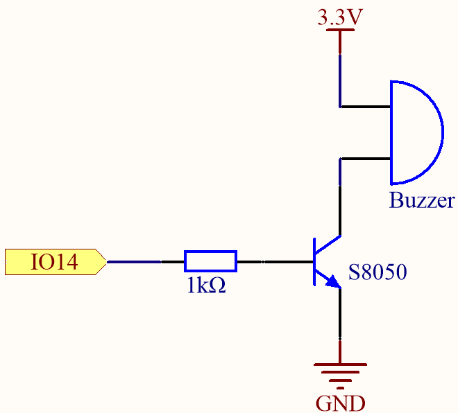
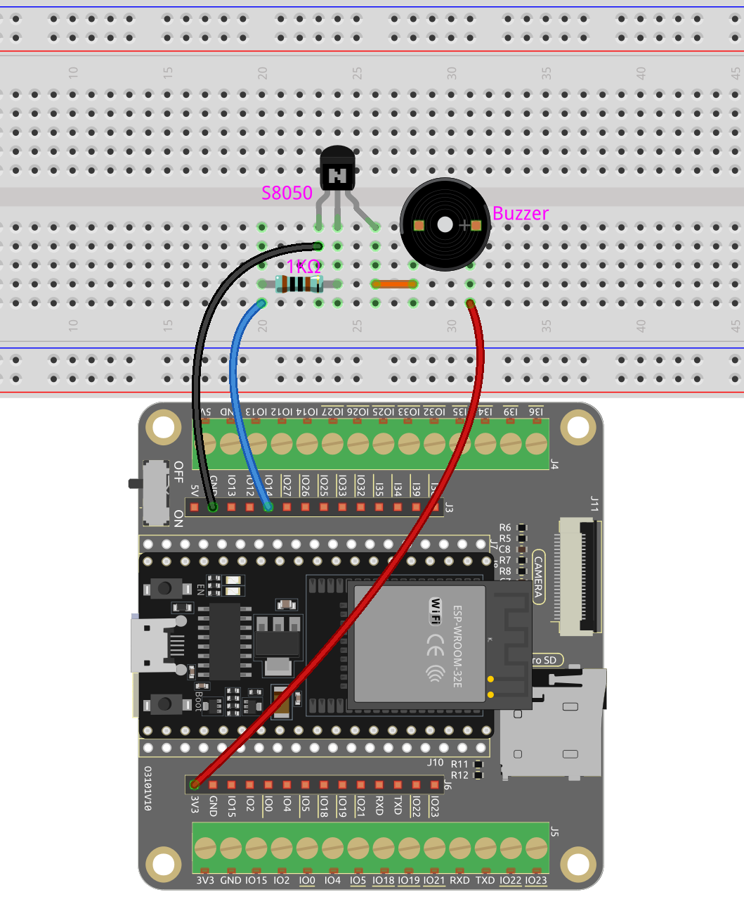

.. note::

    Bonjour, bienvenue dans la communauté des passionnés de SunFounder Raspberry Pi, Arduino et ESP32 sur Facebook ! Plongez au cœur des Raspberry Pi, Arduino et ESP32 avec d'autres passionnés.

    **Pourquoi nous rejoindre ?**

    - **Support d'experts** : Résolvez les problèmes après-vente et les défis techniques avec l'aide de notre communauté et de notre équipe.
    - **Apprendre et partager** : Échangez des astuces et des tutoriels pour améliorer vos compétences.
    - **Aperçus exclusifs** : Accédez en avant-première aux annonces de nouveaux produits et aux avant-premières.
    - **Réductions spéciales** : Profitez de réductions exclusives sur nos derniers produits.
    - **Promotions festives et cadeaux** : Participez à des tirages au sort et à des promotions festives.

    👉 Prêt à explorer et à créer avec nous ? Cliquez sur [|link_sf_facebook|] et rejoignez-nous dès aujourd'hui !

.. _py_pa_buz:

3.2 Tonalité Personnalisée
==========================================

Nous avons utilisé un buzzer actif dans le projet précédent, cette fois nous utiliserons un buzzer passif.

Comme le buzzer actif, le buzzer passif utilise également le phénomène d'induction électromagnétique pour fonctionner. La différence est qu'un buzzer passif n'a pas de source oscillante, il ne bipera donc pas si des signaux CC sont utilisés. Mais cela permet au buzzer passif d'ajuster sa propre fréquence d'oscillation et de produire différentes notes comme "do, ré, mi, fa, sol, la, si".

Faisons émettre une mélodie au buzzer passif !

**Composants nécessaires**

Dans ce projet, nous aurons besoin des composants suivants. 

Il est définitivement pratique d'acheter un kit complet, voici le lien :

.. list-table::
    :widths: 20 20 20
    :header-rows: 1

    *   - Nom	
        - ARTICLES DANS CE KIT
        - LIEN
    *   - Kit de démarrage ESP32
        - 320+
        - |link_esp32_starter_kit|

Vous pouvez également les acheter séparément via les liens ci-dessous.

.. list-table::
    :widths: 30 20
    :header-rows: 1

    *   - INTRODUCTION DES COMPOSANTS
        - LIEN D'ACHAT

    *   - :ref:`cpn_esp32_wroom_32e`
        - |link_esp32_wroom_32e_buy|
    *   - :ref:`cpn_esp32_camera_extension`
        - |link_esp32_extension_board|
    *   - :ref:`cpn_breadboard`
        - |link_breadboard_buy|
    *   - :ref:`cpn_wires`
        - |link_wires_buy|
    *   - :ref:`cpn_resistor`
        - |link_resistor_buy|
    *   - :ref:`cpn_buzzer`
        - \-
    *   - :ref:`cpn_transistor`
        - |link_transistor_buy|

**Broches disponibles**

Voici une liste des broches disponibles sur la carte ESP32 pour ce projet.

.. list-table::
    :widths: 5 20 

    * - Broches disponibles
      - IO13, IO12, IO14, IO27, IO26, IO25, IO33, IO32, IO15, IO2, IO0, IO4, IO5, IO18, IO19, IO21, IO22, IO23

**Schéma**

Lorsque la sortie IO14 est élevée, après la résistance de limitation de courant de 1K (pour protéger le transistor), le S8050 (transistor NPN) conduira, faisant ainsi retentir le buzzer.

Le rôle du S8050 (transistor NPN) est d'amplifier le courant et de rendre le son du buzzer plus fort. En fait, vous pouvez également connecter directement le buzzer à IO14, mais vous constaterez que le son du buzzer est plus faible.

**Câblage**

Deux types de buzzers sont inclus dans le kit. 
Nous devons utiliser le buzzer passif. Tournez-les, le PCB exposé est celui que nous voulons.

.. image:: ../../components/img/buzzer.png
    :width: 500
    :align: center

Le buzzer nécessite l'utilisation d'un transistor pour fonctionner, ici nous utilisons le S8050 (transistor NPN).

**Code**

.. note::

    * Ouvrez le fichier ``3.2_custom_tone.py`` situé dans le chemin ``esp32-starter-kit-main\micropython\codes``, ou copiez et collez le code dans Thonny. Puis cliquez sur "Run Current Script" ou appuyez sur F5 pour l'exécuter.
    * Assurez-vous de sélectionner l'interpréteur "MicroPython (ESP32).COMxx" dans le coin inférieur droit. 

.. code-block:: python

    import machine
    import time

    # Définir les fréquences de plusieurs notes de musique en Hz
    C4 = 262
    D4 = 294
    E4 = 330
    F4 = 349
    G4 = 392
    A4 = 440
    B4 = 494

    # Créer un objet PWM représentant la broche 14 et l'assigner à la variable buzzer
    buzzer = machine.PWM(machine.Pin(14))

    # Définir une fonction tone qui prend en entrée un objet Pin représentant le buzzer, une fréquence en Hz et une durée en millisecondes
    def tone(pin, frequency, duration):
        pin.freq(frequency) # Définir la fréquence
        pin.duty(512) # Définir le cycle de service
        time.sleep_ms(duration) # Pause pour la durée en millisecondes
        pin.duty(0) # Définir le cycle de service à 0 pour arrêter le son

    # Jouer une séquence de notes avec des fréquences et des durées différentes
    tone(buzzer, C4, 250)
    time.sleep_ms(500)
    tone(buzzer, D4, 250)
    time.sleep_ms(500)
    tone(buzzer, E4, 250)
    time.sleep_ms(500)
    tone(buzzer, F4, 250)
    time.sleep_ms(500)
    tone(buzzer, G4, 250)
    time.sleep_ms(500)
    tone(buzzer, A4, 250)
    time.sleep_ms(500)
    tone(buzzer, B4, 250)

**Comment ça marche ?**

Si le buzzer passif reçoit un signal numérique, il ne fait que pousser le diaphragme sans produire de son.

Par conséquent, nous utilisons la fonction ``tone()`` pour générer le signal PWM et faire sonner le buzzer passif.

Cette fonction a trois paramètres :

* ``pin`` : La broche qui contrôle le buzzer.
* ``frequency`` : La hauteur du son du buzzer est déterminée par la fréquence, plus la fréquence est élevée, plus la hauteur du son est élevée.
* ``duration`` : La durée de la tonalité.

Nous utilisons la fonction ``duty()`` pour régler le cycle de service à 512 (environ 50%). Il peut être d'autres nombres, et il suffit de générer un signal électrique discontinu pour osciller.

**En savoir plus**

Nous pouvons simuler des hauteurs spécifiques et ainsi jouer un morceau de musique complet.

.. note::

    * Ouvrez le fichier ``3.2_custom_tone_music.py`` situé dans le chemin ``esp32-starter-kit-main\micropython\codes``, ou copiez et collez le code dans Thonny. Puis cliquez sur "Run Current Script" ou appuyez sur F5 pour l'exécuter.
    * Assurez-vous de sélectionner l'interpréteur "MicroPython (ESP32).COMxx" dans le coin inférieur droit. 

.. code-block:: python

    import machine
    import time

    # Définir la broche GPIO qui est connectée au buzzer
    buzzer = machine.PWM(machine.Pin(14))

    # Définir les fréquences des notes en Hz
    C5 = 523
    D5 = 587
    E5 = 659
    F5 = 698
    G5 = 784
    A5 = 880
    B5 = 988

    # Définir les durées des notes en millisecondes
    quarter_note = 250
    half_note = 300
    whole_note = 1000

    # Définir la mélodie comme une liste de tuples (note, durée)
    melody = [
        (E5, quarter_note),
        (E5, quarter_note),
        (F5, quarter_note),
        (G5, half_note),
        (G5, quarter_note),
        (F5, quarter_note),
        (E5, quarter_note),
        (D5, half_note),
        (C5, quarter_note),
        (C5, quarter_note),
        (D5, quarter_note),
        (E5, half_note),
        (E5, quarter_note),
        (D5, quarter_note),
        (D5, half_note),
        (E5, quarter_note),
        (E5, quarter_note),
        (F5, quarter_note),
        (G5, half_note),
        (G5, quarter_note),
        (F5, quarter_note),
        (E5, quarter_note),
        (D5, half_note),
        (C5, quarter_note),
        (C5, quarter_note),
        (D5, quarter_note),
        (E5, half_note),
        (D5, quarter_note),
        (C5, quarter_note),
        (C5, half_note),

    ]

    # Définir une fonction pour jouer une note avec la fréquence et la durée données
    def tone(pin,frequency,duration):
        pin.freq(frequency)
        pin.duty(512)
        time.sleep_ms(duration)
        pin.duty(0)

    # Jouer la mélodie
    for note in melody:
        tone(buzzer, note[0], note[1])
        time.sleep_ms(50)

* La fonction ``tone`` définit la fréquence de la broche à la valeur de ``frequency`` en utilisant la méthode ``freq`` de l'objet ``pin``. 
* Elle définit ensuite le cycle de service de la broche à 512 en utilisant la méthode ``duty`` de l'objet ``pin``. 
* Cela amènera la broche à produire une tonalité avec la fréquence et le volume spécifiés pendant la durée de ``duration`` en millisecondes en utilisant la méthode ``sleep_ms`` du module time.
* Le code joue ensuite une mélodie en parcourant une séquence appelée ``melody`` et en appelant la fonction ``tone`` pour chaque note de la mélodie avec la fréquence et la durée de la note. 
* Il insère également une courte pause de 50 millisecondes entre chaque note en utilisant la méthode ``sleep_ms`` du module time.

