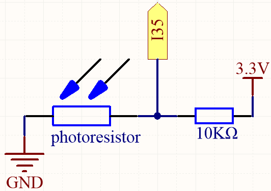
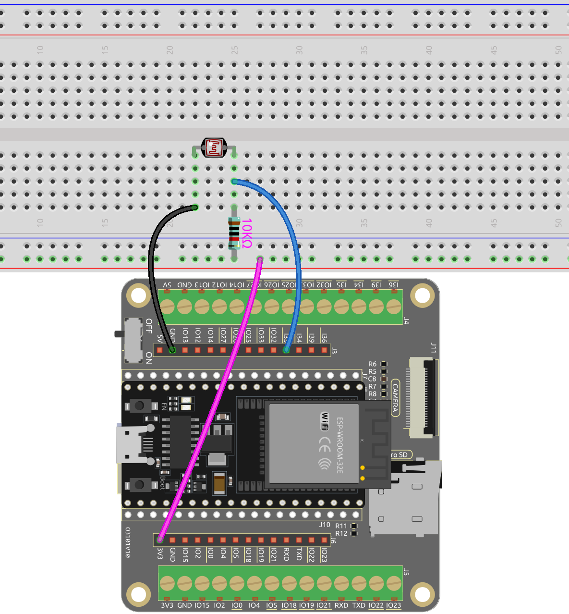

.. note::

    こんにちは、SunFounderのRaspberry Pi & Arduino & ESP32愛好家コミュニティへようこそ！Facebook上でRaspberry Pi、Arduino、ESP32についてもっと深く掘り下げ、他の愛好家と交流しましょう。

    **参加する理由は？**

    - **エキスパートサポート**：コミュニティやチームの助けを借りて、販売後の問題や技術的な課題を解決します。
    - **学び＆共有**：ヒントやチュートリアルを交換してスキルを向上させましょう。
    - **独占的なプレビュー**：新製品の発表や先行プレビューに早期アクセスしましょう。
    - **特別割引**：最新製品の独占割引をお楽しみください。
    - **祭りのプロモーションとギフト**：ギフトや祝日のプロモーションに参加しましょう。

    👉 私たちと一緒に探索し、創造する準備はできていますか？[|link_sf_facebook|]をクリックして今すぐ参加しましょう！

.. _py_photoresistor:

5.7 光を感じる
=============================

フォトレジスタは、ポテンショメータと同様に、アナログ入力によく使用されるデバイスです。受ける光の強度に基づいて抵抗値が変化します。強い光にさらされると、フォトレジスタの抵抗は減少し、光の強度が低下すると抵抗は増加します。

フォトレジスタの値を読むことで、周囲の光の条件に関する情報を収集できます。この情報は、LEDの明るさを制御したり、センサーの感度を調整したり、プロジェクトで光依存のアクションを実装したりするなどのタスクに使用できます。

**必要な部品**

このプロジェクトには、以下のコンポーネントが必要です。

キット全体を購入すると確かに便利です。こちらがリンクです：

.. list-table::
    :widths: 20 20 20
    :header-rows: 1

    *   - 名前
        - このキットのアイテム
        - リンク
    *   - ESP32 Starter Kit
        - 320+
        - |link_esp32_starter_kit|

以下のリンクから個別に購入することもできます。

.. list-table::
    :widths: 30 20
    :header-rows: 1

    *   - コンポーネントの紹介
        - 購入リンク

    *   - :ref:`cpn_esp32_wroom_32e`
        - |link_esp32_wroom_32e_buy|
    *   - :ref:`cpn_esp32_camera_extension`
        - \-
    *   - :ref:`cpn_breadboard`
        - |link_breadboard_buy|
    *   - :ref:`cpn_wires`
        - |link_wires_buy|
    *   - :ref:`cpn_resistor`
        - |link_resistor_buy|
    *   - :ref:`cpn_photoresistor`
        - |link_photoresistor_buy|

**利用可能なピン**

* **利用可能なピン**

    こちらは、このプロジェクトのためのESP32ボード上の利用可能なピンのリストです。

    .. list-table::
        :widths: 5 15

        *   - 利用可能なピン
            - IO14, IO25, I35, I34, I39, I36

* **ストラッピングピン**

    以下のピンはストラッピングピンで、電源オンまたはリセット時のESP32の起動プロセスに影響します。しかし、ESP32が正常に起動した後は、通常のピンとして使用できます。

    .. list-table::
        :widths: 5 15

        *   - ストラッピングピン
            - IO0, IO12

**回路図**

光の強度が増すにつれて、光依存抵抗器（LDR）の抵抗値が減少し、その結果I35で読み取られる値が減少します。

**配線図**

**コード**

.. note::

    * ``esp32-starter-kit-main\micropython\codes`` パスにある ``5.7_feel_the_light.py`` ファイルを開くか、コードをThonnyにコピー＆ペーストします。次に、「Run Current Script」をクリックするかF5キーを押して実行します。
    * 右下隅にある「MicroPython (ESP32).COMxx」インタプリタを選択してください。

.. code-block:: python

    from machine import ADC,Pin
    import time

    # create an ADC object acting on a pin
    photoresistor = ADC(Pin(35, Pin.IN))

    # Configure the ADC attenuation to 11dB for full range     
    photoresistor.atten(photoresistor.ATTN_11DB)

    while True:

        # read a raw analog value in the range 0-4095
        value = photoresistor.read()  
        print(value)
        time.sleep(0.05)

プログラムが実行された後、シェルはフォトレジスタの値を出力します。懐中電灯で照らしたり手で覆ったりして、値がどのように変化するかを確認できます。

* ``atten(photoresistor.ATTN_11DB)``: ADCの減衰を11dBに設定して全範囲をカバーします。

    参照電圧以上の電圧を読み取るためには、attenキーワード引数で入力減衰を適用してください。

    有効な値（およびおおよその線形測定範囲）は以下の通りです：

    * ADC.ATTN_0DB: 減衰なし（100mV - 950mV）
    * ADC.ATTN_2_5DB: 2.5dBの減衰（100mV - 1250mV）
    * ADC.ATTN_6DB: 6dBの減衰（150mV - 1750mV）
    * ADC.ATTN_11DB: 11dBの減衰（150mV - 2450mV）

* `machine.ADC - MicroPythonドキュメント <https://docs.micropython.org/en/latest/esp32/quickref.html#adc-analog-to-digital-conversion>`_

