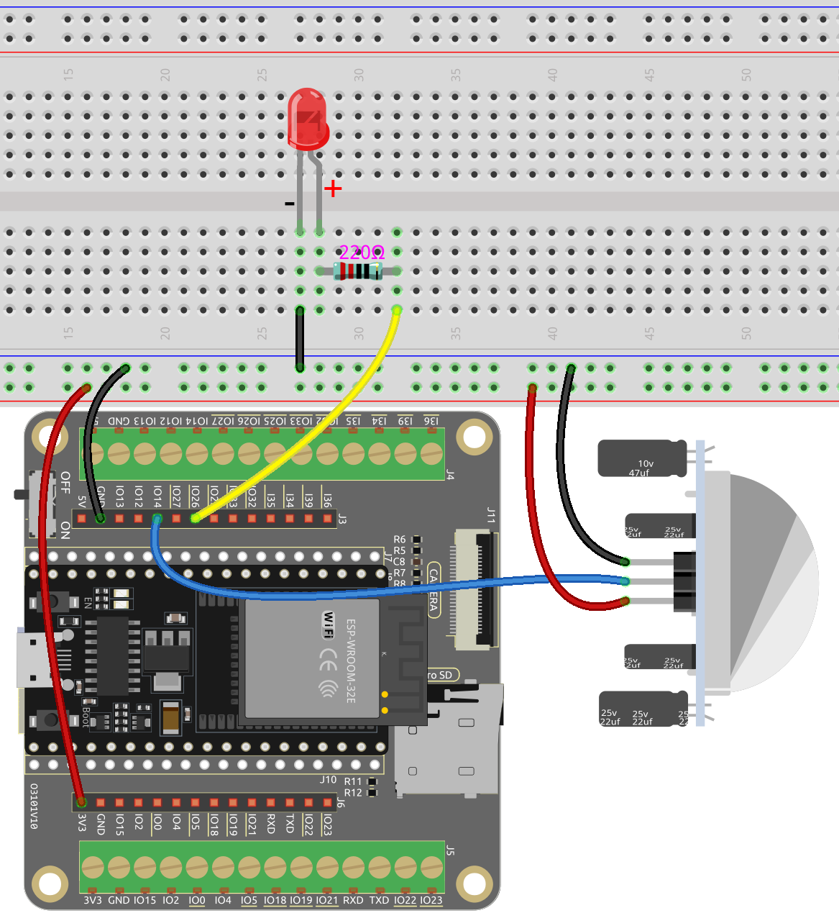

.. note::

    Ciao, benvenuto nella community di SunFounder Raspberry Pi & Arduino & ESP32 Enthusiasts su Facebook! Approfondisci il mondo di Raspberry Pi, Arduino e ESP32 insieme ad altri appassionati.

    **Perché Unirsi?**

    - **Supporto Esperti**: Risolvi problemi post-vendita e sfide tecniche con l'aiuto della nostra community e del nostro team.
    - **Impara & Condividi**: Scambia consigli e tutorial per migliorare le tue competenze.
    - **Anteprime Esclusive**: Accedi in anteprima agli annunci di nuovi prodotti e alle anticipazioni.
    - **Sconti Speciali**: Goditi sconti esclusivi sui nostri prodotti più recenti.
    - **Promozioni Festive e Giveaway**: Partecipa ai giveaway e alle promozioni festive.

    👉 Pronto a esplorare e creare con noi? Clicca su [|link_sf_facebook|] e unisciti oggi stesso!

.. _py_pir:

5.5 Rileva il Movimento Umano
========================================

Il sensore a infrarossi passivo (sensore PIR) è un sensore comune che può misurare 
la luce infrarossa (IR) emessa dagli oggetti nel suo campo visivo. In poche parole, 
rileva la radiazione infrarossa emessa dal corpo, permettendo così di rilevare il 
movimento di persone e altri animali. Più specificamente, comunica alla scheda di controllo principale che qualcuno è entrato nella tua stanza.

**Componenti Necessari**

In questo progetto, abbiamo bisogno dei seguenti componenti.

È sicuramente conveniente acquistare un kit completo, ecco il link:

.. list-table::
    :widths: 20 20 20
    :header-rows: 1

    *   - Nome	
        - OGGETTI IN QUESTO KIT
        - LINK
    *   - ESP32 Starter Kit
        - 320+
        - |link_esp32_starter_kit|

Puoi anche acquistarli separatamente dai link qui sotto.

.. list-table::
    :widths: 30 20
    :header-rows: 1

    *   - INTRODUZIONE AI COMPONENTI
        - LINK PER L'ACQUISTO

    *   - :ref:`cpn_esp32_wroom_32e`
        - |link_esp32_wroom_32e_buy|
    *   - :ref:`cpn_esp32_camera_extension`
        - |link_esp32_extension_board|
    *   - :ref:`cpn_breadboard`
        - |link_breadboard_buy|
    *   - :ref:`cpn_wires`
        - |link_wires_buy|
    *   - :ref:`cpn_resistor`
        - |link_resistor_buy|
    *   - :ref:`cpn_led`
        - |link_led_buy|
    *   - :ref:`cpn_pir`
        - |link_pir_buy|

**Pin Disponibili**

* **Pin Disponibili**

    Ecco un elenco dei pin disponibili sulla scheda ESP32 per questo progetto.

    .. list-table::
        :widths: 5 20

        *   - Per Input
            - IO13, IO14, IO27, IO26, IO25, IO33, I35, I34, I39, I36, IO4, IO18, IO19, IO21, IO22, IO23
        *   - Per Output
            - IO13, IO12, IO14, IO27, IO26, IO25, IO33, IO32, IO15, IO2, IO0, IO4, IO5, IO18, IO19, IO21, IO22, IO23

.. note::
    
    IO32 non può essere utilizzato **come pin di input** in questo progetto perché è internamente collegato a una resistenza di pull-down da 1K, che imposta il suo valore predefinito a 0.

* **Pin di Strapping (Input)**

    I pin di strapping sono un set speciale di pin utilizzati per determinare modalità di avvio specifiche durante l'accensione del dispositivo 
    (cioè, reset di accensione).

    
    .. list-table::
        :widths: 5 15

        *   - Pin di Strapping
            - IO5, IO0, IO2, IO12, IO15 
    

    Generalmente, **non è consigliabile utilizzarli come pin di input**. Se desideri utilizzare questi pin, considera l'impatto potenziale sul processo di avvio. Per ulteriori dettagli, consulta la sezione :ref:`esp32_strapping`.

**Schema**

.. image:: ../../img/circuit/circuit_5.5_pir.png

Quando il modulo PIR rileva un movimento, IO14 andrà in stato alto e il LED si accenderà. Altrimenti, quando non viene rilevato alcun movimento, IO14 sarà in stato basso e il LED si spegnerà.

.. note::
    Il modulo PIR ha due potenziometri: uno regola la sensibilità, l'altro regola la distanza di rilevamento. Per far funzionare al meglio il modulo PIR, è necessario ruotare entrambi i potenziometri in senso antiorario fino alla fine.

    .. image:: ../../components/img/PIR_TTE.png
        :width: 300
        :align: center

**Cablatura**

**Codice**

.. note::

    * Apri il file ``5.5_detect_human_movement.py`` situato nel percorso ``esp32-starter-kit-main\micropython\codes``, oppure copia e incolla il codice in Thonny. Successivamente, fai clic su "Esegui lo script corrente" o premi F5 per eseguirlo.
    * Assicurati di selezionare l'interprete "MicroPython (ESP32).COMxx" nell'angolo in basso a destra.

.. code-block:: python

    import machine
    import time

    # Definisci i pin
    PIR_PIN = 14    # Sensore PIR
    LED_PIN = 26    # LED

    # Inizializza il pin del sensore PIR come pin di input
    pir_sensor = machine.Pin(PIR_PIN, machine.Pin.IN, machine.Pin.PULL_DOWN)
    # Inizializza il pin del LED come pin di output
    led = machine.Pin(LED_PIN, machine.Pin.OUT)

    # Flag globale per indicare il rilevamento di movimento
    motion_detected_flag = False

    # Funzione per gestire l'interrupt
    def motion_detected(pin):
        global motion_detected_flag
        print("Motion detected!")
        motion_detected_flag = True

    # Collega l'interrupt al pin del sensore PIR
    pir_sensor.irq(trigger=machine.Pin.IRQ_RISING, handler=motion_detected)

    # Ciclo principale
    while True:
        if motion_detected_flag:
            led.value(1)  # Accendi il LED
            time.sleep(5)  # Mantieni il LED acceso per 5 secondi
            led.value(0)  # Spegni il LED
            motion_detected_flag = False

Quando lo script è in esecuzione, il LED si accenderà per 5 secondi e poi si spegnerà quando il modulo PIR rileva il passaggio di qualcuno.

.. note::

    Il modulo PIR ha due potenziometri: uno regola la sensibilità, l'altro regola la distanza di rilevamento. Per far funzionare al meglio il modulo PIR, è necessario ruotare entrambi i potenziometri in senso antiorario fino alla fine.

    .. image:: ../../components/img/PIR_TTE.png
        :width: 300
        :align: center

**Come Funziona?**

Questo codice imposta un semplice sistema di rilevamento del movimento utilizzando un sensore PIR e un LED. Quando viene rilevato un movimento, il LED si accenderà per 5 secondi.

Ecco una suddivisione del codice:

#. Definisci la funzione gestore dell'interrupt che verrà eseguita quando viene rilevato un movimento:

    .. code-block:: python

        def motion_detected(pin):
            global motion_detected_flag
            print("Motion detected!")
            motion_detected_flag = True

#. Collega l'interrupt al pin del sensore PIR, con il trigger impostato su "rising" (cioè, quando il pin passa da bassa a alta tensione):

    .. code-block:: python

        pir_sensor.irq(trigger=machine.Pin.IRQ_RISING, handler=motion_detected)

    Questo imposta un interrupt sul pin ``pir_sensor``, che è collegato al sensore di movimento PIR.

    Ecco una spiegazione dettagliata dei parametri:

    * ``trigger=machine.Pin.IRQ_RISING``: Questo parametro imposta la condizione di trigger per l'interrupt. In questo caso, l'interrupt verrà attivato su un fronte di salita. Un fronte di salita è quando la tensione sul pin passa da uno stato basso (0V) a uno stato alto (tipicamente 3.3V o 5V, a seconda dell'hardware). Per un sensore di movimento PIR, quando viene rilevato un movimento, il pin di uscita di solito passa da basso ad alto, rendendo il fronte di salita una condizione di trigger appropriata.

    * ``handler=motion_detected``: Questo parametro specifica la funzione che verrà eseguita quando l'interrupt viene attivato. In questo caso, la funzione ``motion_detected`` viene fornita come gestore dell'interrupt. Questa funzione verrà chiamata automaticamente quando la condizione dell'interrupt (fronte di salita) viene rilevata sul pin ``pir_sensor``.

    Quindi, questa riga di codice configura il sensore PIR per chiamare la funzione ``motion_detected`` ogni volta che il sensore rileva un movimento, a causa del passaggio del pin di uscita da uno stato basso a uno stato alto.

#. Nel ciclo principale, se il ``motion_detected_flag`` è impostato su ``True``, il LED verrà acceso per 5 secondi e poi spento. Il flag viene quindi resettato a ``False`` per attendere il prossimo evento di movimento.

    .. code-block:: python

        while True:
            if motion_detected_flag:
                led.value(1)  # Accendi il LED
                time.sleep(5)  # Mantieni il LED acceso per 5 secondi
                led.value(0)  # Spegni il LED
                motion_detected_flag = False
