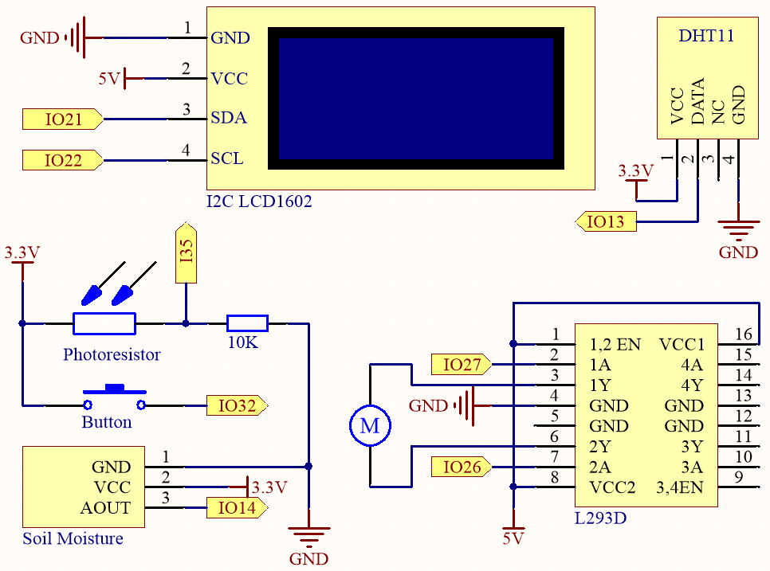
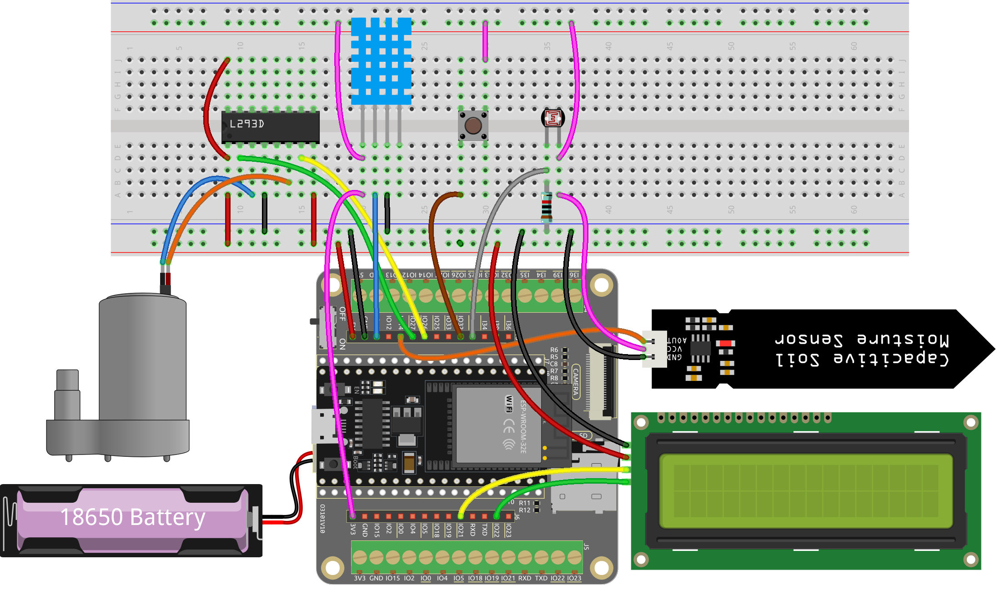

.. _py_plant_monitor:

6.8 Monitor de Plantas
===============================

¡Bienvenido al proyecto Monitor de Plantas!

En este proyecto, utilizaremos una placa ESP32 para crear un sistema que nos ayude a cuidar de nuestras plantas. Con este sistema, podemos monitorear la temperatura, humedad, humedad del suelo y niveles de luz de nuestras plantas, y asegurarnos de que reciban el cuidado y atención que necesitan para prosperar.

**Componentes Requeridos**

Para este proyecto, necesitamos los siguientes componentes.

Es definitivamente conveniente comprar un kit completo, aquí está el enlace:

.. list-table::
    :widths: 20 20 20
    :header-rows: 1

    *   - Nombre	
        - ELEMENTOS EN ESTE KIT
        - ENLACE
    *   - Kit de Inicio ESP32
        - 320+
        - |link_esp32_starter_kit|

También puedes comprarlos por separado en los enlaces a continuación.

.. list-table::
    :widths: 30 20
    :header-rows: 1

    *   - INTRODUCCIÓN DEL COMPONENTE
        - ENLACE DE COMPRA

    *   - :ref:`cpn_esp32_wroom_32e`
        - |link_esp32_wroom_32e_buy|
    *   - :ref:`cpn_esp32_camera_extension`
        - \-
    *   - :ref:`cpn_breadboard`
        - |link_breadboard_buy|
    *   - :ref:`cpn_wires`
        - |link_wires_buy|
    *   - :ref:`cpn_resistor`
        - |link_resistor_buy|
    *   - :ref:`cpn_dht11`
        - |link_dht11_buy|
    *   - :ref:`cpn_lcd`
        - |link_i2clcd1602_buy|
    *   - :ref:`cpn_pump`
        - \-
    *   - :ref:`cpn_l293d`
        - \-
    *   - :ref:`cpn_button`
        - |link_button_buy|
    *   - :ref:`cpn_photoresistor`
        - |link_photoresistor_buy|
    *   - :ref:`cpn_soil_moisture`
        - |link_soil_moisture_buy|

**Esquemático**

El sistema utiliza un sensor DHT11 para medir los niveles de temperatura y humedad del entorno circundante. 
Mientras tanto, un módulo de humedad del suelo se utiliza para medir el nivel de humedad del suelo y un fotoresistor se utiliza para 
medir el nivel de luz. Las lecturas de estos sensores se muestran en una pantalla LCD, y se puede controlar una bomba de agua 
usando un botón para regar la planta cuando sea necesario.

IO32 tiene una resistencia interna de pull-down de 1K, y por defecto, está en un nivel lógico bajo. Cuando se presiona el botón, se establece una conexión a VCC (alto voltaje), resultando en un nivel lógico alto en IO32.

**Conexión**

.. note::

    Se recomienda aquí insertar la batería y luego deslizar el interruptor en la placa de expansión a la posición ON para activar el suministro de la batería.

**Código**

.. note::

    * Abre el archivo ``6.8_plant_monitor.py`` ubicado en el camino ``esp32-starter-kit-main\micropython\codes``, o copia y pega el código en Thonny. Luego, haz clic en "Ejecutar script actual" o presiona F5 para ejecutarlo.
    * Asegúrate de seleccionar el intérprete "MicroPython (ESP32).COMxx" en la esquina inferior derecha. 

.. code-block:: python

      from machine import ADC, Pin
      import time
      import dht
      from lcd1602 import LCD

      # DHT11
      dht11 = dht.DHT11(Pin(13))

      # Humedad del suelo
      moisture_pin = ADC(Pin(14))
      moisture_pin.atten(ADC.ATTN_11DB)

      # Fotoresistor
      photoresistor = ADC(Pin(35))
      photoresistor.atten(ADC.ATTN_11DB)

      # Botón y bomba
      button = Pin(32, Pin.IN)

      motor1A = Pin(27, Pin.OUT)
      motor2A = Pin(26, Pin.OUT)

      # Configuración del LCD I2C1602
      lcd = LCD()

      # Rotar la bomba
      def rotate():
      motor1A.value(1)
      motor2A.value(0)

      # Detener la bomba
      def stop():
      motor1A.value(0)
      motor2A.value(0)

      estado_del_boton = False

      # Definir la función de callback del botón para alternar el estado del botón
      def button_callback(pin):
      global estado_del_boton
      estado_del_boton = not estado_del_boton

      # Adjuntar la función de callback del botón al borde ascendente del pin del botón
      button.irq(trigger=Pin.IRQ_RISING, handler=button_callback)

      pagina = 0
      temp = 0
      humi = 0
            
      try:
      while True:
            
            # Si el botón está presionado y el estado del botón es Verdadero
            if estado_del_boton:
                  print("rotar")
                  rotate()

            # Si el botón está presionado de nuevo y el estado del botón es Falso
            if not estado_del_boton:
                  print("detener")
                  stop()
            time.sleep(2)

            # Limpiar la pantalla LCD
            lcd.clear()
            
            # Alternar el valor de la variable pagina entre 0 y 1
            pagina=(pagina+1)%2
            
            # Cuando la pagina es 1, mostrar temperatura y humedad en el LCD1602
            if pagina is 1:
                  try:
                  # Medir temperatura y humedad
                  dht11.measure()

                  # Obtener valores de temperatura y humedad
                  temp = dht11.temperature()
                  humi = dht11.humidity()
                  except Exception as e:
                  print("Error: ", e)         

                  # Mostrar temperatura y humedad
                  lcd.write(0, 0, "Temp: {}\xDFC".format(temp))
                  lcd.write(0, 1, "Humi: {}%".format(humi))

            # Si la pagina es 0, mostrar la humedad del suelo y luz
            else:
                  luz = photoresistor.read()
                  humedad = moisture_pin.read()

                  # Limpiar la pantalla LCD
                  lcd.clear()

                  # Mostrar el valor de la humedad del suelo y luz
                  lcd.write(0, 0, f"Humedad: {humedad}")
                  lcd.write(0, 1, f"Luz: {luz}")

      except KeyboardInterrupt:
      # Detener el motor cuando se captura KeyboardInterrupt
      stop()

* Cuando el código está ejecutando, el LCD I2C1602 muestra alternativamente temperatura y humedad, así como valores analógicos de humedad del suelo e intensidad de luz, con un intervalo de 2 segundos.
* Presiona el botón para iniciar la bomba de agua, y presiónalo de nuevo para detener la bomba de agua.

.. note:: 

    Si el código y la conexión son correctos, pero el LCD aún no muestra ningún contenido, puedes ajustar el potenciómetro en la parte trasera para aumentar el contraste.

