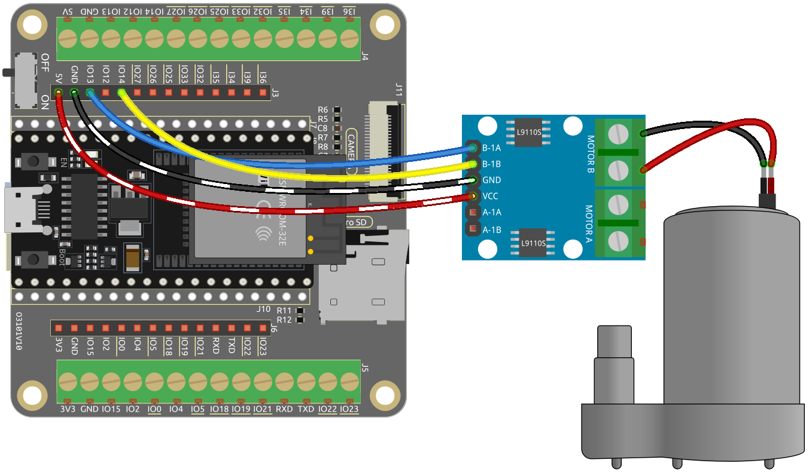

.. _py_pump:

4.2 Pumping
=======================

In this intriguing project, we will delve into controlling a water pump using the L9110 motor driver module. Known for its compactness and effectiveness, the L9110 module is a common choice in robotics and mechatronics projects for controlling DC motors.

In the realm of water pump control, things are a bit simpler compared to controlling other motors. The beauty of this project lies in its simplicity - there's no need to worry about the direction of rotation. Our primary goal is to successfully activate the water pump and keep it running.

**Available Pins**

Here is a list of available pins on the ESP32 board for this project.

.. list-table::
    :widths: 5 20 

    * - Available Pins
      - IO13, IO12, IO14, IO27, IO26, IO25, IO33, IO32, IO15, IO2, IO0, IO4, IO5, IO18, IO19, IO21, IO22, IO23

.. note::

  * **IO12** needs to be connected to the L9110 module after ESP32 starts up normally because the input pins of the L9110 module have a 10K pull-down resistor, which can prevent ESP32 from booting correctly.

**Schematic**

.. image:: ../../img/circuit/circuit_4.1_motor.png

Here is the truth table of pump:

.. list-table:: 
    :widths: 25 25 50
    :header-rows: 1

    * - B-1A
      - B-1B
      - The state of pump
    * - 1
      - 0
      - Work
    * - 0
      - 1
      - Work
    * - 0
      - 0
      - Stop
    * - 1
      - 1
      - Stop

**Wiring**

* :ref:`cpn_esp32_wroom_32e`
* :ref:`cpn_esp32_camera_extension`
* :ref:`cpn_wires`
* :ref:`cpn_pump`
* :ref:`cpn_l9110`

**Code**

.. note::

    * Open the ``4.2_pumping.py`` file located in the ``esp32-ultimate-kit-main\micropython\codes`` path, or copy and paste the code into Thonny. Then, click "Run Current Script" or press F5 to execute it.
    * Make sure to select the "MicroPython (ESP32).COMxx" interpreter in the bottom right corner. 

.. code-block:: python

    import machine
    import time

    # Create Pin objects representing the motor control pins and set them to output mode
    B_1A = machine.Pin(13, machine.Pin.OUT)
    B_1B = machine.Pin(14, machine.Pin.OUT)

    # Define a function to rotate the pump
    def rotate():
        B_1A.value(1)
        B_1B.value(0)

    # Define a function to stop the pump
    def stop():
        B_1A.value(0)
        B_1B.value(0)

    try:
        while True:
            rotate()  # Rotate the motor clockwise
            time.sleep(5)  # Pause for 5 seconds
            stop()  # Stop the motor
            time.sleep(2)

    except KeyboardInterrupt:
        stop()  # Stop the motor when KeyboardInterrupt is caught

During the script execution, you will see the pump working and water coming out of the tube, then stopping for 2 seconds before starting to work again.
