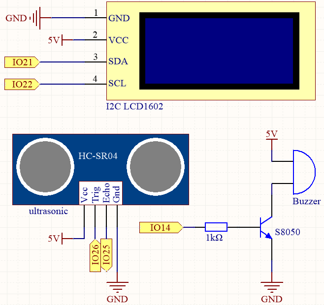

.. note::

    Ciao, benvenuto nella community di SunFounder Raspberry Pi & Arduino & ESP32 Enthusiasts su Facebook! Approfondisci le tue conoscenze su Raspberry Pi, Arduino e ESP32 insieme ad altri appassionati.

    **Perché Unirsi?**

    - **Supporto Esperti**: Risolvi problemi post-vendita e sfide tecniche con l'aiuto della nostra community e del nostro team.
    - **Impara & Condividi**: Scambia consigli e tutorial per migliorare le tue competenze.
    - **Anteprime Esclusive**: Accedi in anteprima agli annunci di nuovi prodotti e alle anticipazioni.
    - **Sconti Speciali**: Goditi sconti esclusivi sui nostri prodotti più recenti.
    - **Promozioni Festive e Giveaway**: Partecipa ai giveaway e alle promozioni festive.

    👉 Pronto a esplorare e creare con noi? Clicca su [|link_sf_facebook|] e unisciti oggi stesso!

.. _py_reversing_aid:

6.4 Ausilio al Parcheggio
================================

Immagina questo: sei in auto, pronto a fare retromarcia per entrare in un parcheggio stretto. Con il nostro progetto, avrai un modulo ultrasonico montato sul retro del veicolo che fungerà da occhio digitale. Quando innesti la retromarcia, il modulo si attiva emettendo impulsi ultrasonici che rimbalzano sugli ostacoli dietro di te.

La magia avviene quando questi impulsi tornano al modulo. Esso calcola rapidamente la distanza tra la tua auto e gli oggetti circostanti, trasformando questi dati in un feedback visivo in tempo reale visualizzato su un vivace schermo LCD. Vedrai indicatori dinamici a colori che rappresentano la vicinanza degli ostacoli, garantendo una comprensione chiara dell'ambiente circostante.

Ma non ci siamo fermati qui. Per immergerti ulteriormente nell'esperienza di guida, abbiamo incorporato un vivace cicalino. Mentre la tua auto si avvicina a un ostacolo, il ritmo del cicalino aumenta, creando una sinfonia uditiva di avvertimenti. È come avere un'orchestra personale che ti guida attraverso le complessità del parcheggio in retromarcia.

Questo progetto innovativo combina tecnologia all'avanguardia con un'interfaccia utente interattiva, rendendo la tua esperienza di retromarcia sicura e senza stress. Con il modulo ultrasonico, il display LCD e il vivace cicalino che lavorano in armonia, ti sentirai sicuro e a tuo agio mentre manovri in spazi ristretti, permettendoti di concentrarti sul piacere della guida.

**Componenti Necessari**

In questo progetto, abbiamo bisogno dei seguenti componenti.

È sicuramente conveniente acquistare un kit completo, ecco il link:

.. list-table::
    :widths: 20 20 20
    :header-rows: 1

    *   - Nome	
        - OGGETTI IN QUESTO KIT
        - LINK
    *   - ESP32 Starter Kit
        - 320+
        - |link_esp32_starter_kit|

Puoi anche acquistarli separatamente dai link qui sotto.

.. list-table::
    :widths: 30 20
    :header-rows: 1

    *   - INTRODUZIONE AI COMPONENTI
        - LINK PER L'ACQUISTO

    *   - :ref:`cpn_esp32_wroom_32e`
        - |link_esp32_wroom_32e_buy|
    *   - :ref:`cpn_esp32_camera_extension`
        - |link_esp32_extension_board|
    *   - :ref:`cpn_breadboard`
        - |link_breadboard_buy|
    *   - :ref:`cpn_wires`
        - |link_wires_buy|
    *   - :ref:`cpn_resistor`
        - |link_resistor_buy|
    *   - :ref:`cpn_ultrasonic`
        - |link_ultrasonic_buy|
    *   - :ref:`cpn_buzzer`
        - \-
    *   - :ref:`cpn_transistor`
        - |link_transistor_buy|
    *   - :ref:`cpn_lcd`
        - |link_i2clcd1602_buy|

**Schema**

Il sensore ultrasonico nel progetto emette onde sonore ad alta frequenza e misura il tempo impiegato dalle onde per rimbalzare dopo aver colpito un oggetto. Analizzando questi dati, è possibile calcolare la distanza tra il sensore e l'oggetto. Per fornire un avviso quando l'oggetto è troppo vicino, viene utilizzato un cicalino per produrre un segnale acustico. Inoltre, la distanza misurata viene visualizzata su uno schermo LCD per una facile visualizzazione.

**Cablatura**

.. image:: ../../img/wiring/6.4_aid_ultrasonic_bb.png
    :width: 800
    :align: center

**Codice**

.. note::

    * Apri il file ``6.4_reversing_aid.py`` situato nel percorso ``esp32-starter-kit-main\micropython\codes``, oppure copia e incolla il codice in Thonny. Successivamente, fai clic su "Esegui lo script corrente" o premi F5 per eseguirlo.
    * Assicurati di selezionare l'interprete "MicroPython (ESP32).COMxx" nell'angolo in basso a destra. 

.. code-block:: python

    # Importa le librerie necessarie
    from machine import Pin
    import time
    from lcd1602 import LCD
    import _thread

    # Inizializza il cicalino
    buzzer = Pin(14, Pin.OUT)

    # Inizializza il modulo ultrasonico
    TRIG = Pin(26, Pin.OUT)
    ECHO = Pin(25, Pin.IN)

    # Inizializza il display LCD1602
    lcd = LCD()

    dis = 100

    # Calcola la distanza
    def distance():
        # Assicurati che il trigger sia inizialmente spento
        TRIG.off()
        time.sleep_us(2)  # Attendi 2 microsecondi

        # Invia un impulso di 10 microsecondi al pin di trigger
        TRIG.on()
        time.sleep_us(10)
        TRIG.off()

        # Attendi che il pin di echo si attivi
        while not ECHO.value():
            pass

        # Registra il tempo in cui il pin di echo si attiva
        time1 = time.ticks_us()

        # Attendi che il pin di echo si disattivi
        while ECHO.value():
            pass

        # Registra il tempo in cui il pin di echo si disattiva
        time2 = time.ticks_us()

        # Calcola la differenza di tempo tra i due tempi registrati
        during = time.ticks_diff(time2, time1)

        # Calcola e restituisci la distanza (in cm) utilizzando la velocità del suono (340 m/s)
        return during * 340 / 2 / 10000

    # Thread per aggiornare continuamente la lettura del sensore ultrasonico
    def ultrasonic_thread():
        global dis
        while True:
            dis = distance()
            
            # Pulisci lo schermo LCD
            lcd.clear()
            
            # Visualizza la distanza
            lcd.write(0, 0, 'Dis: %.2f cm' % dis)
            time.sleep(0.5)

    # Avvia il thread di lettura del sensore ultrasonico
    _thread.start_new_thread(ultrasonic_thread, ())

    # Funzione per emettere un beep con il cicalino
    def beep():
        buzzer.value(1)
        time.sleep(0.1)
        buzzer.value(0)
        time.sleep(0.1)

    # Inizializza la variabile degli intervalli
    intervals = 10000000
    previousMills = time.ticks_ms()
    time.sleep(1)

    # Ciclo principale
    while True:
        # Aggiorna gli intervalli in base alla distanza
        if dis < 0 and dis > 500:
            pass
        elif dis <= 10:
            intervals = 300
        elif dis <= 20:
            intervals = 500
        elif dis <= 50:
            intervals = 1000
        else:
            intervals = 2000

        # Stampa la distanza se non è -1
        if dis != -1:
            print('Distance: %.2f' % dis)
        time.sleep_ms(100)

        # Controlla se è il momento di emettere un beep
        currentMills = time.ticks_ms()
        if time.ticks_diff(currentMills, previousMills) >= intervals:
            beep()
            previousMills = currentMills

* Quando lo script è in esecuzione, il modulo ultrasonico rileverà continuamente la distanza degli ostacoli davanti a esso e visualizzerà la distanza sul Shell e sull'I2C LCD1602.
* Man mano che l'ostacolo si avvicina, la frequenza dei beep del cicalino diventerà più rapida.
* La funzione ``ultrasonic_thread()`` viene eseguita in un thread separato in modo da poter aggiornare continuamente la misurazione della distanza senza bloccare il ciclo principale.

.. note:: 

    Se il codice e il cablaggio sono corretti, ma l'LCD non riesce a visualizzare alcun contenuto, puoi regolare il potenziometro sul retro per aumentare il contrasto.

