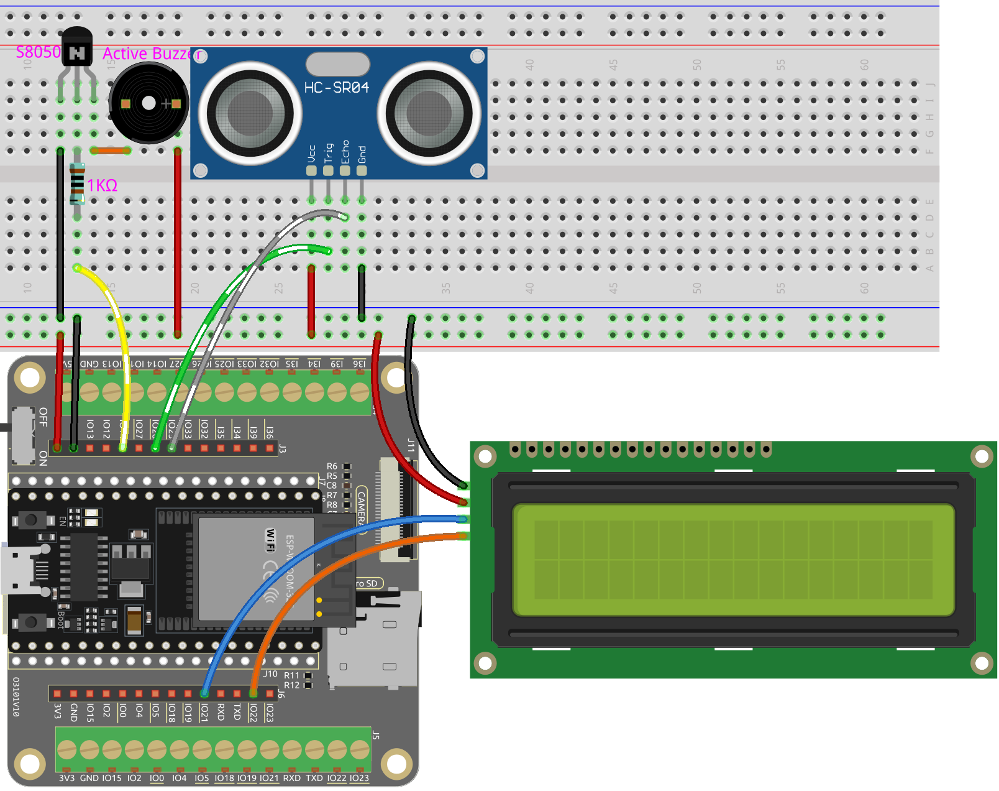

.. _py_reversing_aid:

5.4 Reversing Aid
======================

Imagine this: You're in your car, about to reverse into a tight parking spot. With our project, you will have an ultrasonic module mounted on the rear of your vehicle, acting as a digital eye. As you engage the reverse gear, the module springs to life, emitting ultrasonic pulses that bounce off obstacles behind you.

The magic happens when these pulses return to the module. It swiftly calculates the distance between your car and the objects, transforming this data into real-time visual feedback displayed on a vibrant LCD screen. You'll witness dynamic, color-coded indicators depicting the proximity of obstacles, ensuring you have a crystal-clear understanding of the surrounding environment.

But we didn't stop there. To immerse you further into this driving experience, we incorporated a lively buzzer. As your car inches closer to an obstacle, the buzzer's tempo intensifies, creating an auditory symphony of warnings. It's like having a personal orchestra guiding you through the complexities of reverse parking.

This innovative project combines cutting-edge technology with an interactive user interface, making your reversing experience safe and stress-free. With the ultrasonic module, LCD display, and lively buzzer working harmoniously, you'll feel empowered and confident while maneuvering in tight spaces, leaving you free to focus on the joy of driving.

**Schematic**

.. image:: ../../img/circuit/circuit_6.4_reversing_aid.png
    :width: 800
    :align: center

The ultrasonic sensor in the project emits high-frequency sound waves and measures the time it takes for the waves to bounce back after hitting an object. By analyzing this data, the distance between the sensor and the object can be calculated. To provide a warning when the object is too close, a buzzer is used to produce an audible signal. Additionally, the measured distance is displayed on an LCD screen for easy visualization.

**Wiring**

* :ref:`cpn_esp32_extension`
* :ref:`cpn_breadboard`
* :ref:`cpn_resistor`
* :ref:`cpn_wires`
* :ref:`cpn_ultrasonic`
* :ref:`cpn_buzzer`
* :ref:`cpn_transistor`
* :ref:`cpn_lcd`

**Code**

.. note::

    * Open the ``5.4_reversing_aid.py`` file located in the ``esp32-ultimate-kit-main\micropython\codes`` path, or copy and paste the code into Thonny. Then, click "Run Current Script" or press F5 to execute it.
    * Make sure to select the "MicroPython (ESP32).COMxx" interpreter in the bottom right corner. 

.. code-block:: python

    # Import required libraries
    from machine import Pin
    import time
    from lcd1602 import LCD
    import _thread

    # Initialize the buzzer
    buzzer = Pin(14, Pin.OUT)

    # Initialize the ultrasonic module
    TRIG = Pin(26, Pin.OUT)
    ECHO = Pin(25, Pin.IN)

    # Initialize the LCD1602 display
    lcd = LCD()

    dis = 100

    # Calculate the distance
    def distance():
        # Ensure trigger is off initially
        TRIG.off()
        time.sleep_us(2)  # Wait for 2 microseconds

        # Send a 10-microsecond pulse to the trigger pin
        TRIG.on()
        time.sleep_us(10)
        TRIG.off()

        # Wait for the echo pin to go high
        while not ECHO.value():
            pass

        # Record the time when the echo pin goes high
        time1 = time.ticks_us()

        # Wait for the echo pin to go low
        while ECHO.value():
            pass

        # Record the time when the echo pin goes low
        time2 = time.ticks_us()

        # Calculate the time difference between the two recorded times
        during = time.ticks_diff(time2, time1)

        # Calculate and return the distance (in cm) using the speed of sound (340 m/s)
        return during * 340 / 2 / 10000

    # Thread to continuously update the ultrasonic sensor reading
    def ultrasonic_thread():
        global dis
        while True:
            dis = distance()
            
            # Clear the LCD screen
            lcd.clear()
            
            # Display the distance
            lcd.write(0, 0, 'Dis: %.2f cm' % dis)
            time.sleep(0.5)

    # Start the ultrasonic sensor reading thread
    _thread.start_new_thread(ultrasonic_thread, ())

    # Beep function for the buzzer
    def beep():
        buzzer.value(1)
        time.sleep(0.1)
        buzzer.value(0)
        time.sleep(0.1)

    # Initialize the intervals variable
    intervals = 10000000
    previousMills = time.ticks_ms()
    time.sleep(1)

    # Main loop
    while True:
        # Update intervals based on distance
        if dis < 0 and dis > 500:
            pass
        elif dis <= 10:
            intervals = 300
        elif dis <= 20:
            intervals = 500
        elif dis <= 50:
            intervals = 1000
        else:
            intervals = 2000

        # Print the distance if it's not -1
        if dis != -1:
            print('Distance: %.2f' % dis)
        time.sleep_ms(100)

        # Check if it's time to beep
        currentMills = time.ticks_ms()
        if time.ticks_diff(currentMills, previousMills) >= intervals:
            beep()
            previousMills = currentMills

* When the script is running, the ultrasonic module will continuously detect the distance of obstacles in front of it, and display the distance on the Shell and I2C LCD1602. 
* As the obstacle gets closer, the beeping frequency of the buzzer will become more rapid.
* The ``ultrasonic_thread()`` function runs in a separate thread so that it can update the distance measurement continuously without blocking the main loop.

.. note:: 

    If the code and wiring are correct, but the LCD still fails to display any content, you can adjust the potentiometer on the back to increase the contrast.
