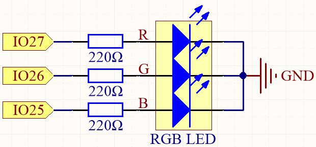
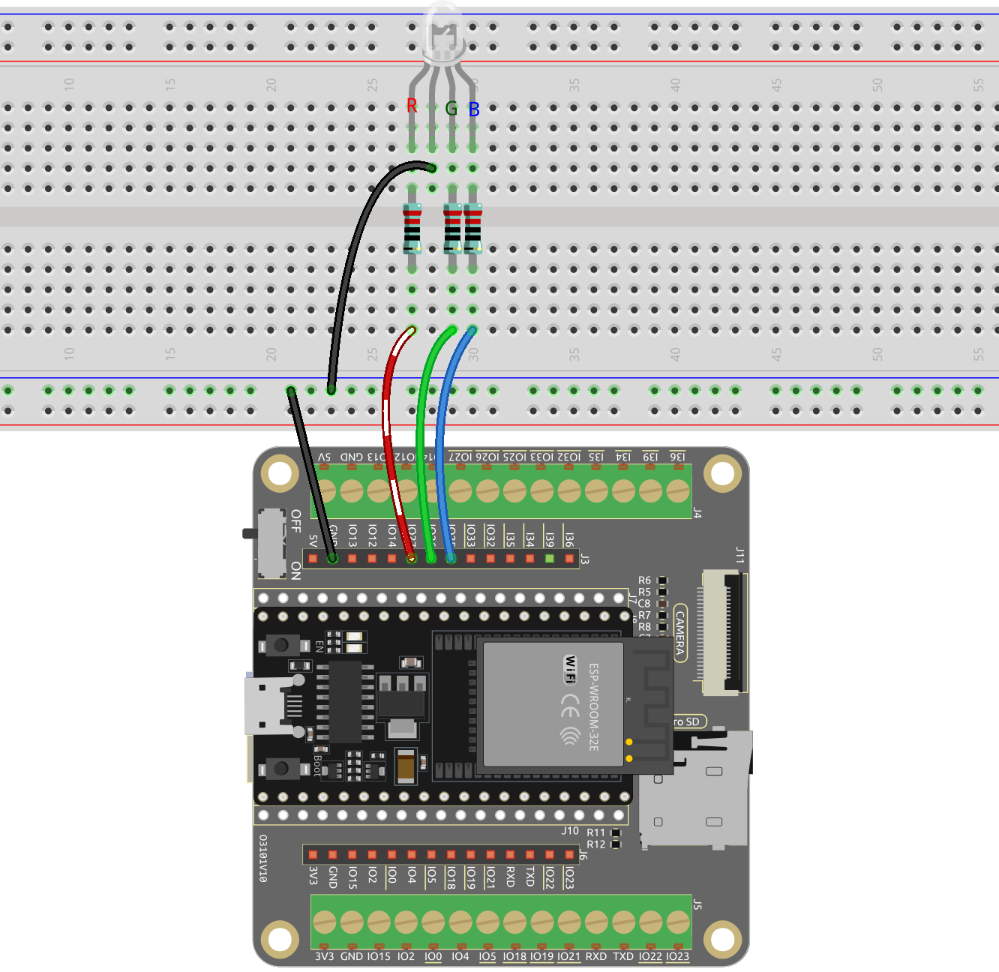

.. _py_rgb:

2.3 Colorful Light
==============================================

In this project, we will delve into the fascinating world of additive color mixing using an RGB LED.

RGB LED combines three primary colors, namely Red, Green, and Blue, into a single package. These three LEDs share a common cathode pin, while each anode pin controls the intensity of the corresponding color.

By varying the electrical signal intensity applied to each anode, we can create a wide range of colors. For example, mixing high-intensity red and green light will result in yellow light, while combining blue and green light will produce cyan.

Through this project, we will explore the principles of additive color mixing and unleash our creativity by manipulating the RGB LED to display captivating and vibrant colors.

**Available Pins**

Here is a list of available pins on the ESP32 board for this project.

.. list-table::
    :widths: 5 20 

    * - Available Pins
      - IO13, IO12, IO14, IO27, IO26, IO25, IO33, IO32, IO15, IO2, IO0, IO4, IO5, IO18, IO19, IO21, IO22, IO23

**Schematic**

The PWM pins pin27, pin26 and pin25 control the Red, Green and Blue pins of the RGB LED respectively, and connect the common cathode pin to GND. This allows the RGB LED to display a specific color by superimposing light on these pins with different PWM values.

**Wiring**

.. image:: ../../components/img/rgb_pin.jpg
    :width: 200
    :align: center

The RGB LED has 4 pins: the long pin is the common cathode pin, which is usually connected to GND; the left pin next to the longest pin is Red; and the two pins on the right are Green and Blue.

* :ref:`cpn_esp32_wroom_32e`
* :ref:`cpn_esp32_camera_extension`
* :ref:`cpn_breadboard`
* :ref:`cpn_wires`
* :ref:`cpn_resistor`
* :ref:`cpn_rgb`

**Code**

.. note::

    * Open the ``2.3_colorful_light.py`` file located in the ``esp32-ultimate-kit-main\micropython\codes`` path, or copy and paste the code into Thonny. Then, click "Run Current Script" or press F5 to execute it.
    * Make sure to select the "MicroPython (ESP32).COMxx" interpreter in the bottom right corner. 

.. code-block:: python

    from machine import Pin, PWM
    import time

    # Define the GPIO pins for the RGB LED
    RED_PIN = 27
    GREEN_PIN = 26
    BLUE_PIN = 25

    # Set up the PWM channels
    red = PWM(Pin(RED_PIN))
    green = PWM(Pin(GREEN_PIN))
    blue = PWM(Pin(BLUE_PIN))

    # Set the PWM frequency
    red.freq(1000)
    green.freq(1000)
    blue.freq(1000)

    def set_color(r, g, b):
        red.duty(r)
        green.duty(g)
        blue.duty(b)

    while True:
        # Set different colors and wait for a while
        set_color(1023, 0, 0) # Red
        time.sleep(1)
        set_color(0, 1023, 0) # Green
        time.sleep(1)
        set_color(0, 0, 1023) # Blue
        time.sleep(1)
        set_color(1023, 0, 1023) # purple
        time.sleep(1)

When the script runs, you will see the RGB LEDs display red, green, blue and purple, and so on.

**Learn More**

You can also set the color you want with the following code with the familiar color values of 0~255.

.. note::

    * Open the ``2.3_colorful_light_rgb.py`` file located in the ``esp32-ultimate-kit-main\micropython\codes`` path, or copy and paste the code into Thonny. Then, click "Run Current Script" or press F5 to execute it.
    * Make sure to select the "MicroPython (ESP32).COMxx" interpreter in the bottom right corner. 

.. code-block:: python

    from machine import Pin, PWM
    import time

    # Define the GPIO pins for the RGB LED
    RED_PIN = 27
    GREEN_PIN = 26
    BLUE_PIN = 25

    # Set up the PWM channels
    red = PWM(Pin(RED_PIN))
    green = PWM(Pin(GREEN_PIN))
    blue = PWM(Pin(BLUE_PIN))

    # Set the PWM frequency
    red.freq(1000)
    green.freq(1000)
    blue.freq(1000)

    # Map input values from one range to another
    def interval_mapping(x, in_min, in_max, out_min, out_max):
        return (x - in_min) * (out_max - out_min) / (in_max - in_min) + out_min

    # Convert color values (0-255) to duty cycle values (0-1023)
    def color_to_duty(rgb_value):
        rgb_value = int(interval_mapping(rgb_value,0,255,0,1023))
        return rgb_value

    def set_color(red_value,green_value,blue_value):
        red.duty(color_to_duty(red_value))
        green.duty(color_to_duty(green_value))
        blue.duty(color_to_duty(blue_value))

    while True:
        # Set different colors and wait for a while
        set_color(255, 0, 0) # Red
        time.sleep(1)
        set_color(0, 255, 0) # Green
        time.sleep(1)
        set_color(0, 0, 255) # Blue
        time.sleep(1)
        set_color(255, 0, 255) # purple
        time.sleep(1)

This code is based on the previous example, but it maps color values from 0 to 255 to a duty cycle range of 0 to 1023.

* The ``interval_mapping`` function is a utility function that maps a value from one range to another. It takes five arguments: the input value, the minimum and maximum values of the input range, and the minimum and maximum values of the output range. It returns the input value mapped to the output range.

    .. code-block:: python

        def color_to_duty(rgb_value):
            rgb_value = int(interval_mapping(rgb_value,0,255,0,1023))
            return rgb_value

* The ``color_to_duty`` function takes an integer RGB value (e.g. 255,0,255) and maps it to a duty cycle value suitable for the PWM pins. The input RGB value is first mapped from the range 0-255 to the range 0-1023 using the ``interval_mapping`` function. The output of ``interval_mapping`` is then returned as the duty cycle value.

    .. code-block:: python

        def color_to_duty(rgb_value):
            rgb_value = int(interval_mapping(rgb_value,0,255,0,1023))
            return rgb_value

* The ``color_set`` function takes three integer arguments: the red, green, and blue values for the LED. These values are passed to ``color_to_duty`` to obtain the duty cycle values for the PWM pins. The duty cycle values are then set for the corresponding pins using the ``duty`` method.

    .. code-block:: python

        def set_color(red_value,green_value,blue_value):
            red.duty(color_to_duty(red_value))
            green.duty(color_to_duty(green_value))
            blue.duty(color_to_duty(blue_value))

