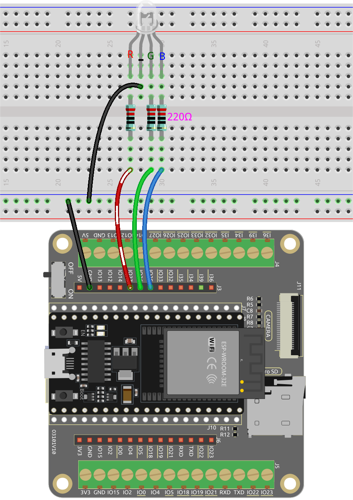

.. note::

    Ciao, benvenuto nella community di SunFounder Raspberry Pi & Arduino & ESP32 Enthusiasts su Facebook! Approfondisci le tue conoscenze su Raspberry Pi, Arduino e ESP32 insieme ad altri appassionati.

    **Perché Unirsi?**

    - **Supporto Esperti**: Risolvi problemi post-vendita e sfide tecniche con l'aiuto della nostra community e del nostro team.
    - **Impara & Condividi**: Scambia consigli e tutorial per migliorare le tue competenze.
    - **Anteprime Esclusive**: Accedi in anteprima agli annunci di nuovi prodotti e alle anticipazioni.
    - **Sconti Speciali**: Goditi sconti esclusivi sui nostri prodotti più recenti.
    - **Promozioni Festive e Giveaway**: Partecipa ai giveaway e alle promozioni festive.

    👉 Pronto a esplorare e creare con noi? Clicca su [|link_sf_facebook|] e unisciti oggi stesso!

.. _py_rgb:

2.3 Luce Colorata
==============================================

In questo progetto, esploreremo l'affascinante mondo della miscelazione additiva dei colori utilizzando un LED RGB.

Un LED RGB combina tre colori primari, ossia Rosso, Verde e Blu, in un unico pacchetto. Questi tre LED condividono un pin catodico comune, mentre ogni pin anodico controlla l'intensità del colore corrispondente.

Variando l'intensità del segnale elettrico applicato a ciascun anodo, possiamo creare una vasta gamma di colori. Ad esempio, mescolando luce rossa e verde ad alta intensità otterremo luce gialla, mentre combinando luce blu e verde produrremo ciano.

Attraverso questo progetto, esploreremo i principi della miscelazione additiva dei colori e libereremo la nostra creatività manipolando il LED RGB per visualizzare colori accattivanti e vivaci.

**Componenti Necessari**

In questo progetto, abbiamo bisogno dei seguenti componenti.

È sicuramente conveniente acquistare un kit completo, ecco il link:

.. list-table::
    :widths: 20 20 20
    :header-rows: 1

    *   - Nome	
        - OGGETTI IN QUESTO KIT
        - LINK
    *   - ESP32 Starter Kit
        - 320+
        - |link_esp32_starter_kit|

Puoi anche acquistarli separatamente dai link qui sotto.

.. list-table::
    :widths: 30 20
    :header-rows: 1

    *   - INTRODUZIONE AI COMPONENTI
        - LINK PER L'ACQUISTO

    *   - :ref:`cpn_esp32_wroom_32e`
        - |link_esp32_wroom_32e_buy|
    *   - :ref:`cpn_esp32_camera_extension`
        - |link_esp32_extension_board|
    *   - :ref:`cpn_breadboard`
        - |link_breadboard_buy|
    *   - :ref:`cpn_wires`
        - |link_wires_buy|
    *   - :ref:`cpn_resistor`
        - |link_resistor_buy|
    *   - :ref:`cpn_rgb`
        - |link_rgb_led_buy|

**Pin Disponibili**

Ecco un elenco dei pin disponibili sulla scheda ESP32 per questo progetto.

.. list-table::
    :widths: 5 20 

    * - Pin Disponibili
      - IO13, IO12, IO14, IO27, IO26, IO25, IO33, IO32, IO15, IO2, IO0, IO4, IO5, IO18, IO19, IO21, IO22, IO23

**Schema**

.. image:: ../../img/circuit/circuit_2.3_rgb.png

I pin PWM pin27, pin26 e pin25 controllano rispettivamente i pin Rosso, Verde e Blu del LED RGB, e collegano il pin catodico comune a GND. Questo permette al LED RGB di visualizzare un colore specifico sovrapponendo la luce su questi pin con diversi valori PWM.

**Cablatura**

.. image:: ../../components/img/rgb_pin.jpg
    :width: 200
    :align: center

Il LED RGB ha 4 pin: il pin lungo è il pin catodico comune, che di solito è collegato a GND; il pin a sinistra accanto al pin più lungo è Rosso; e i due pin a destra sono Verde e Blu.

**Codice**

.. note::

    * Apri il file ``2.3_colorful_light.py`` situato nel percorso ``esp32-starter-kit-main\micropython\codes``, oppure copia e incolla il codice in Thonny. Successivamente, fai clic su "Esegui lo script corrente" o premi F5 per eseguirlo.
    * Assicurati di selezionare l'interprete "MicroPython (ESP32).COMxx" nell'angolo in basso a destra. 

.. code-block:: python

    from machine import Pin, PWM
    import time

    # Definisci i pin GPIO per il LED RGB
    RED_PIN = 27
    GREEN_PIN = 26
    BLUE_PIN = 25

    # Configura i canali PWM
    red = PWM(Pin(RED_PIN))
    green = PWM(Pin(GREEN_PIN))
    blue = PWM(Pin(BLUE_PIN))

    # Imposta la frequenza PWM
    red.freq(1000)
    green.freq(1000)
    blue.freq(1000)

    def set_color(r, g, b):
        red.duty(r)
        green.duty(g)
        blue.duty(b)

    while True:
        # Imposta colori diversi e attendi un po'
        set_color(1023, 0, 0) # Rosso
        time.sleep(1)
        set_color(0, 1023, 0) # Verde
        time.sleep(1)
        set_color(0, 0, 1023) # Blu
        time.sleep(1)
        set_color(1023, 0, 1023) # viola
        time.sleep(1)

Quando il programma viene eseguito, vedrai i LED RGB visualizzare rosso, verde, blu e viola, e così via.

**Per Saperne di Più**

Puoi anche impostare il colore che desideri con il seguente codice utilizzando i familiari valori dei colori da 0 a 255.

.. note::

    * Apri il file ``2.3_colorful_light_rgb.py`` situato nel percorso ``esp32-starter-kit-main\micropython\codes``, oppure copia e incolla il codice in Thonny. Successivamente, fai clic su "Esegui lo script corrente" o premi F5 per eseguirlo.
    * Assicurati di selezionare l'interprete "MicroPython (ESP32).COMxx" nell'angolo in basso a destra. 

.. code-block:: python

    from machine import Pin, PWM
    import time

    # Definisci i pin GPIO per il LED RGB
    RED_PIN = 27
    GREEN_PIN = 26
    BLUE_PIN = 25

    # Configura i canali PWM
    red = PWM(Pin(RED_PIN))
    green = PWM(Pin(GREEN_PIN))
    blue = PWM(Pin(BLUE_PIN))

    # Imposta la frequenza PWM
    red.freq(1000)
    green.freq(1000)
    blue.freq(1000)

    # Mappa i valori di input da un intervallo a un altro
    def interval_mapping(x, in_min, in_max, out_min, out_max):
        return (x - in_min) * (out_max - out_min) / (in_max - in_min) + out_min

    # Converti i valori dei colori (0-255) in valori di duty cycle (0-1023)
    def color_to_duty(rgb_value):
        rgb_value = int(interval_mapping(rgb_value,0,255,0,1023))
        return rgb_value

    def set_color(red_value,green_value,blue_value):
        red.duty(color_to_duty(red_value))
        green.duty(color_to_duty(green_value))
        blue.duty(color_to_duty(blue_value))

    while True:
        # Imposta colori diversi e attendi un po'
        set_color(255, 0, 0) # Rosso
        time.sleep(1)
        set_color(0, 255, 0) # Verde
        time.sleep(1)
        set_color(0, 0, 255) # Blu
        time.sleep(1)
        set_color(255, 0, 255) # viola
        time.sleep(1)

Questo codice si basa sull'esempio precedente, ma mappa i valori dei colori da 0 a 255 a un intervallo di duty cycle da 0 a 1023.

* La funzione ``interval_mapping`` è una funzione di utilità che mappa un valore da un intervallo a un altro. Prende cinque argomenti: il valore di input, i valori minimo e massimo dell'intervallo di input, e i valori minimo e massimo dell'intervallo di output. Restituisce il valore di input mappato all'intervallo di output.

    .. code-block:: python

        def color_to_duty(rgb_value):
            rgb_value = int(interval_mapping(rgb_value,0,255,0,1023))
            return rgb_value

* La funzione ``color_to_duty`` prende un valore RGB intero (es. 255,0,255) e lo mappa a un valore di duty cycle adatto per i pin PWM. Il valore RGB di input viene prima mappato dall'intervallo 0-255 all'intervallo 0-1023 utilizzando la funzione ``interval_mapping``. L'output di ``interval_mapping`` viene quindi restituito come valore di duty cycle.

    .. code-block:: python

        def color_to_duty(rgb_value):
            rgb_value = int(interval_mapping(rgb_value,0,255,0,1023))
            return rgb_value

* La funzione ``color_set`` prende tre argomenti interi: i valori rosso, verde e blu per il LED. Questi valori vengono passati a ``color_to_duty`` per ottenere i valori di duty cycle per i pin PWM. I valori di duty cycle vengono quindi impostati per i pin corrispondenti utilizzando il metodo ``duty``.

    .. code-block:: python

        def set_color(red_value,green_value,blue_value):
            red.duty(color_to_duty(red_value))
            green.duty(color_to_duty(green_value))
            blue.duty(color_to_duty(blue_value))

