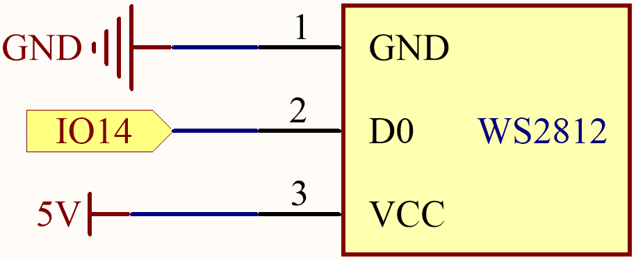
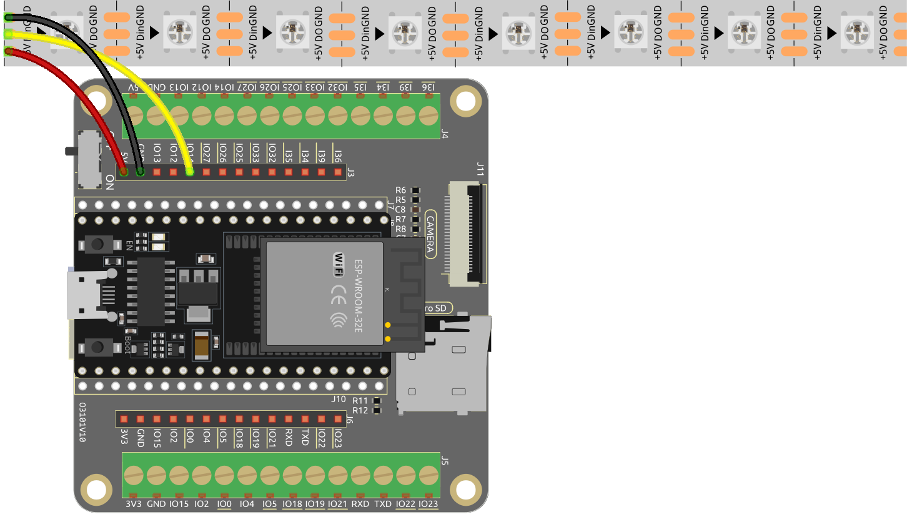

.. note::

    こんにちは、SunFounderのRaspberry Pi & Arduino & ESP32愛好家コミュニティへようこそ！Facebook上でRaspberry Pi、Arduino、ESP32についてもっと深く掘り下げ、他の愛好家と交流しましょう。

    **参加する理由は？**

    - **エキスパートサポート**：コミュニティやチームの助けを借りて、販売後の問題や技術的な課題を解決します。
    - **学び＆共有**：ヒントやチュートリアルを交換してスキルを向上させましょう。
    - **独占的なプレビュー**：新製品の発表や先行プレビューに早期アクセスしましょう。
    - **特別割引**：最新製品の独占割引をお楽しみください。
    - **祭りのプロモーションとギフト**：ギフトや祝日のプロモーションに参加しましょう。

    👉 私たちと一緒に探索し、創造する準備はできていますか？[|link_sf_facebook|]をクリックして今すぐ参加しましょう！

.. _py_rgb_strip:

2.7 RGB LEDストリップ
=========================

このプロジェクトでは、WS2812 LEDストリップを駆動する魅力的な世界に潜り込み、生き生きとした色彩のディスプレイを実現します。ストリップ上の各LEDを個別に制御する能力により、感覚を魅了する魅力的な照明効果を創り出すことができます。

さらに、ランダムな色を導入し、流れる光の効果を実装することで、魅力的で魅惑的な視覚体験を創出するという、このプロジェクトのエキサイティングな拡張についても探求します。

**必要な部品**

このプロジェクトには、以下のコンポーネントが必要です。

キット全体を購入することは非常に便利です。こちらがリンクです：

.. list-table::
    :widths: 20 20 20
    :header-rows: 1

    *   - 名前
        - このキットのアイテム
        - リンク
    *   - ESP32 Starter Kit
        - 320+
        - |link_esp32_starter_kit|

以下のリンクから個別に購入することもできます。

.. list-table::
    :widths: 30 20
    :header-rows: 1

    *   - コンポーネントの紹介
        - 購入リンク

    *   - :ref:`cpn_esp32_wroom_32e`
        - |link_esp32_wroom_32e_buy|
    *   - :ref:`cpn_esp32_camera_extension`
        - |link_esp32_extension_board|
    *   - :ref:`cpn_wires`
        - |link_wires_buy|
    *   - :ref:`cpn_ws2812`
        - |link_ws2812_buy|

**回路図**

**利用可能なピン**

このプロジェクトのESP32ボードに利用可能なピンのリストです。

.. list-table::
    :widths: 5 20 

    * - 利用可能なピン
      - IO13, IO12, IO14, IO27, IO26, IO25, IO32, IO15, IO2, IO0, IO4, IO5, IO18, IO19, IO21, IO22, IO23

.. note::

    IO33は、このプロジェクトでは使用できません。

    WS2812 LEDストリップは、正確なパルス幅変調（PWM）信号を必要とするタイプのLEDストリップです。PWM信号は時間と電圧の両方において厳密な要件を持っています。例えば、WS2812の「0」ビットは約0.4マイクロ秒のハイレベルパルスに相当し、「1」ビットは約0.8マイクロ秒のハイレベルパルスに相当します。これは、ストリップが高周波の電圧変化を受け取る必要があることを意味します。

    しかし、IO33に4.7Kのプルアップ抵抗と100nfのプルダウンコンデンサを使用すると、単純なローパスフィルタが作成されます。このタイプの回路は、コンデンサが電圧変化を受けたときに充電と放電に時間がかかるため、高周波信号を「滑らかに」します。したがって、信号があまりにも迅速に変化する（つまり、高周波である）場合、コンデンサは追いつくことができません。これにより、出力信号がぼやけてストリップに認識できなくなります。

**配線図**

**コード**

.. note::

    * ``esp32-starter-kit-main\micropython\codes`` パスにある ``2.7_rgb_strip.py`` ファイルを開くか、コードをThonnyにコピー＆ペーストしてください。次に、「現在のスクリプトを実行」をクリックするか、F5キーを押して実行します。
    * 右下のコーナーで「MicroPython (ESP32).COMxx」インタープリタを選択してください。

.. code-block:: python

    from machine import Pin
    from neopixel import NeoPixel

    pin = Pin(14, Pin.OUT)   # set a pin to output to drive NeoPixels
    pixels = NeoPixel(pin, 8)   # create NeoPixel driver on pin for 8 pixels

    pixels[0] = [64,154,227]    # set the pixel 
    pixels[1] = [128,0,128]
    pixels[2] = [50,150,50]
    pixels[3] = [255,30,30]
    pixels[4] = [0,128,255]
    pixels[5] = [99,199,0]
    pixels[6] = [128,128,128]
    pixels[7] = [255,100,0]

    pixels.write()              # write data to all pixels

RGB LEDストリップに好きな色を選んで表示しましょう！

**どのように動作するのか？**

#. ``neopixel`` モジュール内で、関連する関数を ``NeoPixel`` クラスに統合しました。

    .. code-block:: python

        from neopixel import NeoPixel

#. ``neopixel`` モジュールの ``NeoPixel`` クラスを使用して、データピンとLEDの数を指定して ``pixels`` オブジェクトを初期化します。

    .. code-block:: python

        pixels = NeoPixel(pin, 8)   # create NeoPixel driver on pin for 8 pixels

#. 各LEDの色を設定し、 ``write()`` メソッドを使用してデータをWS2812 LEDに送信し、表示を更新します。

    .. code-block:: python

        pixels[0] = [64,154,227]    # set the pixel 
        pixels[1] = [128,0,128]
        pixels[2] = [50,150,50]
        pixels[3] = [255,30,30]
        pixels[4] = [0,128,255]
        pixels[5] = [99,199,0]
        pixels[6] = [128,128,128]
        pixels[7] = [255,100,0]

        pixels.write()              # write data to all pixels

**もっと学ぶ**

色をランダムに生成して、カラフルな流れる光を作ることができます。

.. note::

    * ``esp32-starter-kit-main\micropython\codes`` パスにある ``2.7_rgb_strip_random.py`` ファイルを開くか、コードをThonnyにコピー＆ペーストしてください。次に、「現在のスクリプトを実行」をクリックするか、F5キーを押して実行します。
    * 右下のコーナーで「MicroPython (ESP32).COMxx」インタープリタを選択してください。

.. code-block:: python

    from machine import Pin
    import neopixel
    import time
    import random

    # Set the number of pixels for the running light
    num_pixels = 8

    # Set the data pin for the RGB LED strip
    data_pin = Pin(14, Pin.OUT)

    # Initialize the RGB LED strip object
    pixels = neopixel.NeoPixel(data_pin, num_pixels)

    # Continuously loop the running light
    while True:
        for i in range(num_pixels):
            # Generate a random color for the current pixel
            color = (random.randint(0, 255), random.randint(0, 255), random.randint(0, 255))
            
            # Turn on the current pixel with the random color
            pixels[i] = color
            
            # Update the RGB LED strip display
            pixels.write()
            
            # Turn off the current pixel
            pixels[i] = (0, 0, 0)
            
            # Wait for a period of time to control the speed of the running light
            time.sleep_ms(100)

* ``while`` ループの中で、 ``for`` ループを使用してRGB LEDストリップの各ピクセルを順番に点灯させます。
* 最初に ``random.randint()`` 関数を使用して現在のピクセルのためのランダムな色を生成します。
* 次に、ランダムな色で現在のピクセルを点灯させ、 ``NeoPixel`` オブジェクトの ``write()`` メソッドを使用して色データをRGB LEDストリップに送信し、表示を更新します。
* 最後に、色を (0, 0, 0) に設定して現在のピクセルを消し、走る光の速度を制御するために一定時間待機します。

