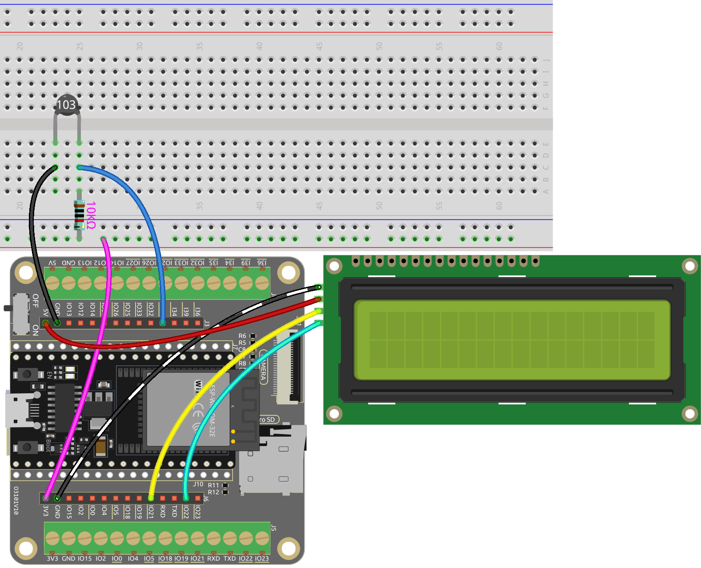

.. note::

    Ciao, benvenuto nella community di SunFounder Raspberry Pi & Arduino & ESP32 Enthusiasts su Facebook! Approfondisci le tue conoscenze su Raspberry Pi, Arduino e ESP32 insieme ad altri appassionati.

    **Perché Unirsi?**

    - **Supporto Esperti**: Risolvi problemi post-vendita e sfide tecniche con l'aiuto della nostra community e del nostro team.
    - **Impara & Condividi**: Scambia consigli e tutorial per migliorare le tue competenze.
    - **Anteprime Esclusive**: Accedi in anteprima agli annunci di nuovi prodotti e alle anticipazioni.
    - **Sconti Speciali**: Goditi sconti esclusivi sui nostri prodotti più recenti.
    - **Promozioni Festive e Giveaway**: Partecipa ai giveaway e alle promozioni festive.

    👉 Pronto a esplorare e creare con noi? Clicca su [|link_sf_facebook|] e unisciti oggi stesso!

.. _py_thermistor:

5.10 Misurazione della Temperatura
=====================================

Un termistore è un sensore di temperatura che mostra una forte dipendenza dalla temperatura e può essere classificato in due tipi: coefficiente di temperatura negativo (NTC) e coefficiente di temperatura positivo (PTC). La resistenza di un termistore NTC diminuisce all'aumentare della temperatura, mentre la resistenza di un termistore PTC aumenta con l'aumentare della temperatura.

In questo progetto, utilizzeremo un termistore NTC. Collegando il termistore NTC a un pin di ingresso analogico del microcontrollore ESP32, possiamo misurare la sua resistenza, che è direttamente proporzionale alla temperatura.

Incorporando il termistore NTC ed eseguendo i calcoli necessari, possiamo misurare accuratamente la temperatura e visualizzarla sul modulo I2C LCD1602. Questo progetto consente il monitoraggio in tempo reale della temperatura e fornisce un'interfaccia visiva per la visualizzazione della temperatura.

**Componenti Necessari**

In questo progetto, abbiamo bisogno dei seguenti componenti.

È sicuramente conveniente acquistare un kit completo, ecco il link:

.. list-table::
    :widths: 20 20 20
    :header-rows: 1

    *   - Nome	
        - OGGETTI IN QUESTO KIT
        - LINK
    *   - ESP32 Starter Kit
        - 320+
        - |link_esp32_starter_kit|

Puoi anche acquistarli separatamente dai link qui sotto.

.. list-table::
    :widths: 30 20
    :header-rows: 1

    *   - INTRODUZIONE AI COMPONENTI
        - LINK PER L'ACQUISTO

    *   - :ref:`cpn_esp32_wroom_32e`
        - |link_esp32_wroom_32e_buy|
    *   - :ref:`cpn_esp32_camera_extension`
        - |link_esp32_extension_board|
    *   - :ref:`cpn_breadboard`
        - |link_breadboard_buy|
    *   - :ref:`cpn_wires`
        - |link_wires_buy|
    *   - :ref:`cpn_resistor`
        - |link_resistor_buy|
    *   - :ref:`cpn_thermistor`
        - |link_thermistor_buy|

**Pin Disponibili**

* **Pin Disponibili**

    Ecco un elenco dei pin disponibili sulla scheda ESP32 per questo progetto.

    .. list-table::
        :widths: 5 15

        *   - Pin Disponibili
            - IO14, IO25, I35, I34, I39, I36

* **Pin di Strapping**

    I seguenti pin sono pin di strapping, che influenzano il processo di avvio dell'ESP32 durante l'accensione o il reset. Tuttavia, una volta che l'ESP32 è avviato correttamente, possono essere utilizzati come pin regolari.

    .. list-table::
        :widths: 5 15

        *   - Pin di Strapping
            - IO0, IO12

**Schema**

.. image:: ../../img/circuit/circuit_5.10_thermistor.png

Quando la temperatura aumenta, la resistenza del termistore diminuisce, causando una diminuzione del valore letto su I35. Inoltre, utilizzando una formula, è possibile convertire il valore analogico in temperatura e poi stamparlo.

**Cablaggio**

.. image:: ../../img/wiring/5.10_thermistor_bb.png

.. note::
    * Il termistore è nero e contrassegnato 103.
    * L'anello colorato della resistenza da 10K ohm è rosso, nero, nero, rosso e marrone.

**Codice**

.. note::

    * Apri il file ``5.10_thermistor.py`` situato nel percorso ``esp32-starter-kit-main\micropython\codes``, oppure copia e incolla il codice in Thonny. Successivamente, fai clic su "Esegui lo script corrente" o premi F5 per eseguirlo.
    * Assicurati di selezionare l'interprete "MicroPython (ESP32).COMxx" nell'angolo in basso a destra. 

.. code-block:: python

    # Importa le librerie necessarie
    from machine import ADC, Pin
    import time
    import math

    # Definisci il valore beta del termistore, tipicamente fornito nel datasheet
    beta = 3950

    # Crea un oggetto ADC (termistore)
    thermistor = ADC(Pin(35, Pin.IN))

    # Imposta l'attenuazione
    thermistor.atten(thermistor.ATTN_11DB)

    # Avvia un ciclo infinito per monitorare continuamente la temperatura
    mentre True:
        # Leggi la tensione in microvolt e converti in volt
        Vr = thermistor.read_uv() / 1000000

        # Calcola la resistenza del termistore in base alla tensione misurata
        Rt = 10000 * Vr / (3.3 - Vr)

        # Utilizza il parametro beta e il valore della resistenza per calcolare la temperatura in Kelvin
        temp = 1 / (((math.log(Rt / 10000)) / beta) + (1 / (273.15 + 25)))

        # Converti in Celsius
        Cel = temp - 273.15

        # Converti in Fahrenheit
        Fah = Cel * 1.8 + 32

        # Stampa i valori di temperatura sia in Celsius che in Fahrenheit
        print('Celsius: %.2f C  Fahrenheit: %.2f F' % (Cel, Fah))
        time.sleep(0.5)

Quando il codice viene eseguito, la Shell stamperà le temperature in Celsius e Fahrenheit.

**Come funziona?**

Ogni termistore ha una resistenza nominale. Qui è di 10k ohm, misurata a 25 gradi Celsius.

Quando la temperatura aumenta, la resistenza del termistore diminuisce. Successivamente, i dati di tensione vengono convertiti in quantità digitali dall'adattatore A/D.

La temperatura in Celsius o Fahrenheit viene fornita tramite programmazione.

Ecco la relazione tra resistenza e temperatura:

    **RT =RN expB(1/TK - 1/TN)**

    * **RT** è la resistenza del termistore NTC quando la temperatura è **TK**.
    * **RN** è la resistenza del termistore NTC alla temperatura nominale TN. Qui, il valore numerico di RN è 10k.
    * **TK** è una temperatura in Kelvin e l'unità è K. Qui, il valore numerico di **TK** è ``373,15 + gradi Celsius``.
    * **TN** è una temperatura nominale in Kelvin; l'unità è anche K. Qui, il valore numerico di TN è ``373,15 + 25``.
    * E **B(beta)**, la costante del materiale del termistore NTC, è anche chiamata indice di sensibilità termica con un valore numerico di ``4950``.
    * **exp** è l'abbreviazione di esponenziale, e il numero base ``e`` è un numero naturale che vale approssimativamente 2,7.

    Converti questa formula ``TK=1/(ln(RT/RN)/B+1/TN)`` per ottenere la temperatura in Kelvin che, meno 273,15, equivale ai gradi Celsius.

    Questa relazione è una formula empirica. È accurata solo quando la temperatura e la resistenza sono entro il range effettivo.

**Approfondimenti**

Puoi anche visualizzare le temperature calcolate in Celsius e Fahrenheit sul modulo I2C LCD1602.

.. note::

    * Apri il file ``5.10_thermistor_lcd.py`` situato nel percorso ``esp32-starter-kit-main\micropython\codes``, oppure copia e incolla il codice in Thonny. Successivamente, fai clic su "Esegui lo script corrente" o premi F5 per eseguirlo.
    * Assicurati di selezionare l'interprete "MicroPython (ESP32).COMxx" nell'angolo in basso a destra.

    * Qui devi utilizzare la libreria chiamata ``lcd1602.py``, controlla se è stata caricata su ESP32, per un tutorial dettagliato fai riferimento a :ref:`add_libraries_py`.

.. code-block:: python

    # Importa le librerie necessarie
    from machine import ADC, Pin
    from lcd1602 import LCD
    import time
    import math

    # Definisci il valore beta del termistore, tipicamente fornito nel datasheet
    beta = 3950

    # Crea un oggetto ADC (termistore)
    thermistor = ADC(Pin(35, Pin.IN))

    # Imposta l'attenuazione
    thermistor.atten(thermistor.ATTN_11DB)

    lcd = LCD()

    # Avvia un ciclo infinito per monitorare continuamente la temperatura
    mentre True:
        # Leggi la tensione in microvolt e converti in volt
        Vr = thermistor.read_uv() / 1000000

        # Calcola la resistenza del termistore in base alla tensione misurata
        Rt = 10000 * Vr / (3.3 - Vr)

        # Utilizza il parametro beta e il valore della resistenza per calcolare la temperatura in Kelvin
        temp = 1 / (((math.log(Rt / 10000)) / beta) + (1 / (273.15 + 25)))

        # Converti in Celsius
        Cel = temp - 273.15

        # Converti in Fahrenheit
        Fah = Cel * 1.8 + 32

        # Stampa i valori di temperatura sia in Celsius che in Fahrenheit
        print('Celsius: %.2f C  Fahrenheit: %.2f F' % (Cel, Fah))

        # Pulisci lo schermo LCD
        lcd.clear()
        
        # Visualizza i valori di temperatura sia in Celsius che in Fahrenheit
        lcd.message('Cel: %.2f \xDFC \n' % Cel)
        lcd.message('Fah: %.2f \xDFF' % Fah)
        time.sleep(1)
