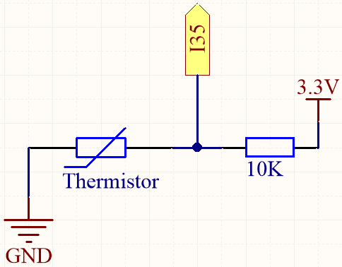

.. _py_thermistor:

5.10 Temperaturmessung
===========================

Ein Thermistor ist ein Temperatursensor, der eine starke Temperaturabhängigkeit aufweist, und er kann in zwei Typen eingeteilt werden: Negative Temperature Coefficient (NTC) und Positive Temperature Coefficient (PTC). Der Widerstand eines NTC-Thermistors nimmt mit steigender Temperatur ab, während der Widerstand eines PTC-Thermistors mit steigender Temperatur zunimmt.

In diesem Projekt werden wir einen NTC-Thermistor verwenden. Durch Anschluss des NTC-Thermistors an einen analogen Eingangspin des ESP32-Mikrocontrollers können wir seinen Widerstand messen, der direkt proportional zur Temperatur ist.

Durch die Einbindung des NTC-Thermistors und die Durchführung der notwendigen Berechnungen können wir die Temperatur genau messen und auf dem I2C LCD1602-Modul anzeigen. Dieses Projekt ermöglicht eine Echtzeit-Temperaturüberwachung und bietet eine visuelle Schnittstelle zur Temperaturanzeige.

**Benötigte Komponenten**

Für dieses Projekt benötigen wir folgende Komponenten.

Es ist definitiv praktisch, ein ganzes Kit zu kaufen, hier ist der Link:

.. list-table::
    :widths: 20 20 20
    :header-rows: 1

    *   - Name	
        - ARTIKEL IN DIESEM KIT
        - LINK
    *   - ESP32 Starter Kit
        - 320+
        - |link_esp32_starter_kit|

Sie können sie auch einzeln über die untenstehenden Links kaufen.

.. list-table::
    :widths: 30 20
    :header-rows: 1

    *   - KOMPONENTENBESCHREIBUNG
        - KAUF-LINK

    *   - :ref:`cpn_esp32_wroom_32e`
        - |link_esp32_wroom_32e_buy|
    *   - :ref:`cpn_esp32_camera_extension`
        - \-
    *   - :ref:`cpn_breadboard`
        - |link_breadboard_buy|
    *   - :ref:`cpn_wires`
        - |link_wires_buy|
    *   - :ref:`cpn_resistor`
        - |link_resistor_buy|
    *   - :ref:`cpn_thermistor`
        - |link_thermistor_buy|

**Verfügbare Pins**

* **Verfügbare Pins**

    Hier ist eine Liste der verfügbaren Pins auf dem ESP32-Board für dieses Projekt.

    .. list-table::
        :widths: 5 15

        *   - Verfügbare Pins
            - IO14, IO25, I35, I34, I39, I36

* **Strapping Pins**

    Die folgenden Pins sind Strapping-Pins, die den Startvorgang des ESP32 beim Einschalten oder Zurücksetzen beeinflussen. Sobald der ESP32 jedoch erfolgreich hochgefahren ist, können sie als reguläre Pins verwendet werden.

    .. list-table::
        :widths: 5 15

        *   - Strapping-Pins
            - IO0, IO12

**Schaltplan**

Wenn die Temperatur steigt, nimmt der Widerstand des Thermistors ab, was dazu führt, dass der auf I35 abgelesene Wert sinkt. Zusätzlich können Sie durch Verwendung einer Formel den Analogwert in Temperatur umrechnen und dann ausdrucken.

**Verdrahtung**

.. image:: ../../img/wiring/5.10_thermistor_bb.png

.. note::
    * Der Thermistor ist schwarz und mit 103 gekennzeichnet.
    * Der Farbring des 10K-Ohm-Widerstands ist rot, schwarz, schwarz, rot und braun.

**Code**

.. note::

    * Öffnen Sie die Datei ``5.10_thermistor.py``, die sich im Pfad ``esp32-starter-kit-main\micropython\codes`` befindet, oder kopieren und fügen Sie den Code in Thonny ein. Klicken Sie dann auf "Run Current Script" oder drücken Sie F5, um ihn auszuführen.
    * Stellen Sie sicher, dass der Interpreter "MicroPython (ESP32).COMxx" in der unteren rechten Ecke ausgewählt ist. 

.. code-block:: python

    # Import the necessary libraries
    from machine import ADC, Pin
    import time
    import math

    # Define the beta value of the thermistor, typically provided in the datasheet
    beta = 3950

    # Create an ADC object (thermistor)
    thermistor = ADC(Pin(35, Pin.IN))

    # Set the attenuation
    thermistor.atten(thermistor.ATTN_11DB)

    # Start an infinite loop to continuously monitor the temperature
    while True:
        # Read the voltage in microvolts and convert it to volts
        Vr = thermistor.read_uv() / 1000000

        # Calculate the resistance of the thermistor based on the measured voltage
        Rt = 10000 * Vr / (3.3 - Vr)

        # Use the beta parameter and resistance value to calculate the temperature in Kelvin
        temp = 1 / (((math.log(Rt / 10000)) / beta) + (1 / (273.15 + 25)))

        # Convert to Celsius
        Cel = temp - 273.15

        # Convert to Fahrenheit
        Fah = Cel * 1.8 + 32

        # Print the temperature values in both Celsius and Fahrenheit
        print('Celsius: %.2f C  Fahrenheit: %.2f F' % (Cel, Fah))
        time.sleep(0.5)

Wenn der Code ausgeführt wird, zeigt die Shell die Temperaturen in Celsius und Fahrenheit an.

**Wie funktioniert das?**

Jeder Thermistor hat einen normalen Widerstand. Hier beträgt er 10k Ohm, gemessen bei 25 Grad Celsius.

Wenn die Temperatur steigt, nimmt der Widerstand des Thermistors ab. Dann werden die Spannungsdaten durch den A/D-Adapter in digitale Werte umgewandelt.

Die Temperatur in Celsius oder Fahrenheit wird durch Programmierung ausgegeben.

Hier ist die Beziehung zwischen Widerstand und Temperatur:

    **RT = RN expB(1/TK - 1/TN)** 

    * **RT** ist der Widerstand des NTC-Thermistors bei der Temperatur **TK**. 
    * **RN** ist der Widerstand des NTC-Thermistors unter der Nenntemperatur TN. Hier beträgt der numerische Wert von RN 10k. 
    * **TK** ist eine Kelvin-Temperatur und die Einheit ist K. Hier beträgt der numerische Wert von **TK** ``373.15 + degree Celsius``. 
    * **TN** ist eine Nenntemperatur in Kelvin; die Einheit ist ebenfalls K. Hier beträgt der numerische Wert von TN ``373.15+25``.
    * Und **B(Beta)**, die Materialkonstante des NTC-Thermistors, wird auch als Wärmeempfindlichkeitsindex bezeichnet, mit einem numerischen Wert von ``4950``. 
    * **exp** ist die Abkürzung für Exponential, und die Basiszahl ``e`` ist eine natürliche Zahl und entspricht ungefähr 2,7. 

    Konvertieren Sie diese Formel ``TK=1/(ln(RT/RN)/B+1/TN)``, um die Kelvin-Temperatur zu erhalten, die minus 273,15 Grad Celsius entspricht. 

    Diese Beziehung ist eine empirische Formel. Sie ist nur genau, wenn die Temperatur und der Widerstand innerhalb des effektiven Bereichs liegen.

**Weitere Informationen**

Sie können auch die berechneten Temperaturen in Celsius und Fahrenheit auf dem I2C LCD1602 anzeigen.

.. image:: ../../img/wiring/5.10_thermistor_lcd_bb.png

.. note::

    * Öffnen Sie die Datei ``5.10_thermistor_lcd.py``, die sich im Pfad ``esp32-starter-kit-main\micropython\codes`` befindet, oder kopieren und fügen Sie den Code in Thonny ein. Klicken Sie dann auf "Run Current Script" oder drücken Sie F5, um ihn auszuführen.
    * Stellen Sie sicher, dass der Interpreter "MicroPython (ESP32).COMxx" in der unteren rechten Ecke ausgewählt ist. 

    * Hier müssen Sie die Bibliothek ``lcd1602.py`` verwenden, überprüfen Sie bitte, ob sie auf den ESP32 hochgeladen wurde. Für eine detaillierte Anleitung siehe :ref:`add_libraries_py`.

.. code-block:: python

    # Import the necessary libraries
    from machine import ADC, Pin
    from lcd1602 import LCD
    import time
    import math

    # Define the beta value of the thermistor, typically provided in the datasheet
    beta = 3950

    # Create an ADC object (thermistor)
    thermistor = ADC(Pin(35, Pin.IN))

    # Set the attenuation
    thermistor.atten(thermistor.ATTN_11DB)

    lcd = LCD()

    # Start an infinite loop to continuously monitor the temperature
    while True:
        # Read the voltage in microvolts and convert it to volts
        Vr = thermistor.read_uv() / 1000000

        # Calculate the resistance of the thermistor based on the measured voltage
        Rt = 10000 * Vr / (3.3 - Vr)

        # Use the beta parameter and resistance value to calculate the temperature in Kelvin
        temp = 1 / (((math.log(Rt / 10000)) / beta) + (1 / (273.15 + 25)))

        # Convert to Celsius
        Cel = temp - 273.15

        # Convert to Fahrenheit
        Fah = Cel * 1.8 + 32

        # Print the temperature values in both Celsius and Fahrenheit
        print('Celsius: %.2f C  Fahrenheit: %.2f F' % (Cel, Fah))

        # Clear the LCD screen
        lcd.clear()
        
        # Display the temperature values in both Celsius and Fahrenheit
        lcd.message('Cel: %.2f \xDFC \n' % Cel)
        lcd.message('Fah: %.2f \xDFF' % Fah)
        time.sleep(1)
