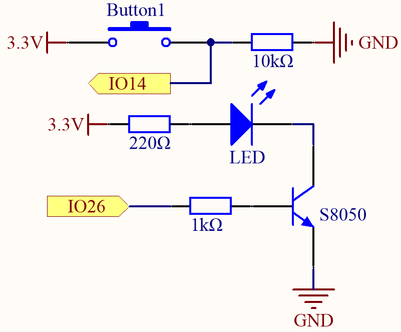

.. _py_transistor:

5.6 Zwei Arten von Transistoren
==========================================
Dieses Kit enthält zwei Arten von Transistoren, S8550 und S8050, wobei der erstere ein PNP- und der letztere ein NPN-Transistor ist. Sie sehen sich sehr ähnlich, und es bedarf sorgfältiger Überprüfung, um ihre Beschriftungen zu erkennen.
Wenn ein High-Level-Signal durch einen NPN-Transistor fließt, wird dieser aktiviert. Ein PNP-Transistor hingegen benötigt ein Low-Level-Signal für seine Steuerung. Beide Transistorarten werden häufig für kontaktlose Schalter verwendet, genau wie in diesem Experiment.

Lassen Sie uns LED und Taster verwenden, um den Einsatz von Transistoren zu verstehen!

**Benötigte Komponenten**

Für dieses Projekt benötigen wir die folgenden Komponenten.

Es ist definitiv praktisch, ein ganzes Kit zu kaufen, hier ist der Link:

.. list-table::
    :widths: 20 20 20
    :header-rows: 1

    *   - Name	
        - ARTIKEL IN DIESEM KIT
        - LINK
    *   - ESP32 Starter Kit
        - 320+
        - |link_esp32_starter_kit|

Sie können diese auch separat über die untenstehenden Links kaufen.

.. list-table::
    :widths: 30 20
    :header-rows: 1

    *   - KOMPONENTENBESCHREIBUNG
        - KAUF-LINK

    *   - :ref:`cpn_esp32_wroom_32e`
        - |link_esp32_wroom_32e_buy|
    *   - :ref:`cpn_esp32_camera_extension`
        - \-
    *   - :ref:`cpn_breadboard`
        - |link_breadboard_buy|
    *   - :ref:`cpn_wires`
        - |link_wires_buy|
    *   - :ref:`cpn_resistor`
        - |link_resistor_buy|
    *   - :ref:`cpn_led`
        - |link_led_buy|
    *   - :ref:`cpn_button`
        - |link_button_buy|
    *   - :ref:`cpn_transistor`
        - |link_transistor_buy|

**Verfügbare Pins**

* **Verfügbare Pins**

    Hier ist eine Liste der verfügbaren Pins auf dem ESP32-Board für dieses Projekt.

    .. list-table::
        :widths: 5 20

        *   - Für Eingang
            - IO14, IO25, I35, I34, I39, I36, IO18, IO19, IO21, IO22, IO23
        *   - Für Ausgang
            - IO13, IO12, IO14, IO27, IO26, IO25, IO33, IO32, IO15, IO2, IO0, IO4, IO5, IO18, IO19, IO21, IO22, IO23

* **Bedingungsabhängige Nutzungspins (Eingang)**

    Die folgenden Pins verfügen über eingebaute Pull-up- oder Pull-down-Widerstände, sodass externe Widerstände nicht erforderlich sind, wenn **sie als Eingangspins verwendet werden**:

    .. list-table::
        :widths: 5 15
        :header-rows: 1

        *   - Bedingungsabhängige Nutzungspins
            - Beschreibung
        *   - IO13, IO15, IO2, IO4
            - Hochziehen mit einem 47K-Widerstand setzt den Standardwert auf hoch.
        *   - IO27, IO26, IO33
            - Hochziehen mit einem 4,7K-Widerstand setzt den Standardwert auf hoch.
        *   - IO32
            - Runterziehen mit einem 1K-Widerstand setzt den Standardwert auf niedrig.

* **Strapping-Pins (Eingang)**

    Strapping-Pins sind eine spezielle Gruppe von Pins, die verwendet werden, um bestimmte Boot-Modi während des Gerätestarts zu bestimmen 
    (d.h. Power-On-Reset).

    
    
    .. list-table::
        :widths: 5 15

        *   - Strapping-Pins
            - IO5, IO0, IO2, IO12, IO15 
    

    

    Generell wird **nicht empfohlen, sie als Eingangspins zu verwenden**. Wenn Sie diese Pins nutzen möchten, bedenken Sie den potenziellen Einfluss auf den Bootvorgang. Für weitere Details siehe den Abschnitt :ref:`esp32_strapping`.

**Anschlussmethode für NPN-Transistor (S8050)**

In diesem Schaltkreis leuchtet die LED auf, wenn der Knopf gedrückt wird und IO14 hoch ist.

Durch Programmierung von IO26 auf **hoch** wird nach einem 1k-Strombegrenzungswiderstand (zum Schutz des Transistors) der S8050 (NPN-Transistor) zum Leiten gebracht, sodass die LED aufleuchtet.

.. image:: ../../img/wiring/5.6_s8050_bb.png

**Anschlussmethode für PNP-Transistor (S8550)**

.. image:: ../../img/circuit/circuit_5.6_S8550.png

In diesem Schaltkreis ist IO14 standardmäßig niedrig und wechselt auf hoch, wenn der Knopf gedrückt wird.

Durch Programmierung von IO26 auf **low** wird nach einem 1k-Strombegrenzungswiderstand (zum Schutz des Transistors) der S8550 (PNP-Transistor) zum Leiten gebracht, sodass die LED aufleuchtet.

Der einzige Unterschied, den Sie zwischen diesem und dem vorherigen Schaltkreis bemerken werden, ist, dass im vorherigen Schaltkreis die Kathode der LED an den **collector** des **S8050 (NPN-Transistor)** angeschlossen ist, während sie in diesem an den **emitter** des **S8550 (PNP-Transistor)** angeschlossen ist.

.. image:: ../../img/wiring/5.6_s8550_bb.png

**Code**

.. note::

    * Öffnen Sie die Datei ``5.6_transistor.py``, die sich im Pfad ``esp32-starter-kit-main\micropython\codes`` befindet, oder kopieren Sie den Code in Thonny. Klicken Sie dann auf "Aktuelles Skript ausführen" oder drücken Sie F5, um es auszuführen.
    * Stellen Sie sicher, dass Sie den Interpreter "MicroPython (ESP32).COMxx" in der unteren rechten Ecke auswählen. 

.. code-block:: python

    import machine 

    button = machine.Pin(14, machine.Pin.IN)   # Button
    led = machine.Pin(26, machine.Pin.OUT)  # LED

    # Start an infinite loop
    while True:  
        # Read the current value of the 'button' object (0 or 1) and store it in the 'button_status' variable
        button_status = button.value() 
        # If the button is pressed (value is 1)
        if button_status == 1: 
            led.value(1) # Turn the LED on
        # If the button is not pressed (value is 0)
        else:       
            led.value(0)            # turn the LED off

Zwei Arten von Transistoren können mit demselben Code gesteuert werden. 
Wenn wir den Knopf drücken, sendet der ESP32 ein High-Level-Signal an den Transistor; 
wenn wir ihn loslassen, sendet er ein Low-Level-Signal.

* Der Schaltkreis mit dem S8050 (NPN-Transistor) leuchtet auf, wenn der Knopf gedrückt wird, was darauf hinweist, dass er sich in einem High-Level-Leitzustand befindet;
* Der Schaltkreis mit dem S8550 (PNP-Transistor) leuchtet auf, wenn der Knopf losgelassen wird, was darauf hinweist, dass er sich in einem Low-Level-Leitzustand befindet.
