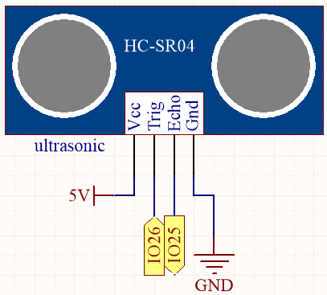
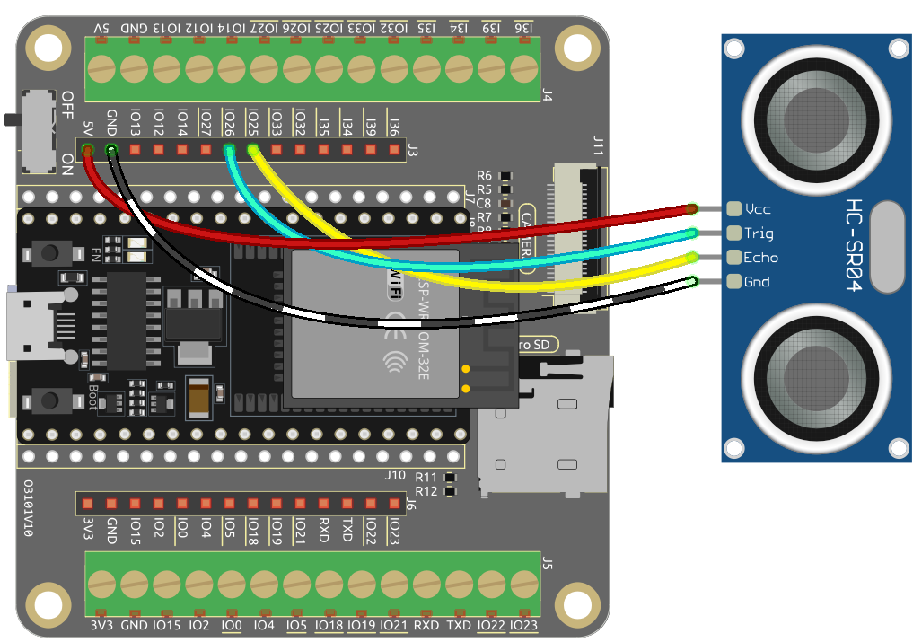

.. note::

    Hallo und willkommen in der SunFounder Raspberry Pi & Arduino & ESP32 Enthusiasten-Gemeinschaft auf Facebook! Tauchen Sie tiefer ein in die Welt von Raspberry Pi, Arduino und ESP32 mit anderen Enthusiasten.

    **Warum beitreten?**

    - **Expertenunterstützung**: Lösen Sie Nachverkaufsprobleme und technische Herausforderungen mit Hilfe unserer Gemeinschaft und unseres Teams.
    - **Lernen & Teilen**: Tauschen Sie Tipps und Anleitungen aus, um Ihre Fähigkeiten zu verbessern.
    - **Exklusive Vorschauen**: Erhalten Sie frühzeitigen Zugang zu neuen Produktankündigungen und exklusiven Einblicken.
    - **Spezialrabatte**: Genießen Sie exklusive Rabatte auf unsere neuesten Produkte.
    - **Festliche Aktionen und Gewinnspiele**: Nehmen Sie an Gewinnspielen und Feiertagsaktionen teil.

    👉 Sind Sie bereit, mit uns zu erkunden und zu erschaffen? Klicken Sie auf [|link_sf_facebook|] und treten Sie heute bei!

.. _py_ultrasonic:

5.12 Distanzmessung
======================================

Das Ultraschallmodul wird zur Entfernungsmessung oder Objekterkennung verwendet. In diesem Projekt werden wir das Modul so programmieren, dass es Hindernisentfernungen erfasst. Durch das Senden von Ultraschallimpulsen und das Messen der Zeit, die sie zum Zurückprallen benötigen, können wir Entfernungen berechnen. Dies ermöglicht es uns, distanzbasierte Aktionen oder Verhaltensweisen zur Hindernisvermeidung zu implementieren.

**Benötigte Komponenten**

Für dieses Projekt benötigen wir folgende Komponenten.

Es ist definitiv praktisch, ein ganzes Kit zu kaufen, hier ist der Link:

.. list-table::
    :widths: 20 20 20
    :header-rows: 1

    *   - Name	
        - ARTIKEL IN DIESEM KIT
        - LINK
    *   - ESP32 Starter Kit
        - 320+
        - |link_esp32_starter_kit|

Sie können sie auch einzeln über die untenstehenden Links kaufen.

.. list-table::
    :widths: 30 20
    :header-rows: 1

    *   - KOMPONENTENBESCHREIBUNG
        - KAUF-LINK

    *   - :ref:`cpn_esp32_wroom_32e`
        - |link_esp32_wroom_32e_buy|
    *   - :ref:`cpn_esp32_camera_extension`
        - |link_esp32_extension_board|
    *   - :ref:`cpn_wires`
        - |link_wires_buy|
    *   - :ref:`cpn_ultrasonic`
        - |link_ultrasonic_buy|

**Verfügbare Pins**

* **Verfügbare Pins**

    Hier ist eine Liste der verfügbaren Pins auf dem ESP32-Board für dieses Projekt.

    .. list-table::
        :widths: 5 20

        *   - Für Eingang
            - IO13, IO14, IO27, IO26, IO25, IO33, IO32, I35, I34, I39, I36, IO4, IO18, IO19, IO21, IO22, IO23
        *   - Für Ausgang
            - IO13, IO12, IO14, IO27, IO26, IO25, IO33, IO32, IO15, IO2, IO0, IO4, IO5, IO18, IO19, IO21, IO22, IO23

**Schaltplan**

Der ESP32 sendet alle 10 Sekunden eine Reihe von Rechteckwellensignalen an den Trig-Pin des Ultraschallsensors. Das veranlasst den Ultraschallsensor, ein 40kHz Ultraschallsignal nach außen zu senden. Gibt es ein Hindernis vorne, werden die Ultraschallwellen zurückreflektiert.

Durch Aufzeichnung der Zeit vom Senden bis zum Empfangen des Signals, Teilen durch 2 und Multiplizieren mit der Lichtgeschwindigkeit können Sie die Entfernung zum Hindernis bestimmen.

**Verdrahtung**

**Code**

.. note::

    * Öffnen Sie die Datei ``5.12_ultrasonic.py``, die sich im Pfad ``esp32-starter-kit-main\micropython\codes`` befindet, oder kopieren und fügen Sie den Code in Thonny ein. Klicken Sie dann auf "Run Current Script" oder drücken Sie F5, um ihn auszuführen.
    * Stellen Sie sicher, dass der Interpreter "MicroPython (ESP32).COMxx" in der unteren rechten Ecke ausgewählt ist. 

.. code-block:: python

    import machine
    import time

    # Define the trigger and echo pins for the distance sensor
    TRIG = machine.Pin(26, machine.Pin.OUT)
    ECHO = machine.Pin(25, machine.Pin.IN)

    # Calculate the distance using the ultrasonic sensor
    def distance():
        # Ensure trigger is off initially
        TRIG.off()
        time.sleep_us(2)  # Wait for 2 microseconds

        # Send a 10-microsecond pulse to the trigger pin
        TRIG.on()
        time.sleep_us(10)
        TRIG.off()

        # Wait for the echo pin to go high
        while not ECHO.value():
            pass

        # Record the time when the echo pin goes high
        time1 = time.ticks_us()

        # Wait for the echo pin to go low
        while ECHO.value():
            pass

        # Record the time when the echo pin goes low
        time2 = time.ticks_us()

        # Calculate the time difference between the two recorded times
        during = time.ticks_diff(time2, time1)

        # Calculate and return the distance (in cm) using the speed of sound (340 m/s)
        return during * 340 / 2 / 10000

    # Continuously measure and print the distance
    while True:
        dis = distance()
        print('Distance: %.2f' % dis)
        time.sleep_ms(300)  # Wait for 300 milliseconds before repeating

Sobald das Programm läuft, wird die Shell die Entfernung des Ultraschallsensors zum Hindernis vor ihm ausgeben.

