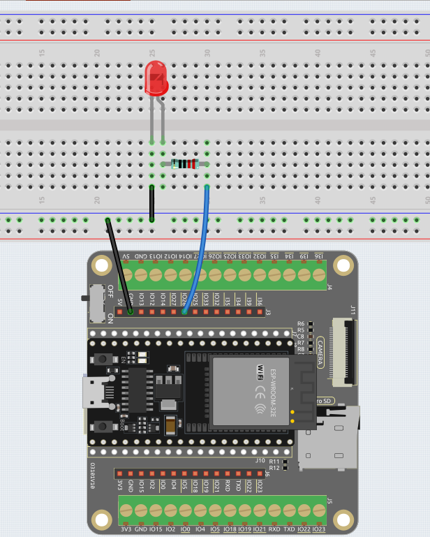

.. _py_fade:

2.2 Fading LED（PWM引脚没确定）
===================================

As of now, we have only used two output signals: high level and low level (also called ON and OFF), which is called digital output.
However, in actual use, many devices do not simply ON/OFF to work, for example, adjusting the speed of the motor, adjusting the brightness of the desk lamp, and so on.
To achieve this goal, a slider that adjusts resistance was used in the past, but it is unreliable and inefficient.
Therefore, Pulse width modulation (PWM) has emerged as a feasible solution to such complex problems.

So far, we have only used digital outputs which have two states - high and low (also known as ON and OFF). 
However, many devices require more complex control than simply switching ON/OFF, 
such as adjusting the speed of a motor or the brightness of a lamp. 
In the past, this was achieved using a slider that adjusted resistance, but this was unreliable and inefficient. 
Pulse Width Modulation (PWM) emerged as a feasible solution to these problems.

A pulse is a digital output that contains a high level and a low level. 
The width of these pulses can be adjusted by changing the speed at which the signal switches between high and low.

If we turn an LED on, then off, and on again within a short period of time (e.g. 20ms, which is most people's visual retention period), 
we won't see the LED turning off, but the brightness of the light will be slightly weaker. 
During this period, the longer the LED is on, the brighter it becomes. 
In other words, in the cycle, the wider the pulse, the greater the "electric signal strength" output by the microcontroller. 
This is how PWM is used to control LED brightness (or motor speed).

* `Pulse-width modulation - Wikipedia <https://en.wikipedia.org/wiki/Pulse-width_modulation>`_

On the ESP32, almost all pins that can be output-enabled can also be used for PWM.

There are a maximum of 16 PWM channels (pins) available on the ESP32, but only 8 different PWM frequencies are available. 
The remaining 8 channels must use the same frequency. However, 16 independent PWM duty cycles are possible at the same frequency.

Let's try to achieve the fading LED effect now that we understand this knowledge.

* :ref:`cpn_led`

**Bill of Materials**

In this project, we need the following components. 

It's definitely convenient to buy a whole kit, here's the link: 

.. list-table::
    :widths: 20 20 20
    :header-rows: 1

    *   - Name	
        - ITEMS IN THIS KIT
        - LINK
    *   - Kepler Kit	
        - 450+
        - |link_kepler_kit|

You can also buy them separately from the links below.

.. list-table::
    :widths: 5 20 5 20
    :header-rows: 1

    *   - SN
        - COMPONENT	
        - QUANTITY
        - LINK

    *   - 1
        - Raspberry Pi Pico W
        - 1
        - |link_picow_buy|
    *   - 2
        - Micro USB Cable
        - 1
        - 
    *   - 3
        - Breadboard
        - 1
        - |link_breadboard_buy|
    *   - 4
        - Wires
        - Several
        - |link_wires_buy|
    *   - 5
        - Resistor
        - 1(220Ω)
        - |link_resistor_buy|
    *   - 6
        - LED
        - 1
        - |link_led_buy|

**Schematic**

|sch_led|

This project is the same circuit as the first project :ref:`py_led`, but the signal type is different. The first project is to output digital high and low levels (0&1) directly from pin26 to make the LED light up or turn off, this project is to output PWM signal from pin26 to control the brightness of the LED.

**Wiring**

**Code**

.. note::

    * Open the ``2.2_fading_led.py`` file located in the ``esp32-ultimate-kit\micropython\codes`` path, or copy and paste the code into Thonny. Then, click "Run Current Script" or press F5 to execute it.
    * Make sure to select the "MicroPython (ESP32).COMxx" interpreter in the bottom right corner. 

    * For detailed tutorials, please refer to :ref:`open_run_code_py`.

.. code-block:: python

    # Import the necessary libraries
    from machine import Pin, PWM
    import time

    # Create a PWM object
    led = PWM(Pin(26), freq=1000)

    while True:
        # Gradually increase brightness
        for duty_cycle in range(0, 1024, 1):
            led.duty(duty_cycle)
            time.sleep(0.01)

        # Gradually decrease brightness
        for duty_cycle in range(1023, -1, -1):
            led.duty(duty_cycle)
            time.sleep(0.01)

The LED will gradually become brighter as the code runs.

**How it works?**

Overall, this code demonstrates how to use PWM signals to control the brightness of an LED.

#. It imports two modules, ``machine`` and ``time``. The ``machine`` module provides low-level access to the microcontroller's hardware, while the ``time`` module provides functions for time-related operations.

    .. code-block:: python

        import machine
        import time

#. Then initializes a ``PWM`` object for controlling the LED connected to pin 26 and sets the frequency of the PWM signal to 1000 Hz.

    .. code-block:: python

        led = PWM(Pin(26), freq=1000)

#. Fade the LED in and out using a loop: The outer ``while True`` loop runs indefinitely. Two nested ``for`` loops are used to gradually increase and decrease the LED's brightness. The duty cycle ranges from 0 to 1023, representing a 0% to 100% duty cycle.

    .. code-block:: python

        # Import the necessary libraries
        from machine import Pin, PWM
        import time

        # Create a PWM object
        led = PWM(Pin(26), freq=1000)

        while True:
            # Gradually increase brightness
            for duty_cycle in range(0, 1024, 2):
                led.duty(duty_cycle)
                time.sleep(0.01)

            # Gradually decrease brightness
            for duty_cycle in range(1023, -1, -2):
                led.duty(duty_cycle)
                time.sleep(0.01)

    * ``range()``: Create a sequence of integers from 0 to 1023. 
    * The duty cycle of the PWM signal is set to each value in the sequence using the ``duty()`` method of the ``PWM`` object. 
    * ``time.sleep()``: Pause the execution of the program for 10 milliseconds between each iteration of the loop, creating a gradual increase in brightness over time.

    