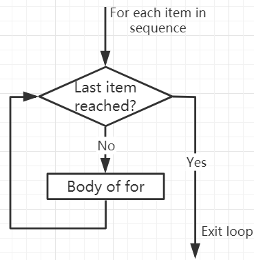

Bucles For
============

El bucle ``for`` puede recorrer cualquier secuencia de elementos, como una lista o una cadena.

El formato de sintaxis del bucle for es el siguiente:

.. code-block:: python

    for val in secuencia:
        Cuerpo del for

Aquí, ``val`` es una variable que obtiene el valor del elemento en la secuencia en cada iteración.

El bucle continúa hasta que alcanzamos el último elemento en la secuencia. Usa la indentación para separar el cuerpo del bucle ``for`` del resto del código.

**Diagrama de flujo del bucle For**

.. code-block:: python

    numbers = [1, 2, 3, 4]
    sum = 0

    for val in numbers:
        sum = sum+val
        
    print("The sum is", sum)

>>> %Run -c $EDITOR_CONTENT
The sum is 10

La sentencia break
-------------------------

Con la sentencia break podemos detener el bucle antes de que haya recorrido todos los elementos:

.. code-block:: python

    numbers = [1, 2, 3, 4]
    sum = 0

    for val in numbers:
        sum = sum+val
        if sum == 6:
            break
    print("The sum is", sum)

>>> %Run -c $EDITOR_CONTENT
The sum is 6

La sentencia continue
--------------------------------------------

Con la sentencia ``continue`` podemos detener la iteración actual del bucle y continuar con la siguiente:

.. code-block:: python

    numbers = [1, 2, 3, 4]

    for val in numbers:
        if val == 3:
            continue
        print(val)

>>> %Run -c $EDITOR_CONTENT
1
2
4

La función ``range()``
--------------------------------------------

Podemos usar la función ``range()`` para generar una secuencia de números. ``range(6)`` producirá números entre 0 y 5 (6 números).

También podemos definir inicio, parada y tamaño de paso como ``range(start, stop, step_size)``. Si no se proporciona, el tamaño_de_paso por defecto es 1.

En un sentido de range, el objeto es "perezoso" porque cuando creamos el objeto, no genera cada número que "contiene". Sin embargo, esto no es un iterador porque soporta operaciones in, len y ``__getitem__``.

Esta función no almacenará todos los valores en la memoria; sería ineficiente. Por lo tanto, recordará el inicio, la parada, el tamaño de paso y generará el siguiente número durante el recorrido.

Para forzar a esta función a mostrar todos los elementos, podemos usar la función ``list()``.

.. code-block:: python

    print(range(6))

    print(list(range(6)))

    print(list(range(2, 6)))

    print(list(range(2, 10, 2)))

>>> %Run -c $EDITOR_CONTENT
range(0, 6)
[0, 1, 2, 3, 4, 5]
[2, 3, 4, 5]
[2, 4, 6, 8]

Podemos usar ``range()`` en un bucle ``for`` para iterar sobre una secuencia de números. Se puede combinar con la función ``len()`` para usar el índice para recorrer la secuencia.

.. code-block:: python

    fruits = ['pear', 'apple', 'grape']

    for i in range(len(fruits)):
        print("I like", fruits[i])
        
>>> %Run -c $EDITOR_CONTENT
I like pear
I like apple
I like grape

Else in For Loop
--------------------------------

El bucle ``for`` también puede tener un bloque ``else`` opcional. Si los elementos en la secuencia utilizada para el bucle se agotan, se ejecuta la parte ``else``.

La palabra clave ``break`` puede usarse para detener el bucle ``for``. En este caso, se ignorará la parte ``else``.

Por lo tanto, si no ocurre ninguna interrupción, la parte ``else`` del bucle ``for`` se ejecutará.

.. code-block:: python

    for val in range(5):
        print(val)
    else:
        print("Finished")

>>> %Run -c $EDITOR_CONTENT
0
1
2
3
4
Finished

El bloque else NO se ejecutará si el bucle se detiene mediante una sentencia break.

.. code-block:: python

    for val in range(5):
        if val == 2: break
        print(val)
    else:
        print("Finished")

>>> %Run -c $EDITOR_CONTENT
0
1

