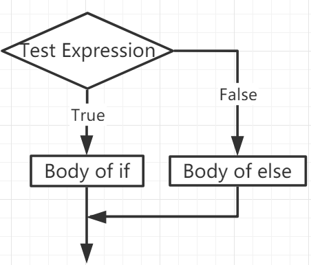
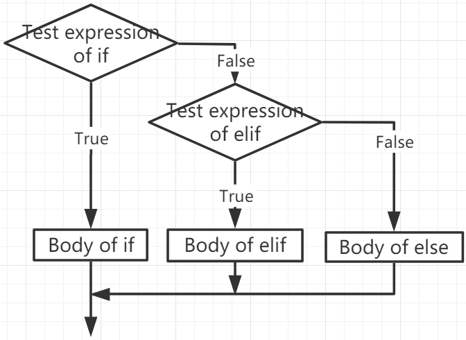

.. note::

    こんにちは、SunFounderのRaspberry Pi & Arduino & ESP32愛好家コミュニティへようこそ！Facebook上でRaspberry Pi、Arduino、ESP32についてもっと深く掘り下げ、他の愛好家と交流しましょう。

    **参加する理由は？**

    - **エキスパートサポート**：コミュニティやチームの助けを借りて、販売後の問題や技術的な課題を解決します。
    - **学び＆共有**：ヒントやチュートリアルを交換してスキルを向上させましょう。
    - **独占的なプレビュー**：新製品の発表や先行プレビューに早期アクセスしましょう。
    - **特別割引**：最新製品の独占割引をお楽しみください。
    - **祭りのプロモーションとギフト**：ギフトや祝日のプロモーションに参加しましょう。

    👉 私たちと一緒に探索し、創造する準備はできていますか？[|link_sf_facebook|]をクリックして今すぐ参加しましょう！

If Else
=============

条件によってコードを実行したい場合には、条件分岐が必要になります。

if
--------------------
.. code-block:: python

    if test expression:
        statement(s)

ここでは、プログラムが`テスト表現`を評価し、 `test expression` がTrueの場合のみ `test expression` を実行します。

`test expression` がFalseであれば、 `statement(s)` は実行されません。

MicroPythonでは、インデントは `if` ステートメントの本体を意味します。本体はインデントで始まり、最初の非インデント行で終わります。

Pythonはゼロでない値を「True」と解釈します。Noneと0は「False」と解釈されます。

**ifステートメントのフローチャート**

.. image:: img/if_statement.png

**例**

.. code-block:: python

    num = 8
    if num > 0:
        print(num, "is a positive number.")
    print("End with this line")

>>> %Run -c $EDITOR_CONTENT
8 is a positive number.
End with this line

if...else
-----------------------

.. code-block:: python

    if test expression:
        Body of if
    else:
        Body of else

`if..else` ステートメントは`テスト表現`を評価し、テスト条件が `True` の場合にのみ `if` の本体を実行します。

条件が `False` の場合、 `else` の本体が実行されます。インデントはブロックを分けるために使用されます。

**if...elseステートメントのフローチャート**

**例**

.. code-block:: python

    num = -8
    if num > 0:
        print(num, "is a positive number.")
    else:
        print(num, "is a negative number.")

>>> %Run -c $EDITOR_CONTENT
-8 is a negative number.

if...elif...else
--------------------

.. code-block:: python

    if test expression:
        Body of if
    elif test expression:
        Body of elif
    else: 
        Body of else

`Elif` は `else if` の略です。複数の表現をチェックすることができます。

`if` の条件がFalseの場合、次のelifブロックの条件がチェックされ、以下同様に続きます。

すべての条件が `False` であれば、 `else` の本体が実行されます。

複数ある `if...elif...else` ブロックのうち、条件に応じて実行されるのは1つだけです。

`if` ブロックは1つの `else` ブロックを持つことができますが、複数の `elif` ブロックを持つことができます。

**if...elif...elseステートメントのフローチャート**

**例**

.. code-block:: python

    x = 10
    y = 9

    if x > y:
        print("x is greater than y")
    elif x == y:
        print("x and y are equal")
    else:
        print("x is greater than y")

>>> %Run -c $EDITOR_CONTENT
x is greater than y

Nested if
---------------------

ifステートメントを別のifステートメントに埋め込むことができ、これをネストされたifステートメントと呼びます。

**例**

.. code-block:: python

    x = 67

    if x > 10:
        print("Above ten,")
        if x > 20:
            print("and also above 20!")
        else:
            print("but not above 20.")

>>> %Run -c $EDITOR_CONTENT
Above ten,
and also above 20!
