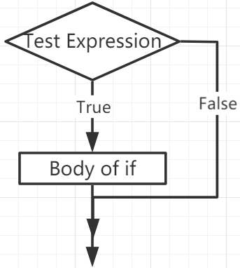

If Else
========

Entscheidungsfindung ist erforderlich, wenn wir einen Code nur dann ausführen möchten, wenn eine bestimmte Bedingung erfüllt ist.

if
----

.. code-block:: python

    if test expression:
        statement(s)

Hier bewertet das Programm den `test expression` und führt die `statement` nur aus, wenn der `test expression` True ist.

Ist der `test expression` False, werden die `statement(s)` nicht ausgeführt.

In MicroPython bedeutet Einrückung den Körper der `if`-Anweisung. Der Körper beginnt mit einer Einrückung und endet mit der ersten nicht eingerückten Zeile.

Python interpretiert Nicht-Null-Werte als "True". None und 0 werden als "False" interpretiert.

**Flussdiagramm des if-Statements**

**Beispiel**

.. code-block:: python

    num = 8
    if num > 0:
        print(num, "is a positive number.")
    print("End with this line")

>>> %Run -c $EDITOR_CONTENT
8 is a positive number.
End with this line

if...else
----------

.. code-block:: python

    if test expression:
        Body of if
    else:
        Body of else

Die `if..else`-Anweisung bewertet `test expression` und führt den Körper von `if` nur aus, wenn die Testbedingung `True` ist.

Ist die Bedingung `False`, wird der Körper von `else` ausgeführt. Einrückungen werden verwendet, um die Blöcke zu trennen.

**Flussdiagramm des if...else-Statements**

.. image:: img/if_else.png

**Beispiel**

.. code-block:: python

    num = -8
    if num > 0:
        print(num, "is a positive number.")
    else:
        print(num, "is a negative number.")

>>> %Run -c $EDITOR_CONTENT
-8 is a negative number.

if...elif...else
----------------

.. code-block:: python

    if test expression:
        Body of if
    elif test expression:
        Body of elif
    else: 
        Body of else

`Elif` steht für `else if`. Es ermöglicht uns, mehrere Ausdrücke zu überprüfen.

Ist die Bedingung des `if` False, wird die Bedingung des nächsten elif-Blocks überprüft, und so weiter.

Sind alle Bedingungen `False`, wird der Körper von `else` ausgeführt.

Nur einer von mehreren `if...elif...else`-Blöcken wird entsprechend den Bedingungen ausgeführt.

Der `if`-Block kann nur einen `else`-Block haben. Aber er kann mehrere `elif`-Blöcke haben.

**Flussdiagramm des if...elif...else-Statements**

.. image:: img/if_elif_else.png

**Beispiel**

.. code-block:: python

    x = 10
    y = 9

    if x > y:
        print("x is greater than y")
    elif x == y:
        print("x and y are equal")
    else:
        print("x is greater than y")

>>> %Run -c $EDITOR_CONTENT
x is greater than y

Verschachteltes if
------------------

Wir können ein if-Statement in ein anderes if-Statement einbetten, das dann als verschachteltes if-Statement bezeichnet wird.

**Beispiel**

.. code-block:: python

    x = 67

    if x > 10:
        print("Above ten,")
        if x > 20:
            print("and also above 20!")
        else:
            print("but not above 20.")

>>> %Run -c $EDITOR_CONTENT
Above ten,
and also above 20!
