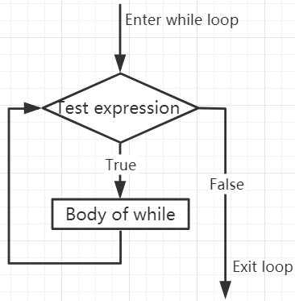

.. note::

    Ciao, benvenuto nella SunFounder Raspberry Pi & Arduino & ESP32 Enthusiasts Community su Facebook! Approfondisci Raspberry Pi, Arduino ed ESP32 insieme ad altri appassionati.

    **Perché unirti a noi?**

    - **Supporto esperto**: Risolvi problemi post-vendita e sfide tecniche con l'aiuto della nostra comunità e del nostro team.
    - **Impara e condividi**: Scambia suggerimenti e tutorial per migliorare le tue competenze.
    - **Anteprime esclusive**: Ottieni accesso anticipato agli annunci di nuovi prodotti e anteprime.
    - **Sconti speciali**: Approfitta di sconti esclusivi sui nostri prodotti più recenti.
    - **Promozioni e omaggi festivi**: Partecipa a omaggi e promozioni durante le festività.

    👉 Pronto a esplorare e creare con noi? Clicca su [|link_sf_facebook|] e unisciti oggi stesso!

Cicli While
===============

L'istruzione ``while`` viene utilizzata per eseguire un programma in un ciclo, ovvero per eseguire un programma in un ciclo sotto certe condizioni per gestire lo stesso compito che deve essere elaborato ripetutamente.

La sua forma base è:

.. code-block:: python

    while test expression:
        Body of while

Nel ciclo ``while``, viene prima verificata la ``test expression``. Solo quando la ``test expression`` risulta ``True``, si entra nel corpo del while. Dopo una iterazione, la ``test expression`` viene controllata di nuovo. Questo processo continua fino a quando la ``test expression`` risulta ``False``.

In MicroPython, il corpo del ciclo ``while`` è determinato dall'indentazione.

Il corpo inizia con un'indentazione e termina con la prima riga non indentata.

Python interpreta qualsiasi valore diverso da zero come ``True``. None e 0 vengono interpretati come ``False``.

**Diagramma di Flusso del ciclo while**

.. code-block:: python

    x = 10

    while x > 0:
        print(x)
        x -= 1

>>> %Run -c $EDITOR_CONTENT
10
9
8
7
6
5
4
3
2
1

Istruzione Break
--------------------

Con l'istruzione break possiamo interrompere il ciclo anche se la condizione while è vera:

.. code-block:: python

    x = 10

    while x > 0:
        print(x)
        if x == 6:
            break
        x -= 1

>>> %Run -c $EDITOR_CONTENT
10
9
8
7
6

Ciclo While con Else
--------------------------

Come il ciclo `if`, anche il ciclo `while` può avere un blocco `else` opzionale.

Se la condizione nel ciclo `while` viene valutata come `False`, viene eseguita la parte `else`.

.. code-block:: python

    x = 10

    while x > 0:
        print(x)
        x -= 1
    else:
        print("Game Over")

>>> %Run -c $EDITOR_CONTENT
10
9
8
7
6
5
4
3
2
1
Game Over