.. note::

    Hallo und willkommen in der SunFounder Raspberry Pi & Arduino & ESP32 Enthusiasten-Gemeinschaft auf Facebook! Tauchen Sie tiefer ein in die Welt von Raspberry Pi, Arduino und ESP32 mit anderen Enthusiasten.

    **Warum beitreten?**

    - **Expertenunterstützung**: Lösen Sie Nachverkaufsprobleme und technische Herausforderungen mit Hilfe unserer Gemeinschaft und unseres Teams.
    - **Lernen & Teilen**: Tauschen Sie Tipps und Anleitungen aus, um Ihre Fähigkeiten zu verbessern.
    - **Exklusive Vorschauen**: Erhalten Sie frühzeitigen Zugang zu neuen Produktankündigungen und exklusiven Einblicken.
    - **Spezialrabatte**: Genießen Sie exklusive Rabatte auf unsere neuesten Produkte.
    - **Festliche Aktionen und Gewinnspiele**: Nehmen Sie an Gewinnspielen und Feiertagsaktionen teil.

    👉 Sind Sie bereit, mit uns zu erkunden und zu erschaffen? Klicken Sie auf [|link_sf_facebook|] und treten Sie heute bei!

.. _sh_light_ball:

2.10 Lichtempfindlicher Ball
==============================

In diesem Projekt verwenden wir einen Fotowiderstand, um den Ball auf der Bühne nach oben fliegen zu lassen. Halten Sie Ihre Hand über den Fotowiderstand, um die Lichtintensität zu steuern, die er empfängt. Je näher Ihre Hand am Fotowiderstand ist, desto kleiner ist dessen Wert und desto höher fliegt der Ball auf der Bühne, andernfalls fällt er. Wenn der Ball die Schnur berührt, erzeugt er einen schönen Klang sowie funkelndes Sternenlicht.

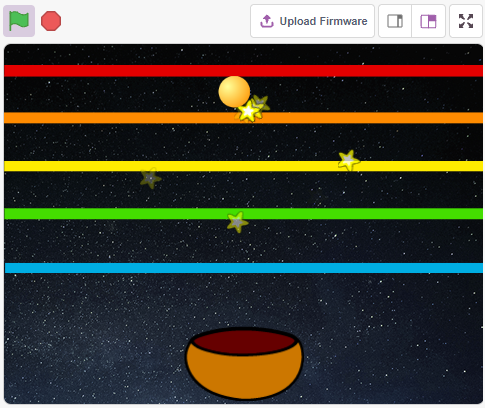

Benötigte Komponenten
---------------------

Für dieses Projekt benötigen wir die folgenden Komponenten.

Es ist definitiv praktisch, ein ganzes Set zu kaufen. Hier ist der Link:

.. list-table::
    :widths: 20 20 20
    :header-rows: 1

    *   - Name	
        - ARTIKEL IN DIESEM KIT
        - LINK
    *   - ESP32 Starter Kit
        - 320+
        - |link_esp32_starter_kit|

Sie können sie auch separat über die untenstehenden Links kaufen.

.. list-table::
    :widths: 30 20
    :header-rows: 1

    *   - KOMPONENTENBESCHREIBUNG
        - KAUF-LINK

    *   - :ref:`cpn_esp32_wroom_32e`
        - |link_esp32_wroom_32e_buy|
    *   - :ref:`cpn_esp32_camera_extension`
        - \-
    *   - :ref:`cpn_breadboard`
        - |link_breadboard_buy|
    *   - :ref:`cpn_wires`
        - |link_wires_buy|
    *   - :ref:`cpn_resistor`
        - |link_resistor_buy|
    *   - :ref:`cpn_photoresistor`
        - |link_photoresistor_buy|

Was Sie Lernen Werden
---------------------

- Füllen des Sprites mit Farben
- Berührung zwischen den Sprites

Schaltung Aufbauen
-----------------------

Ein Fotowiderstand oder eine Fotodiode ist ein lichtgesteuerter variabler Widerstand. Der Widerstand eines Fotowiderstands nimmt mit zunehmender einfallender Lichtintensität ab.

Bauen Sie die Schaltung gemäß dem folgenden Diagramm auf.

Verbinden Sie ein Ende des Fotowiderstands mit 5V, das andere Ende mit Pin35, und schalten Sie einen 10K-Widerstand in Serie mit GND an diesem Ende.

Wenn also die Lichtintensität zunimmt, verringert sich der Widerstand des Fotowiderstands, die Spannungsteilung des 10K-Widerstands nimmt zu, und der von Pin35 erhaltene Wert wird größer.

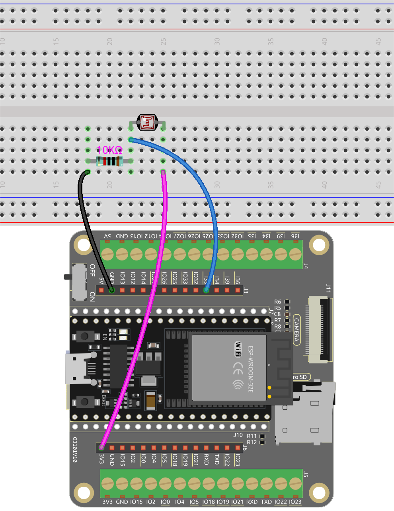

Programmierung
------------------

Das gewünschte Ergebnis ist, dass je näher Ihre Hand dem Fotowiderstand kommt, das Ball-Sprite auf der Bühne immer weiter nach oben geht, andernfalls fällt es auf das Schüssel-Sprite. Wenn es beim Aufsteigen oder Herunterfallen das Linien-Sprite berührt, erzeugt es einen musikalischen Klang und sendet Stern-Sprites in alle Richtungen.

**1. Sprite und Hintergrund auswählen**

Lösche das Standard-Sprite, wähle die Sprites **Ball**, **Bowl** und **Star** aus.

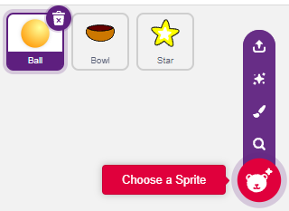

Bewege das **Bowl**-Sprite in die Mitte unten auf der Bühne und vergrößere seine Größe.

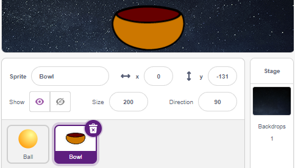

Da wir es nach oben bewegen müssen, setze die Richtung des **Ball**-Sprites auf 0.

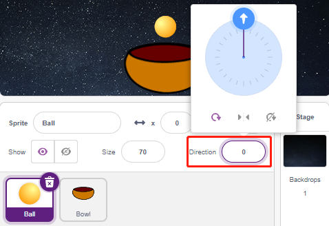

Setze die Größe und Richtung des **Star**-Sprites auf 180, da es nach unten fallen soll, oder ändere es in einen anderen Winkel.

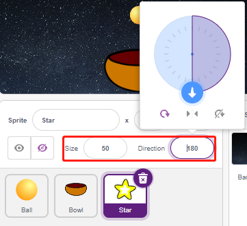

Füge nun den **Stars**-Hintergrund hinzu.

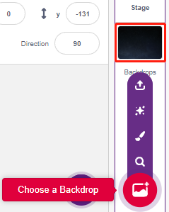

**2. Ein Linien-Sprite zeichnen**

Füge ein Linien-Sprite hinzu.

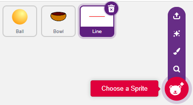

Gehe zur **Costumes**-Seite des **Line**-Sprites, reduziere die Breite der roten Linie auf der Leinwand leicht, kopiere sie dann 5 Mal und richte die Linien aus.

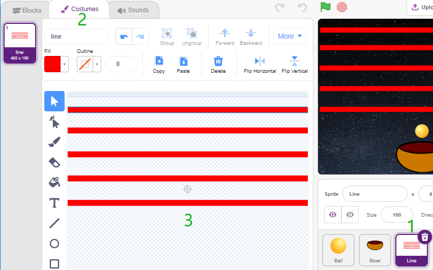

Fülle nun die Linien mit verschiedenen Farben. Wähle zuerst eine Farbe, die dir gefällt, klicke dann auf das **Fill**-Werkzeug und bewege die Maus über die Linie, um sie mit Farbe zu füllen.

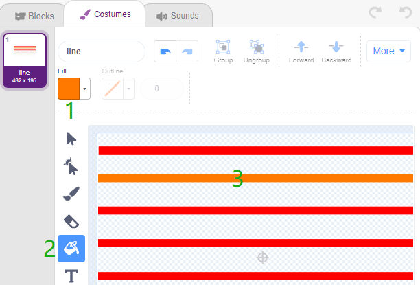

Verwende die gleiche Methode, um die Farbe der anderen Linien zu ändern.

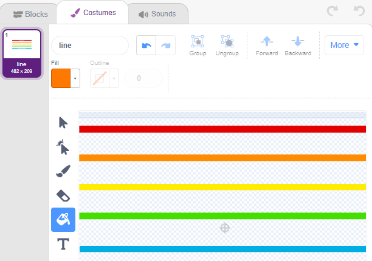

**3. Skript für das Ball-Sprite**

Setze die Anfangsposition des **Ball**-Sprites, dann, wenn der Lichtwert kleiner als 1500 ist (es kann ein anderer Wert sein, abhängig von deiner aktuellen Umgebung.), lass den Ball nach oben bewegen.

Du kannst die Variable light_value auf der Bühne anzeigen lassen, um die Änderung der Lichtintensität jederzeit zu beobachten.

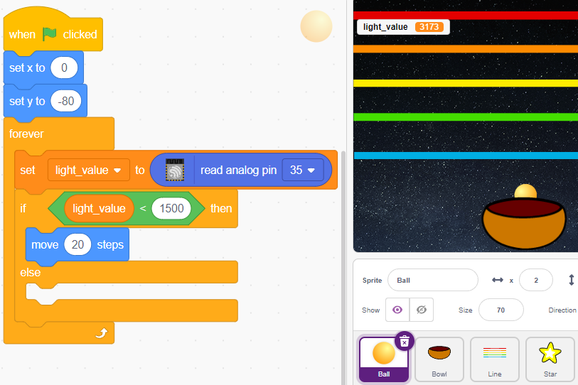

Andernfalls fällt das **Ball**-Sprite und seine Y-Koordinate wird auf ein Minimum von -100 begrenzt. Dies kann geändert werden, damit es aussieht, als würde es auf das **Bowl**-Sprite fallen.

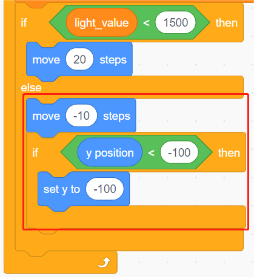

Wenn das **Line**-Sprite getroffen wird, wird die aktuelle Y-Koordinate in die Variable **ball_coor** gespeichert und eine **Bling**-Nachricht gesendet.

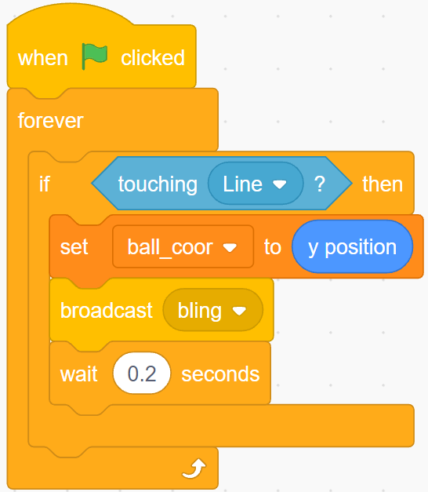

**4. Skript für das Stern-Sprite**

Wenn das Skript startet, verstecke zunächst das **Star**-Sprite. Wenn die **Bling**-Nachricht empfangen wird, klone das **Star**-Sprite.

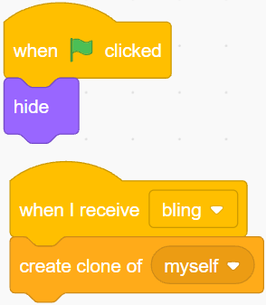

Wenn das **Star**-Sprite als Klon erscheint, spiele den Toneffekt und setze seine Koordinaten synchron zum **Ball**-Sprite.

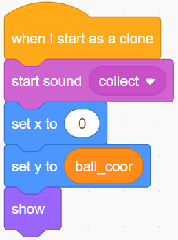

Erstelle den Effekt des erscheinenden **Star**-Sprites und passe ihn bei Bedarf an.

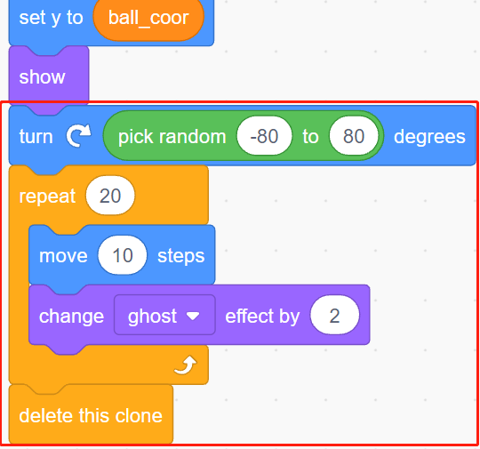
