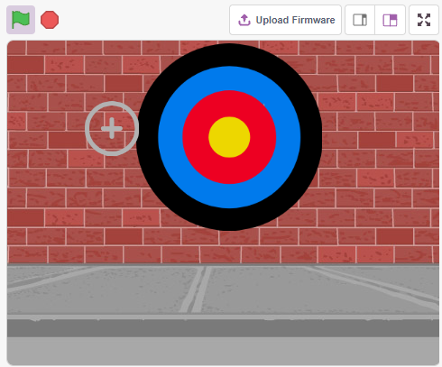
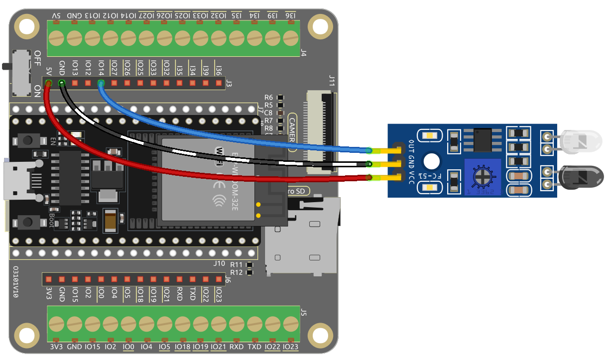
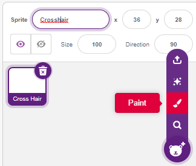
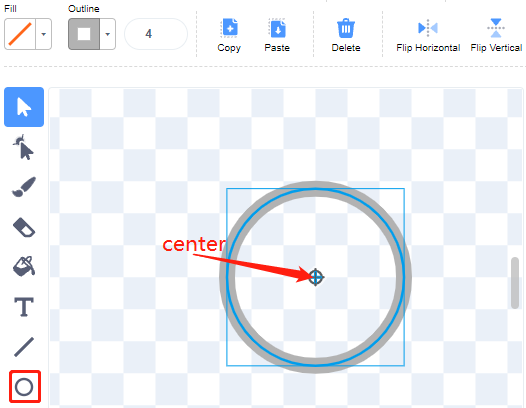
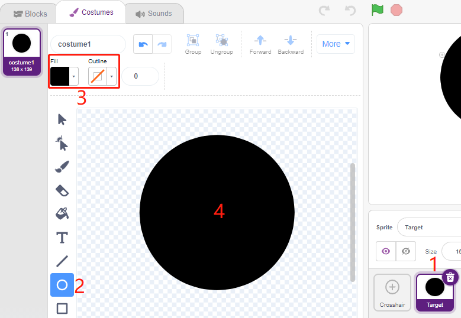
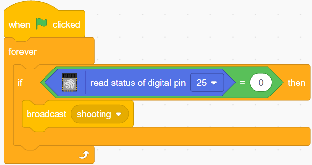
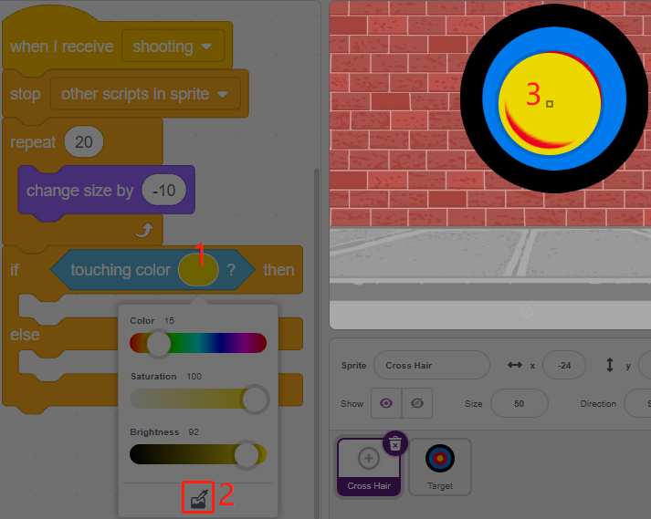
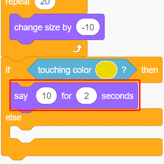
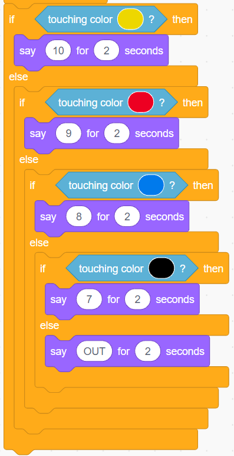

.. _sh_shooting:

2.11 ゲーム - 射撃
====================================

テレビで見る射撃ゲームはご存知ですか？競技者がターゲットの真ん中に近いところに弾丸を撃つほど、高得点を得られます。

今日はScratchで射撃ゲームを行います。ゲームでは、十字線をできるだけ中心に近づけて、より高い得点を獲得しましょう。

緑の旗をクリックしてスタートします。障害物回避モジュールを使って弾丸を撃ちます。

必要な部品
---------------------

このプロジェクトには以下の部品が必要です。

全てのキットを購入するのが便利ですが、以下のリンクからも個別に購入できます。

.. list-table::
    :widths: 20 20 20
    :header-rows: 1

    *   - 名前
        - このキットのアイテム
        - リンク
    *   - ESP32 Starter Kit
        - 320+
        - |link_esp32_starter_kit|

.. list-table::
    :widths: 30 20
    :header-rows: 1

    *   - コンポーネントの紹介
        - 購入リンク

    *   - :ref:`cpn_esp32_wroom_32e`
        - |link_esp32_wroom_32e_buy|
    *   - :ref:`cpn_esp32_camera_extension`
        - \-
    *   - :ref:`cpn_wires`
        - |link_wires_buy|
    *   - :ref:`cpn_avoid`
        - |link_avoid_buy|

学べること
---------------------

- 障害物回避モジュールの仕組みと角度範囲
- 異なるスプライトのペイント
- 色のタッチ

回路の構築
-----------------------

障害物回避モジュールは距離調整可能な赤外線近接センサーで、通常は高出力で障害物を検知すると低出力になります。

以下の図に従って回路を組み立ててください。

プログラミング
------------------

**1. 照準のスプライトを描く**

デフォルトのスプライトを削除し、 **Sprite** ボタンを選択して **Paint** をクリックすると、空白のスプライト **Sprite1** が現れるので、 **Crosshair** と名付けます。

**Crosshair** スプライトの **Costumes** ページに移動します。 **Circle** ツールをクリックし、塗りつぶし色をなくして、アウトラインの色と幅を設定します。

.. image:: img/14_shooting02.png

**Circle** ツールで円を描きます。描いた後、 **Select** ツールをクリックして円を移動し、原点がキャンバスの中心に合うようにします。

**Line** ツールを使って、円の内側に十字を描きます。

.. image:: img/14_shooting033.png

**ターゲットのスプライトを描く**

**Target** という新しいスプライトを作成します。

.. image:: img/14_shooting01.png

**Target** スプライトのコスチュームページに移動し、 **Circle** ツールをクリックして、塗りつぶし色を選んでアウトラインをなくし、大きな円を描きます。

同じ方法でさらに円を描き、それぞれに異なる色を使用します。 **Forward** や **Backbard** ツールを使って、重なっている円の位置を変更することができます。また、ツールを選択して円を移動し、すべての円の原点がキャンバスの中心に合うようにする必要があります。

.. image:: img/14_shooting04.png

**3. 背景を追加**

できれば色が多すぎず、 **Target** スプライトの色と一致しない、適切な背景を追加します。 ここでは **Wall1** 背景を選択しました。

.. image:: img/14_shooting06.png

**4. 照準スプライトのスクリプト**

**Crosshair** スプライトのランダムな位置とサイズを設定し、ランダムに動かします。

.. image:: img/14_shooting4.png

障害物回避モジュールの前に手を置くと、送信信号としてローレベルを出力します。

**shooting** メッセージを受け取ると、スプライトは動きを止めてゆっくり縮小し、弾丸が撃たれた効果をシミュレートします。

.. image:: img/14_shooting6.png

[Touch color ()]ブロックを使って、ショットの位置を判断します。

ショットが黄色の円の内側にある場合、10ポイントを報告します。

同じ方法で弾丸の撃たれた位置を判断しますが、 **Target** スプライトに設定されていない場合は円の外ということになります。

