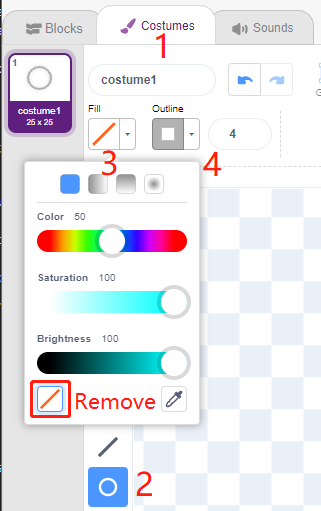

.. _sh_shooting:

2.11 SPIEL - Schießen
====================================

Haben Sie schon einmal diese Schießspiele im Fernsehen gesehen? Je näher ein Teilnehmer mit einer Kugel am Ziel zum Bullseye schießt, desto höher ist seine Punktzahl.

Heute machen wir auch ein Schießspiel in Scratch. Im Spiel soll das Fadenkreuz so weit wie möglich zum Bullseye schießen, um eine höhere Punktzahl zu erreichen.

Klicken Sie auf die grüne Flagge, um zu starten. Verwenden Sie das Modul zur Hindernisvermeidung, um eine Kugel zu schießen.

.. image:: img/14_shooting.png

Benötigte Komponenten
---------------------

Für dieses Projekt benötigen wir die folgenden Komponenten.

Es ist definitiv praktisch, ein ganzes Set zu kaufen. Hier ist der Link:

.. list-table::
    :widths: 20 20 20
    :header-rows: 1

    *   - Name	
        - ARTIKEL IN DIESEM KIT
        - LINK
    *   - ESP32 Starter Kit
        - 320+
        - |link_esp32_starter_kit|

Sie können sie auch separat über die untenstehenden Links kaufen.

.. list-table::
    :widths: 30 20
    :header-rows: 1

    *   - KOMPONENTENBESCHREIBUNG
        - KAUF-LINK

    *   - :ref:`cpn_esp32_wroom_32e`
        - |link_esp32_wroom_32e_buy|
    *   - :ref:`cpn_esp32_camera_extension`
        - \-
    *   - :ref:`cpn_wires`
        - |link_wires_buy|
    *   - :ref:`cpn_avoid`
        - |link_avoid_buy|

Was Sie Lernen Werden
---------------------

- Funktionsweise des Hindernisvermeidungsmoduls und der Winkelbereich
- Unterschiedliche Sprites malen
- Farben berühren

Schaltung Aufbauen
-----------------------

Das Hindernisvermeidungsmodul ist ein infrarotbasierter Näherungssensor mit einstellbarer Distanz, dessen Ausgang normalerweise hoch ist und bei Erkennung eines Hindernisses niedrig wird.

Bauen Sie die Schaltung gemäß dem untenstehenden Diagramm auf.

.. image:: img/circuit/12_shooting_bb.png

Programmierung
------------------

**1. Das Fadenkreuz-Sprite malen**

Lösche das Standard-Sprite, wähle den **Sprite**-Button und klicke auf **Paint**, es erscheint ein leeres Sprite **Sprite1** und benenne es **Crosshair**.

.. image:: img/14_shooting0.png

Gehe zur **Costumes**-Seite des **Crosshair**-Sprites. Klicke auf das **Circle**-Werkzeug, entferne die Füllfarbe und stelle die Farbe und Breite der Umrandung ein.

Zeichne jetzt einen Kreis mit dem **Circle**-Werkzeug. Nach dem Zeichnen kannst du das **Select**-Werkzeug anklicken und den Kreis verschieben, sodass der ursprüngliche Punkt mit der Mitte der Leinwand ausgerichtet ist.

.. image:: img/14_shooting03.png

Verwende das **Line**-Werkzeug, um ein Kreuz in den Kreis zu zeichnen.

.. image:: img/14_shooting033.png

**Male das Ziel-Sprite**

Erstelle ein neues Sprite namens **Target**-Sprite.

.. image:: img/14_shooting01.png

Gehe zur Kostüme-Seite des **Target**-Sprites, klicke auf das **Circle**-Werkzeug, wähle eine Füllfarbe und entferne die Umrandung und male einen großen Kreis.

.. image:: img/14_shooting05.png

Verwende die gleiche Methode, um zusätzliche Kreise zu zeichnen, jeder mit einer anderen Farbe, und du kannst das **Forward**- oder **Backbard**-Werkzeug verwenden, um die Position der sich überlappenden Kreise zu ändern. Beachte, dass du auch das Werkzeug zum Verschieben der Kreise auswählen musst, sodass der Ursprung aller Kreise und die Mitte der Leinwand ausgerichtet sind.

.. image:: img/14_shooting04.png

**3. Einen Hintergrund hinzufügen**

Füge einen passenden Hintergrund hinzu, der vorzugsweise nicht zu viele Farben hat und nicht mit den Farben im **Target**-Sprite übereinstimmt. Hier habe ich den **Wall1**-Hintergrund gewählt.

.. image:: img/14_shooting06.png

**4. Skript für das Fadenkreuz-Sprite**

Stelle die zufällige Position und Größe des **Crosshair**-Sprites ein und lass es sich zufällig bewegen.

.. image:: img/14_shooting4.png

Wenn eine Hand vor das Hindernisvermeidungsmodul gehalten wird, gibt es ein niedriges Signal als Sendesignal aus.

.. image:: img/14_shooting5.png

Wenn die Nachricht **shooting** empfangen wird, stoppt das Sprite seine Bewegung und schrumpft langsam, um den Effekt eines abgefeuerten Geschosses zu simulieren.

.. image:: img/14_shooting6.png

Verwende den Block [Touch color ()], um die Position des Schusses zu bestimmen.

.. image:: img/14_shooting7.png

Wenn der Schuss innerhalb des gelben Kreises liegt, werden 10 Punkte vergeben.

Verwende die gleiche Methode, um die Position des abgefeuerten Geschosses zu bestimmen. Wenn es nicht auf dem **Target**-Sprite landet, bedeutet das, dass es außerhalb des Kreises ist.

.. image:: img/14_shooting9.png
